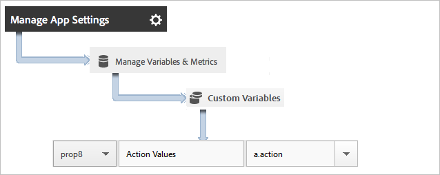
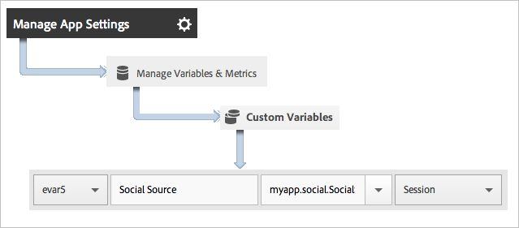

# Toepassingsacties bijhouden {#track-app-actions}

Acties zijn de gebeurtenissen die in uw Android-app optreden en die u wilt meten.

Elke actie heeft één of meerdere overeenkomstige metriek die elke keer worden verhoogd de gebeurtenis voorkomt. Bijvoorbeeld, zou u een `trackAction` vraag voor elk nieuw abonnement kunnen verzenden, telkens als een artikel wordt bekeken, of telkens als een niveau wordt voltooid. Handelingen worden niet automatisch bijgehouden. U moet dus een aanroep doen `trackAction` wanneer een gebeurtenis plaatsvindt die u wilt bijhouden en de handeling toewijzen aan een aangepaste gebeurtenis.

## Handelingen bijhouden {#section_380DF56C4EE4432A823940E4AE4C9E91}

1. Voeg de bibliotheek aan uw project toe en implementeer levenscyclus.

   Voor meer informatie, zie *Voeg het Dossier SDK en Config aan uw IDEA IntelliJ of Project* Eclipse in de implementatie en de levenscyclus [van de](/help/android/getting-started/dev-qs.md)Kern toe.

1. De bibliotheek importeren:

   ```java
   import com.adobe.mobile.*;
   ```

1. Wanneer de handeling die u wilt bijhouden plaatsvindt in uw app, roept u `trackAction` aan om een hit voor deze actie te verzenden:

   ```java
   Analytics.trackAction("myapp.ActionName", null);
   ```

1. Selecteer uw toepassing in de gebruikersinterface van Adobe Mobile Services en klik op **[!UICONTROL Manage App Settings]**.
1. Klik **[!UICONTROL Manage Variables and Metrics]** en klik op het **[!UICONTROL Custom Metrics]** tabblad.

1. Wijs bijvoorbeeld de naam van de contextgegevens die in de code is gedefinieerd, toe `myapp.ActionName`aan een aangepaste gebeurtenis.

   

U kunt ook een eigenschap instellen om alle actiewaarden in te houden door een aangepaste eigenschap met een naam als **[!UICONTROL Custom Actions]** en de waarde in te stellen op `a.action`.



## Extra gegevens verzenden {#section_3EBE813E54A24F6FB669B2478B5661F9}

Naast de naam van de handeling kunt u aanvullende contextgegevens verzenden bij elke aanroep van een trackactie:

```java
HashMap<String, Object> exampleContextData = new HashMap<String, Object>(); 
exampleContextData.put("myapp.social.SocialSource", "Twitter"); 
Analytics.trackAction("myapp.SocialShare", exampleContextData);
```

Contextgegevenswaarden moeten worden toegewezen aan aangepaste variabelen in Adobe Mobile-services:



## Actierapport {#section_0F6A54AB7A3F42C9BB042D86A0FC4630}

| Interface | Rapport |
|--- |--- |
| Adobe Mobile Services | **[!UICONTROL Action Paths]** verslag.  Geef de volgorde weer waarin acties in uw app plaatsvinden. U kunt ook op elk rapport klikken **[!UICONTROL Customize]** om gerangschikte, beheerde acties of een defecatierapport weer te geven of een filter toepassen om acties voor een bepaald segment weer te geven. |
| Marketingrapporten en -analyses | **[!UICONTROL Custom Event]** verslag.  Nadat een handeling is toegewezen aan een aangepaste gebeurtenis, kunt u mobiele gebeurtenissen weergeven die vergelijkbaar zijn met alle andere analytische gebeurtenissen. |
| Ad-hocanalyse | **[!UICONTROL Custom Event]** verslag.  Nadat een handeling is toegewezen aan een aangepaste gebeurtenis, kunt u mobiele gebeurtenissen weergeven die vergelijkbaar zijn met alle andere analytische gebeurtenissen. |

