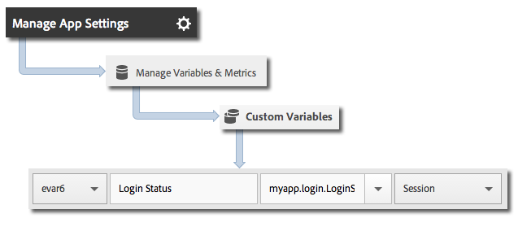

# Toepassingsstaten bijhouden {#track-app-states}

Frames zijn de verschillende schermen of weergaven in uw toepassing.

Telkens wanneer een nieuwe staat in uw toepassing wordt getoond, bijvoorbeeld, wanneer een gebruiker van de homepage aan de nieuwsvoer navigeert, wordt een `trackState` vraag verzonden. In Android wordt `trackState` doorgaans aangeroepen wanneer een nieuwe activiteit wordt geladen.

## Frames bijhouden {#section_380DF56C4EE4432A823940E4AE4C9E91}

1. Voeg de bibliotheek aan uw project toe en implementeer levenscyclus.

   Voor meer informatie, zie *Voeg het dossier SDK en Config aan uw Project IntelliJ IDEA of Eclipse* in [de implementatie van de Kern en levenscyclus](/help/android/getting-started/dev-qs.md) toe.

1. De bibliotheek importeren:

   ```java
   import com.adobe.mobile.*;
   ```

1. In de functie `onCreate`, roep `trackState` om een klap voor deze staatsmening te verzenden:

   ```java
   @Override 
   public void onCreate(Bundle savedInstanceState) { 
       super.onCreate(savedInstanceState); 
       setContentView(R.layout.main); 
   
       // Adobe - track when this state loads 
       Analytics.trackState("State Name", null); 
   }
   ```

`"State Name"` wordt vermeld in `View State` variabele in de Mobiele diensten van Adobe, en een mening wordt geregistreerd voor elke `trackState` vraag. In andere analytische interfaces wordt `View State` gerapporteerd als `Page Name` en `state views` als `page views`.

## Extra gegevens verzenden {#section_CFDB4F944496401786A145C209AB387C}

Naast `"State Name"`, kunt u extra contextgegevens met elke vraag van de spooractie verzenden:

```java
@Override 
public void onCreate(Bundle savedInstanceState) { 
    super.onCreate(savedInstanceState); 
    setContentView(R.layout.main); 
  
    // Adobe - track when this state loads 
    HashMap<String, Object> exampleContextData = new HashMap<String, Object>(); 
    exampleContextData.put("myapp.login.LoginStatus", "logged in"); 
    Analytics.trackState("Home Screen", exampleContextData); 
}
```

De waarden van contextgegevens moeten aan douanevariabelen in de Mobiele diensten van Adobe worden in kaart gebracht:



## Rapportage toepassingsstatus {#section_0F6A54AB7A3F42C9BB042D86A0FC4630}

Frames worden meestal weergegeven met behulp van een tekenrapport, waarmee u kunt zien hoe gebruikers door uw app navigeren en welke statussen het vaakst worden weergegeven.

|  |  |
|--- |--- |
| Adobe Mobile Services | Het **[!UICONTROL View States]** rapport. Dit rapport is gebaseerd op de wegen die de gebruikers door uw toepassing hebben genomen. Een voorbeeldpad is **[!UICONTROL Home]** > **[!UICONTROL Settings]** > **[!UICONTROL Feed]**. |
| Adobe Analytics | Frames kunnen overal worden weergegeven waar pagina&#39;s kunnen worden weergegeven, zoals het **[!UICONTROL Pages]**-rapport, het **[!UICONTROL Page Views]**-rapport en het **[!UICONTROL Path]**-rapport. |
| Ad-hocanalyse | Staten kunnen overal worden bekeken Pagina&#39;s kunnen worden bekeken door de **[!UICONTROL Page]** dimensie, **[!UICONTROL Page Views]** metrisch, **[!UICONTROL Path]** rapporten te gebruiken. |
