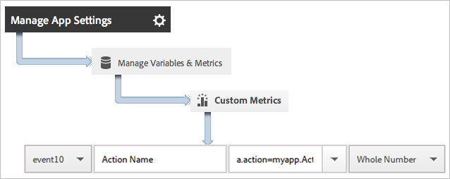
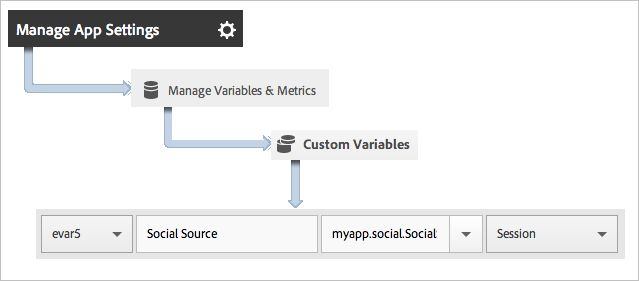

# Toepassingsacties bijhouden {#track-app-actions}

Acties zijn de gebeurtenissen die in uw app voorkomen en die u wilt meten. Elke actie heeft één of meerdere overeenkomstige metriek die elke keer worden verhoogd de gebeurtenis voorkomt. U kunt bijvoorbeeld een nieuw abonnement bijhouden wanneer een artikel wordt weergegeven of telkens wanneer een niveau wordt voltooid. De overeenkomstige metriek voor deze gebeurtenissen worden gevormd als abonnementen, gelezen artikelen, en voltooide niveaus.

Handelingen worden niet automatisch bijgehouden, dus als u een gebeurtenis wilt volgen, moet u `trackAction`.

## Handelingen bijhouden {#section_380DF56C4EE4432A823940E4AE4C9E91}

1. Voeg de bibliotheek aan uw project toe en implementeer levenscyclus.

   Zie voor meer informatie *SDK en configuratiebestand toevoegen aan uw project* in [Core-implementatie en levenscyclus](/help/ios/getting-started/dev-qs.md).
1. Importeer de bibliotheek.

   ```objective-c
   #import "ADBMobile.h"
   ```

1. Wanneer de handeling die u wilt bijhouden plaatsvindt in uw app, roept u `trackAction` om een hit voor deze handeling te verzenden.

   ```objective-c
   [ADBMobile trackAction:@"myapp.ActionName"  
                     data:nil];
   ```

   >[!TIP]
   >
   >Als de code waaraan u deze aanroep toevoegt, kan worden uitgevoerd terwijl de toepassing zich op de achtergrond bevindt, roept u `trackActionFromBackground` in plaats van `trackAction`.

1. Selecteer uw app in de gebruikersinterface van Adobe Mobile Services en klik op **[!UICONTROL Manage App Settings]**.

1. Klikken **[!UICONTROL Manage Variables and Metrics]** en klik op de knop **[!UICONTROL Custom Metrics]** tab.

1. Wijs bijvoorbeeld de naam van de contextgegevens toe die in uw code is gedefinieerd, `a.action=myapp.ActionName`, naar een aangepaste gebeurtenis.

   

U kunt ook een eigenschap instellen om alle actiewaarden in te houden door een aangepaste eigenschap met een naam als **[!UICONTROL Custom Actions]** en de waarde instellen op `a.action`.


## Extra gegevens verzenden {#section_3EBE813E54A24F6FB669B2478B5661F9}

Naast de naam van de handeling kunt u aanvullende contextgegevens verzenden bij elke aanroep van een trackactie:

```objective-c
NSMutableDictionary *contextData = [NSMutableDictionary dictionary]; 
[contextData setObject:@"Twitter" forKey:@"myapp.social.SocialSource"]; 
[ADBMobile trackAction:@"myapp.SocialShare" data:contextData];
```

Contextgegevenswaarden moeten worden toegewezen aan aangepaste variabelen:



## Achtergrondhandelingen bijhouden {#section_AC13013F207D4FBAAF27E4412034251E}

Als u een handeling in code bijhoudt die kan worden uitgevoerd wanneer de toepassing op de achtergrond wordt uitgevoerd, roept u `trackActionFromBackground` in plaats van `trackAction`. Hoewel `trackActionFromBackground` bevat wat extra logica om levenscyclusvraag te verhinderen te vuren wanneer zij niet zouden moeten, zijn de parameters het zelfde.

## Actierapport {#section_0F6A54AB7A3F42C9BB042D86A0FC4630}

| Interface | Rapport |
|--- |--- |
| Adobe Mobile Services | **[!UICONTROL Action Paths]** verslag. Geef de volgorde weer waarin acties in uw app plaatsvinden. U kunt ook op **[!UICONTROL Customize]** op om het even welk rapport om acties te bekijken gerangschikt, trended, of in een verdelingsrapport of een filter toe te passen om acties voor een specifiek segment te bekijken. |
| Marketing reports and analytics | **[!UICONTROL Custom Event]** verslag.  Nadat een handeling is toegewezen aan een aangepaste gebeurtenis, kunt u mobiele gebeurtenissen weergeven die vergelijkbaar zijn met alle andere analytische gebeurtenissen. |
| Ad-hocanalyse | **[!UICONTROL Custom Event]** verslag. Nadat een handeling is toegewezen aan een aangepaste gebeurtenis, kunt u mobiele gebeurtenissen weergeven die vergelijkbaar zijn met alle andere analytische gebeurtenissen. |
