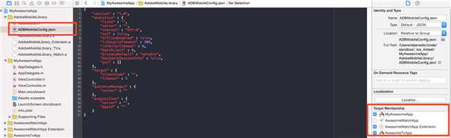

# Kernimplementatie en levenscyclus {#core-implementation-and-lifecycle}

Met deze informatie kunt u de iOS-bibliotheek implementeren en levenscyclusmetriek verzamelen, zoals opstarten, upgrades, sessies, betrokken gebruikers enzovoort.

## De SDK downloaden {#section_99FE1A17A36D4A2C943939023CF6265C}

>[!IMPORTANT]
>
>Als u de SDK&#39;s wilt downloaden, **moet** u iOS 6 of hoger gebruiken.

**Vereiste**

Voordat u de SDK downloadt, voert u de stappen in *Een rapportsuite* maken in de [Core-implementatie en -levenscyclus](/help/ios/getting-started/requirements.md) uit om een ontwikkelrapportsuite in te stellen en een vooraf ingevulde versie van het configuratiebestand te downloaden.

De SDK downloaden:

1. Download het bestand, decomprimeer het `[Your_App_Name_]AdobeMobileLibrary-4.*-iOS.zip` bestand en controleer of u de volgende softwareonderdelen hebt:

   * `ADBMobile.h`, het objectc-headerbestand dat wordt gebruikt voor iOS AppMeasurement.
   * `ADBMobileConfig.json`, dit is het SDK-configuratiebestand dat voor uw app is aangepast.
   * `AdobeMobileLibrary.a`, een binaire bitcode met vet die de bibliotheekbuilds voor iOS-apparaten bevat (armv7, armv7s, arm64) en simulatoren (i386, x86_64).

      Dit binaire bestand met vet moet worden gekoppeld wanneer het doel is bedoeld voor een iOS-app.

   * `AdobeMobileLibrary_Extension.a`, een binaire bitcode met vet die de bibliotheekbuilds bevat voor iOS-apparaten (armv7, armv7s, arm64) en simulatoren (i386, x86_64).

      Dit binaire vet moet worden gekoppeld wanneer het doel is bedoeld voor een iOS-extensie.

   * `AdobeMobileLibrary_Watch.a`, een binaire bitcode met vet die de bibliotheekbuilds bevat voor Apple Watch devices (armv7k) en simulators (i386, x86_64).

      Dit binaire bestand met vet moet worden gekoppeld wanneer het doel is bedoeld voor een Apple Watch-extensie-app (watchOS 2).

   * `AdobeMobileLibrary_TV.a`, een binaire bitcode met vet die de bibliotheek bevat voor nieuwe Apple TV-apparaten (arm64) en simulator (x86_64).

      Dit binaire bestand met vet moet worden gekoppeld wanneer het doel is bedoeld voor een Apple TV-app (tvOS).

>[!IMPORTANT]
>
>Als u de SDK buiten de gebruikersinterface van de Adobe Mobile-services downloadt, moet het `ADBMobileConfig.json` bestand handmatig worden geconfigureerd. Zie [Voordat u begint](/help/ios/getting-started/requirements.md) met het instellen van een ontwikkelrapportsuite en download een vooraf ingevulde versie van het configuratiebestand als u nog niet eerder met Analytics en de Mobile SDK werkt.

## SDK en configuratiebestand toevoegen aan uw project {#section_93C25D893B4A4CD3B996CF3C5590C8DC}

1. Start de Xcode-IDE en open uw app.
1. In de Navigator van het Project, sleep de `AdobeMobileLibrary` omslag en laat vallen het onder uw project.
1. Controleer het volgende:

   * Het **[!UICONTROL Copy Items if needed]** selectievakje is ingeschakeld.
   * **[!UICONTROL Create groups]** is geselecteerd.
   * Geen enkel selectievakje in de **[!UICONTROL Add to targets]** sectie is geselecteerd.

   

1. Klik op **[!UICONTROL Finish]**.
1. In **[!UICONTROL Project Navigator]** selecteert u **`ADBMobileConfig.json`**.
1. Voeg in **[!UICONTROL File Inspector]**, het JSON- dossier aan om het even welke doelstellingen in uw project toe die Adobe SDK zullen gebruiken.

   

1. Voer in **[!UICONTROL Project Navigator]** de volgende stappen uit:

   1. Klik op uw app.
   1. Selecteer op het **[!UICONTROL General]** tabblad de gewenste doelen en koppel de vereiste frameworks en bibliotheken in de **[!UICONTROL Linked Frameworks]** secties en **[!UICONTROL Libraries]** secties.
   * **iOS App-doelen**
      * `SystemConfiguration.framework`
      * `WebKit.framework`
      * `libsqlite3.0.tbd`
      * `AdobeMobileLibrary.a`
      * `CoreLocation.framework` (optioneel, maar vereist voor geo-tracking-mogelijkheden)
   * **Doel iOS-extensie**

      * `SystemConfiguration.framework`
      * `libsqlite3.0.tbd`
      * `AdobeMobileLibrary\_Extension.a`
   * **Apple Watch (watchOS 2)-doel**

      * `libsqlite3.0.tbd`
      * `AdobeMobileLibrary\_Watch.a`
   * **Apple TV (tvOS)-doel**

      * `SystemConfiguration.framework`
      * `libsqlite3.0.tbd`
      * `AdobeMobileLibrary\_TV.a`

   >[!CAUTION]
   >
   > Het koppelen van meerdere `AdobeMobileLibrary*.a` bestanden in hetzelfde doel leidt tot onverwacht gedrag of tot de onmogelijkheid om te bouwen.

1. Bevestig dat uw app zonder fouten wordt gemaakt.

## Levenscyclusmetriek implementeren {#section_532702562A7A43809407C9A2CBA80E1E}

>[!IMPORTANT]
>
>iOS stuurt levenscyclusinformatie met of zonder aanroep `collectlifecycledata`en `collectlifecycledata` is slechts een manier om eerder in de opstartreeks van de toepassing de levenscyclus te starten.

Nadat u de levenscyclus hebt ingeschakeld, wordt elke keer dat uw app wordt gestart, een hit verzonden om het starten, upgrades, sessies, betrokken gebruikers en andere [levenscyclusstatistieken](/help/ios/metrics.md)te meten.

Voeg een `collectLifecycleData`/ `collectLifecycleDataWithAdditionalData` vraag binnen toe `application:didFinishLaunchingWithOptions`:

```objective-c
- (BOOL)application:(UIApplication *)application didFinishLaunchingWithOptions:(NSDictionary *)launchOptions { 
 [ADBMobile collectLifecycleData]; 
    return YES; 
}
```

### Extra gegevens opnemen met levenscyclusaanroepen

Om extra gegevens met metrische vraag van de levenscyclus te omvatten, gebruik `collectLifecycleDataWithAdditionalData`:

>[!IMPORTANT]
>
>Alle gegevens die via de SDK worden doorgegeven, `collectLifecycleDataWithAdditionalData:` blijven in `NSUserDefaults` de SDK behouden. De SDK slaat de waarden in de `NSDictionary` parameter over die niet van de `NSString` of `NSNumber` typen zijn.

```objective-c
- (BOOL)application:(UIApplication *)application didFinishLaunchingWithOptions:(NSDictionary *)launchOptions { 
    NSMutableDictionary *contextData = [NSMutableDictionary dictionary]; 
    [contextData setObject:@"Game" forKey:@"myapp.category"]; 
    [ADBMobile collectLifecycleDataWithAdditionalData:contextData]; 
    return YES; 
}
```

De extra waarden van contextgegevens die met worden verzonden `collectLifecycleDataWithAdditionalData` moeten aan douanevariabelen in de Mobiele diensten van Adobe worden in kaart gebracht:


Andere levenscyclusmetriek worden automatisch verzameld. Zie [Levenscyclusstatistieken](/help/ios/metrics.md)voor meer informatie.

## Volgende handelingen {#section_A24DC703359D4B5C8F493D6421306FD3}

Voer de volgende taken uit:

* [App-statussen bijhouden](/help/ios/analytics-main/states.md)
* [App-acties bijhouden](/help/ios/analytics-main/actions.md)
