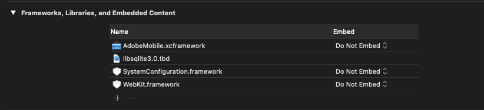

# Kernimplementatie en levenscyclus {#core-implementation-and-lifecycle}

Met deze informatie kunt u de iOS-bibliotheek implementeren en levenscyclusmetriek verzamelen, zoals opstarten, upgrades, sessies, betrokken gebruikers enzovoort.

## SDK {#section_99FE1A17A36D4A2C943939023CF6265C} downloaden

>[!IMPORTANT]
>
>Voor de SDK is iOS 8 of hoger vereist.

**Vereiste**

Voordat u de SDK downloadt, voert u de stappen in *Een rapportsuite maken* in [Core-implementatie en levenscyclus](/help/ios/getting-started/requirements.md) uit om een ontwikkelrapportsuite in te stellen en een vooraf ingevulde versie van het configuratiebestand te downloaden.

De SDK downloaden:

>[!IMPORTANT]
>
>Vanaf versie 4.21.0 wordt de SDK gedistribueerd via XCFrameworks. Volg onderstaande stappen als u 4.21.0 of hoger gebruikt.
>
>Versie 4.21.0 van de SDK vereist Xcode 12.0 of hoger en, indien van toepassing, Cocoapods 1.10.0 of hoger.

1. Download, decomprimeer het `[Your_App_Name_]AdobeMobileLibrary-4.*-iOS.zip`-bestand en controleer of de volgende softwarecomponenten in de map `AdobeMobileLibrary` staan:

   * `ADBMobile.h` - het objectc-headerbestand dat wordt gebruikt voor iOS SDK.
   * `ADBMobileConfig.json` - het SDK-configuratiebestand dat voor uw app is aangepast.
   * `AdobeMobile.xcframework` - bevat twee vetbinaire getallen, één voor iOS-apparaten (armv7, armv7, arm64) en simulatoren (i386, x86_64, arm64).

      Dit XCF-framework moet worden gekoppeld wanneer u zich richt op een iOS-app.

   * `AdobeMobileExtension.xcframework` - bevat twee vetbinaire getallen, één voor iOS-apparaten (armv7, armv7, arm64) en simulatoren (i386, x86_64, arm64).

      Dit XCFFramework moet worden gekoppeld wanneer u een iOS-extensie als doel instelt.

   * `AdobeMobileWatch.xcframework` - bevat twee vetbinaire getallen, elk voor watchOS-apparaten (arm64_32, armv7k) en simulatoren (i386, x86_64, arm64).

      Dit XCFFramework moet worden gekoppeld wanneer u zich richt op een Apple Watch (watchOS)-app.

   * `AdobeMobileTV.xcframework` - bevat twee vetbinaire getallen, elk voor tvOS-apparaten (arm64) en simulatoren (x86_64, arm64).

      Dit XCF-framework moet worden gekoppeld wanneer het programma is gericht op een Apple TV-app (tvOS).

>[!IMPORTANT]
>
>In versies ouder dan 4.21.0, wordt SDK verdeeld via binaire getallen. Voer de onderstaande stappen uit als u een versie ouder dan 4.21.0 gebruikt.

1. Download, decomprimeer het `[Your_App_Name_]AdobeMobileLibrary-4.*-iOS.zip`-bestand en controleer of u de volgende softwarecomponenten hebt:

   * `ADBMobile.h`, het objectc-headerbestand dat wordt gebruikt voor iOS AppMeasurement.
   * `ADBMobileConfig.json`, dit is het SDK-configuratiebestand dat voor uw app is aangepast.
   * `AdobeMobileLibrary.a`, een binaire bitcode met vet die de bibliotheekbuilds voor iOS-apparaten bevat (armv7, armv7s, arm64) en simulatoren (i386, x86_64).

      Dit binaire bestand met vet moet worden gekoppeld wanneer het doel is bedoeld voor een iOS-app.

   * `AdobeMobileLibrary_Extension.a`, een binaire bitcode met vet die de bibliotheekbuilds bevat voor iOS-apparaten (armv7, armv7s, arm64) en simulatoren (i386, x86_64).

      Dit binaire vet moet worden gekoppeld wanneer het doel is bedoeld voor een iOS-extensie.

   * `AdobeMobileLibrary_Watch.a`, een binaire bitcode met vet die de bibliotheekbuilds bevat voor Apple Watch devices (armv7k) en simulators (i386, x86_64).

      Dit binaire bestand met vet moet worden gekoppeld wanneer het doel is bedoeld voor een Apple Watch-extensie-app (watchOS 2).

   * `AdobeMobileLibrary_TV.a`, een binaire bitcode met vet die de bibliotheek bevat voor nieuwe Apple TV-apparaten (arm64) en simulator (x86_64).

      Dit binaire bestand met vet moet worden gekoppeld wanneer het doel is bedoeld voor een Apple TV-app (tvOS).

>[!IMPORTANT]
>
>Als u de SDK buiten de gebruikersinterface van de mobiele services van Adobe downloadt, moet het `ADBMobileConfig.json`-bestand handmatig worden geconfigureerd. Als u aan Analytics en Mobiele SDK nieuw bent, zie [Voor u ](/help/ios/getting-started/requirements.md) aan opstelling een reeks van het ontwikkelingsrapport en download een pre-bevolkte versie van het configuratiedossier begint.

## Voeg SDK en config dossier aan uw project {#section_93C25D893B4A4CD3B996CF3C5590C8DC} toe

1. Start de Xcode-IDE en open uw app.
1. In de Navigator van het Project, sleep de `AdobeMobileLibrary` omslag en laat vallen het onder uw project.
1. Controleer het volgende:

   * Het selectievakje **[!UICONTROL Copy Items if needed]** is ingeschakeld.
   * **[!UICONTROL Create groups]** is geselecteerd.
   * Geen enkel selectievakje in de sectie **[!UICONTROL Add to targets]** is geselecteerd.

   

1. Klik op **[!UICONTROL Finish]**.
1. In **[!UICONTROL Project Navigator]** selecteert u **`ADBMobileConfig.json`**.
1. Voeg in **[!UICONTROL File Inspector]** het JSON-bestand toe aan eventuele doelen in uw project die de Adobe SDK gebruiken.

   

1. Voer in **[!UICONTROL Project Navigator]** de volgende stappen uit:

   1. Klik op uw app.
   1. Selecteer op het tabblad **[!UICONTROL General]** uw doelen en koppel de vereiste frameworks en bibliotheken in de secties **[!UICONTROL Linked Frameworks]** en **[!UICONTROL Libraries]**.
   * **iOS App-doelen**
      * `SystemConfiguration.framework`
      * `WebKit.framework`
      * `libsqlite3.0.tbd`
      * `AdobeMobileLibrary.a`
      * `CoreLocation.framework` (optioneel, maar vereist voor geo-tracking-mogelijkheden)
   * **Doel iOS-extensie**

      * `SystemConfiguration.framework`
      * `libsqlite3.0.tbd`
      * `AdobeMobileLibrary\_Extension.a`
   * **Apple Watch (watchOS 2)-doel**

      * `libsqlite3.0.tbd`
      * `AdobeMobileLibrary\_Watch.a`
   * **Apple TV (tvOS)-doel**

      * `SystemConfiguration.framework`
      * `libsqlite3.0.tbd`
      * `AdobeMobileLibrary\_TV.a`

   >[!CAUTION]
   >
   > Als u meerdere `AdobeMobileLibrary*.a`-bestanden in hetzelfde doel koppelt, treedt onverwacht gedrag of de mogelijkheid om te bouwen op.

   >[!IMPORTANT]
   >
   > Als u versie 4.21.0 of hoger gebruikt, moet u ervoor zorgen dat de Adobe XCFrameworks niet zijn ingesloten.

   

1. Bevestig dat uw app zonder fouten wordt gemaakt.

## Levenscyclusmetriek implementeren {#section_532702562A7A43809407C9A2CBA80E1E}

>[!IMPORTANT]
>
>iOS verzendt levenscyclusinformatie met of zonder `collectlifecycledata` aan te roepen, en `collectlifecycledata` is slechts een manier om levenscyclus vroeger in de lanceringsopeenvolging van de toepassing in werking te stellen.

Nadat u de levenscyclus hebt ingeschakeld, wordt elke keer dat uw app wordt gestart, een hit verzonden om het starten, upgrades, sessies, betrokken gebruikers en andere [Levenscyclusmetriek](/help/ios/metrics.md) te meten.

Voeg een `collectLifecycleData`/ `collectLifecycleDataWithAdditionalData` vraag in `application:didFinishLaunchingWithOptions` toe:

```objective-c
- (BOOL)application:(UIApplication *)application didFinishLaunchingWithOptions:(NSDictionary *)launchOptions {
 [ADBMobile collectLifecycleData];
    return YES;
}
```

### Extra gegevens opnemen met levenscyclusaanroepen

Om extra gegevens met metrische vraag van de levenscyclus te omvatten, gebruik `collectLifecycleDataWithAdditionalData`:

>[!IMPORTANT]
>
>Alle gegevens die via `collectLifecycleDataWithAdditionalData:` aan de SDK worden doorgegeven, blijven in `NSUserDefaults` van de SDK bestaan. De SDK verwijdert de waarden in de parameter `NSDictionary` die niet tot de typen `NSString` of `NSNumber` behoren.

```objective-c
- (BOOL)application:(UIApplication *)application didFinishLaunchingWithOptions:(NSDictionary *)launchOptions {
    NSMutableDictionary *contextData = [NSMutableDictionary dictionary];
    [contextData setObject:@"Game" forKey:@"myapp.category"];
    [ADBMobile collectLifecycleDataWithAdditionalData:contextData];
    return YES;
}
```

De extra waarden van contextgegevens die met `collectLifecycleDataWithAdditionalData` worden verzonden moeten aan douanevariabelen in de Mobiele diensten van Adobe worden in kaart gebracht:


Andere levenscyclusmetriek worden automatisch verzameld. Zie [Levenscyclusmetriek](/help/ios/metrics.md) voor meer informatie.

## Volgende {#section_A24DC703359D4B5C8F493D6421306FD3}

Voer de volgende taken uit:

* [App-statussen bijhouden](/help/ios/analytics-main/states.md)
* [App-acties bijhouden](/help/ios/analytics-main/actions.md)
