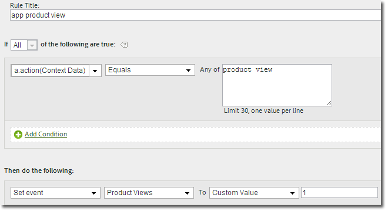

# Migreren naar de 4.x iOS-bibliotheek{#migrating-to-the-x-ios-library}

Met deze informatie kunt u migreren van versie 3.x of 2.x van de iOS-bibliotheek naar versie 4.x.

>[!IMPORTANT]
>
>De SDK gebruikt `NSUserDefaults` om gegevens op te slaan die nodig zijn voor het berekenen van unieke gebruikers, levenscyclusmetriek en andere gegevens met betrekking tot de belangrijkste SDK-functionaliteit.  Als u de waarden in `NSUserDefaults` die door de SDK worden verwacht, kan onverwacht gedrag leiden tot inconsistenties in de gegevens.

In versie 4.x van de SDK-bibliotheek van iOS worden de methoden public geconsolideerd in één header. De functionaliteit is nu ook toegankelijk via methoden op klasseniveau, zodat u geen aanwijzingen, instanties of singletons hoeft bij te houden.

## Gebeurtenissen, profielen en eVars {#section_76EA6F5611184C5CAE6E62956D84D7B6}

In versie 4 kunt u niet langer rechtstreeks in uw app variabelen zoals gebeurtenissen, eVars, props, haren en lijsten toewijzen. In plaats daarvan gebruikt de SDK contextgegevens en verwerkingsregels om uw toepassingsgegevens toe te wijzen aan analytische variabelen voor rapportage.

De verwerkingsregels bieden de volgende voordelen:

* U kunt de gegevenstoewijzing wijzigen zonder een update naar de App Store te verzenden.
* U kunt betekenisvolle namen voor gegevens gebruiken in plaats van het plaatsen van variabelen die voor een rapportreeks specifiek zijn.
* Het verzenden van extra gegevens heeft weinig effect.

   Deze waarden worden pas in rapporten weergegeven als ze met verwerkingsregels zijn toegewezen.

>[!TIP]
>
>Waarden die u rechtstreeks toewijst aan variabelen, moeten nu worden toegevoegd aan de `data` NSDictionary.

## Ongebruikte eigenschappen verwijderen {#section_145222EAA20F4CC2977DD883FDDBBFC5}

De nieuwe `ADBMobileConfig.json` Het bestand bevat toepassingsspecifieke, algemene instellingen en vervangt de meeste configuratievariabelen die in vorige versies werden gebruikt. Hier is een voorbeeld van een `ADBMobileConfig.json` bestand:

```js
{ 
    "version" : "1.0", 
    "analytics" : { 
        "rsids" : "coolApp", 
        "server" : "my.CoolApp.com", 
        "charset" : "UTF-8", 
        "ssl" : true, 
        "offlineEnabled" : true, 
        "lifecycleTimeout" : 5, 
        "privacyDefault" : "optedin", 
        "poi" : [ 
                    ["san francisco",37.757144,-122.44812,7000], 
                    ["santa cruz",36.972935,-122.01725,600] 
                ] 
    }, 
 "target" : { 
  "clientCode" : "myTargetClientCode", 
  "timeout" : 5 
 }, 
 "audienceManager" : { 
  "server" : "myServer.demdex.com" 
 } 
}
```


### Het configuratiebestand verplaatsen

Het configuratiebestand verplaatsen:

1. Verplaats de waarde die voor de variabele in de eerste kolom is ingesteld naar de variabele in de tweede kolom.
1. Verwijder de oude configuratievariabele uit uw code.

### Migratiegegevens

De volgende lijsten maken een lijst van de configuratievariabelen die u naar het configuratiedossier moet bewegen.

#### Migreren van versie 3.x

Verplaats de waarde van de eerste kolom naar de variabele in de tweede kolom.

| Configuratievariabele | Variabele in het dialoogvenster `ADBMobileConfig.json` file |
|--- |--- |
| offlineTrackingEnabled | &quot;offlineEnabled&quot; |
| offlineHitLimit | &quot;batchLimit&quot; |
| reportSuiteIDs | &quot;sids&quot; |
| trackingServer | &quot;server&quot; |
| charSet | &quot;charset&quot; |
| currencyCode | &quot;currency&quot; |
| ssl | &quot;ssl&quot; |
| linkTrackVars | Verwijderen, niet meer gebruikt. |
| linkTrackEvents | Verwijderen, niet meer gebruikt. |


#### Migreren van versie 2.x

Verplaats de waarde van de eerste kolom naar de variabele in de tweede kolom.

| Configuratievariabele | Variabele in het dialoogvenster `ADBMobileConfig.json` file |
|--- |--- |
| trackOffline | &quot;offlineEnabled&quot; |
| offlineLimit | &quot;batchLimit&quot; |
| account | &quot;sids&quot; |
| trackingServer | &quot;server&quot;, verwijdert u de `"https://"` voorvoegsel. Het protocolvoorvoegsel wordt automatisch toegevoegd op basis van de instelling &quot;ssl&quot;. |
| trackingServerSecure | Verwijderen. Voor veilige verbindingen definieert u &quot;server&quot; en schakelt u &quot;ssl&quot; in. |
| charSet | &quot;charset&quot; |
| currencyCode | &quot;currency&quot; |
| ssl | &quot;ssl&quot; |
| linkTrackVars | Verwijderen, niet meer gebruikt. |
| linkTrackEvents | Verwijderen, niet meer gebruikt. |
| timestamp | Verwijderen, niet meer configureerbaar. |
| dc | Verwijderen, niet meer gebruikt. |
| userAgent | Verwijderen, niet meer configureerbaar. |
| dynamicVariablePrefix | Verwijderen, niet meer gebruikt. |
| visitorNamespace | Verwijderen, niet meer gebruikt. |
| usePlugins | Verwijderen, niet meer gebruikt. |
| useBestPractices alle aanroepen naar churn measurement ( getChurnInstance ) | Verwijderen, vervangen door levenscyclusmetriek. Zie voor meer informatie [Levenscycluscijfers](/help/ios/metrics.md). |


## Trackaanroepen en trackingvariabelen bijwerken {#section_96E7D9B3CDAC444789503B7E7F139AB9}

In plaats van de webfocus te gebruiken `track` en `trackLink` vraag, gebruikt versie 4 SDK de volgende methodes:

* `trackState:data:` statussen zijn de weergaven die beschikbaar zijn in uw app, zoals `home dashboard`, `app settings`, `cart`, enzovoort.

   Deze statussen lijken op pagina&#39;s op een website, en `trackState` roept stijgende paginameningen.

* `trackAction:data:` acties, zoals `logons`, `banner taps`, `feed subscriptions`en andere meetgegevens die in uw app voorkomen en die u wilt meten.

De `data` parameter voor beide methoden is een `NSDictionary` die naam-waardeparen bevat die als contextgegevens worden verzonden.

### Gebeurtenissen, profielen, variabelen

In versie 4 kunt u niet langer rechtstreeks in uw app variabelen zoals gebeurtenissen, eVars, props, haren en lijsten toewijzen. De SDK gebruikt nu contextgegevens en verwerkingsregels om uw toepassingsgegevens toe te wijzen aan analytische variabelen voor rapportage.

De verwerkingsregels bieden de volgende voordelen:

* U kunt de gegevenstoewijzing wijzigen zonder een update naar de App Store te verzenden.
* U kunt betekenisvolle namen voor gegevens gebruiken in plaats van het plaatsen van variabelen die voor een rapportreeks specifiek zijn.
* Het verzenden van extra gegevens heeft weinig effect.

   Deze waarden worden pas in rapporten weergegeven als ze met verwerkingsregels zijn toegewezen. Zie voor meer informatie [Verwerkingsregels en contextgegevens](/help/ios/getting-started/proc-rules.md).

Waarden die u rechtstreeks aan variabelen hebt toegewezen, moeten worden toegevoegd aan de `data` `NSDictionary` in plaats daarvan. Dit betekent dat `setProp`, `setEvar`en de toewijzingen aan permanente contextgegevens moeten allemaal worden verwijderd en de waarden moeten worden toegevoegd aan de `data` parameter.

### AppSection/Server, GeoZip, transactie-id, Campaign en andere standaardvariabelen

De gegevens die u op het meetobject instelde, inclusief de hierboven vermelde variabelen, moeten worden toegevoegd aan de `data` `NSDictionary` in plaats daarvan. De enige gegevens die met een `trackState` of `trackAction` de vraag is de lading in `data` parameter.

### Trackingaanroepen vervangen

Vervang in uw code de volgende methoden door een aanroep van `trackState` of `trackAction`:

#### Migreren van versie 3.x

* `trackAppState (trackState)`
* `trackEvents (trackAction)`
* `track (trackAction)`
* `trackWithContextData (trackAction)`
* `trackLinkURL (trackAction)`

#### Migreren van versie 2.x

* `track (trackState)`
* `trackLink (trackAction)`

## Aangepaste bezoeker-id {#section_2CF930C13BA64F04959846E578B608F3}

Vervang de `visitorID` variabele met een aanroep van `setUserIdentifier:`.

## Offline bijhouden {#section_5D4CD8CD1BE041A79A8657E31C0D24C6}

Offline bijhouden is ingeschakeld in het dialoogvenster `ADBMobileConfig.json` en alle andere offlineconfiguratie wordt automatisch uitgevoerd.

In uw code, verwijder vraag aan de volgende methodes:

### Versie 3.x

* `setOnline`
* `setOffline`

### Versie 2.x

* `forceOffline`
* `forceOnline`

## Variabele voor producten {#section_AFBA36F3718C44D29AF81B9E1056A1B4}

Aangezien de productvariabele niet beschikbaar is in verwerkingsregels, kunt u de volgende syntaxis gebruiken om `products`:

```objective-c
//create a processing rule to set the corresponding product event. 
// for example, set prodView event when context data a.action = "product view" 
[ADBMobile trackAction:@"LikeButtonClicked"  
                  data:@{@"&&products" : @";Cool Shoe"}];
```


