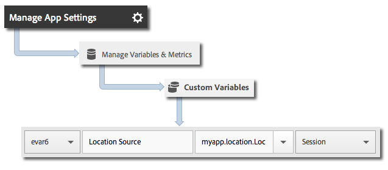

# Geolocatie en aandachtspunten {#geo-location-and-points-of-interest}

Geo-location helpt u locatiegegevens te meten door breedte- en lengtegegevens en vooraf gedefinieerde interessepunten te gebruiken in uw iOS-apps.

Elke `trackLocation` vraag verzendt het volgende:

* Breedtegraad, lengtegraad en locatie in een interessant punt (POI) dat is gedefinieerd in mobiele Adobe-services.

   Deze informatie wordt doorgegeven aan mobiele oplossingvariabelen voor automatische rapportage.

* Afstand van middelpunt en nauwkeurigheid die als contextgegevens worden doorgegeven.

   Deze variabelen worden niet automatisch vastgelegd. U moet deze variabelen van contextgegevens in kaart brengen door de instructies in *Verzendend Extra Gegevens* hieronder sectie te gebruiken.

## Dynamische POI-updates {#section_3747B310DD5147E2AAE915E762997712}

Vanaf versie 4.2 worden POI&#39;s gedefinieerd in de Adobe Mobile-interface en dynamisch gesynchroniseerd met het configuratiebestand van de app. Voor deze synchronisatie is een `analytics.poi`-instelling in het `ADBMobile.json`-bestand vereist:

```js
"analytics.poi": "https://assets.adobedtm.com/…/yourfile.json",
```

Zie [ADBMobile JSON Config](/help/ios/configuration/json-config/json-config.md) voor meer informatie.

Als dit niet wordt gevormd, moet een bijgewerkte versie van het `ADBMobile.json` dossier worden gedownload en aan uw app worden toegevoegd. Zie *Download de SDK en de testtools* in [Voor u start](/help/ios/getting-started/requirements.md) voor meer informatie en instructies.

## Go-locaties en POI&#39;s volgen {#section_B1616E400A7548F9A672F97FEC75AE27}

1. Voeg de bibliotheek aan uw project toe en implementeer levenscyclus.

   Zie *SDK en configuratiebestand toevoegen aan uw project* in [Core-implementatie en LiveCycle](/help/ios/getting-started/dev-qs.md) voor meer informatie.
1. De bibliotheek importeren:

   ```objective-c
   #import "ADBMobile.h"
   ```

1. Roep `trackLocation` aan om de huidige locatie bij te houden:

   ```objective-c
   CLLocation *currentLocation = location; 
   [ADBMobile trackLocation: currentLocation data: nil]; 
   ```

   >[!TIP]
   >
   >U kunt `trackLocation` op elk ogenblik roepen.

   Om de plaats te bepalen die tot `trackLocation` vraag wordt overgegaan, gebruik [het krijgen van de Plaats van de Gebruiker](https://developer.apple.com/Library/ios/documentation/UserExperience/Conceptual/LocationAwarenessPG/CoreLocation/CoreLocation.html).

Als bovendien wordt bepaald dat de locatie zich in een gedefinieerde POI-straal bevindt, wordt een contextgegevensvariabele `a.loc.poi` verzonden met de hit `trackLocation` en wordt deze als een POI gerapporteerd in Locatierapporten. Een contextvariabele `a.loc.dist` wordt ook verzonden met de afstand in meters van de gedefinieerde coördinaten.

## Extra gegevens verzenden {#section_3EBE813E54A24F6FB669B2478B5661F9}

Naast de locatiegegevens kunt u aanvullende contextgegevens verzenden bij elke aanroep van de tracklocatie:

```objective-c
NSMutableDictionary *contextData = [NSMutableDictionary dictionary]; 
[contextData setObject:@"GPS" forKey:@"myapp.location.LocationSource"]; 
[ADBMobile trackLocation: currentLocation data:contextData];
```

Contextgegevenswaarden moeten worden toegewezen aan aangepaste variabelen:



## Locatiecontextgegevens {#section_FFB71E6653F9410A89CC6ACC0C9164A9}

De breedte en lengte worden elk verzonden gebruikend drie verschillende parameters van contextgegevens, met elke parameter die een verschillend niveau van precisie vertegenwoordigt, voor een totaal van zes parameters van contextgegevens.

De coördinaten lat = 40,93231, lon = -111,93152 vertegenwoordigen bijvoorbeeld een locatie met een precisie van 1 m. Deze locatie wordt gesplitst op basis van het precisieniveau in de volgende variabelen:

* `a.loc.lat.a`= 040,9
* `a.loc.lat.b` = 32
* `a.loc.lat.c` = 31
* `a.loc.lon.a` = -111,9
* `a.loc.lon.b` = 31
* `a.loc.lon.c` = 52

Sommige precisieniveaus worden weergegeven als &quot;00&quot;, afhankelijk van de nauwkeurigheid van de huidige locatie. Als de locatie bijvoorbeeld momenteel nauwkeurig is tot 100 m, worden `a.loc.lat.c` en `a.loc.lon.c` gevuld met &quot;00&quot;.

## Aanvullende informatie {#section_931AC1E0D88147E29FE1B6E3CC1E9550}

De volgende informatie onthouden:

* Een `trackLocation` verzoek verzendt in het equivalent van een `trackAction` vraag.

* POIs wordt niet overgegaan als deel van normale `trackAction` en `trackState` vraag, zodat moet u een `trackLocation` vraag gebruiken om POIs te volgen.

* `trackLocation` zo vaak als nodig moet worden opgeroepen om de locatie en de lokalen te volgen.

   We raden u aan `trackLocation` aan te roepen wanneer de app start en vervolgens naar wens op basis van de vereisten van de toepassing.

* POI&#39;s worden alleen gevuld nadat ze zijn gedefinieerd in het configuratiebestand van de app.

   Zij worden niet toegepast op historische `trackLocation` vraag die eerder werden verzonden.
* `trackLocation` vraag steun verzendend extra contextgegevens gelijkend op  `trackAction` vraag.

* Wanneer twee POIs overlappende diameters hebben, wordt eerste POI die de huidige plaats bevat gebruikt.

   Als uw POIs overlappen, zou u POIs in orde van het meest korrelige aan minst korrelig moeten opsommen om ervoor te zorgen dat de korrelbelangrijkste POI wordt gemeld.
