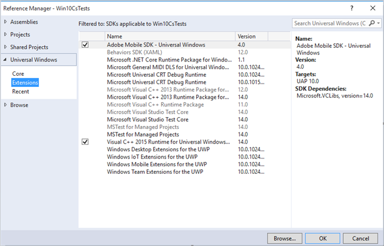

# Windows Visual Studio-extensies voor Experience Cloud Solutions 4.x SDK {#windows-visual-studio-extensions-for-experience-cloud-solutions-x-sdk}

Deze extensie biedt een veel eenvoudigere manier om de referentie van de Windows SDK van Experience Cloud Solutions 4.x in uw project toe te voegen.

## De bibliotheek van GitHub installeren {#section_F55DB6241EF1475286C05FEAEBF996A3}

1. Download de universele SDK van Vensters van [GitHub](https://github.com/Adobe-Marketing-Cloud/mobile-services/releases).
1. Pak het gedownloade bestand lokaal uit.
1. Dubbelklik op het bestand **[!UICONTRTOL ADBMobileUniversalWindowsVSIX.vsix]** om het installatieprogramma te openen.
1. Selecteer **[!UICONTROL Global Location]** en installeer de bibliotheek.

## Referenties toevoegen aan uw project {#section_00C14FE9243D4330BE1F4BB56FCF08B1}

1. Open uw Windows 10-project.
1. Open het dialoogvenster Reference Manager.

   

1. Zoek op het **[!UICONTROL Extensions]** tabblad de Adobe Mobile SDK van **[UICONTROL en selecteer deze]**.
1. Klik **[!UICONTROL OK]** om het op te slaan.

   De Adobe Mobile SDK wordt toegevoegd aan uw project. Als het **[UICONTROL Microsoft Visual C++ Runtime]** pakket nog niet is toegevoegd, zal dit pakket ook aan uw project worden toegevoegd.

1. Selecteer in Configuratiebeheer een platformtype en begin met het testen van de app.

