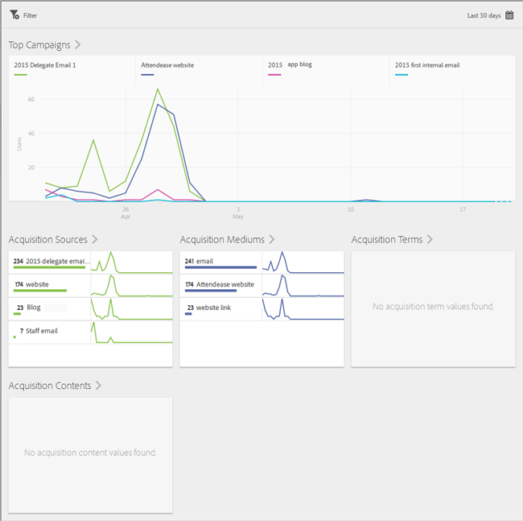
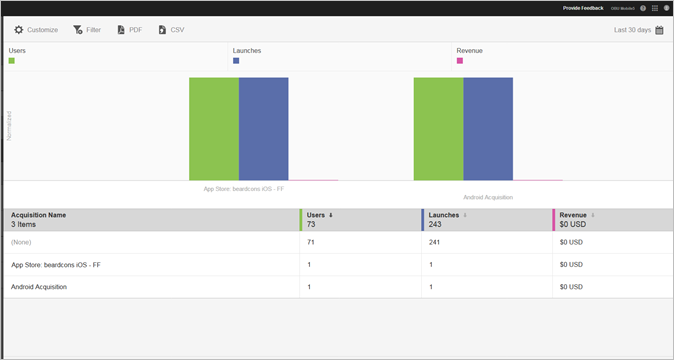

# Acquisitie {#acquisition}

Marketers kunnen koppelingen voor bijhouden maken om hun apps te promoten en het verkeer naar hun apps te sturen. Met deze koppelingen kunnen gebruikers naar App-winkels, diepgaande koppelingen naar apps en interstitials gaan werken. Deze koppelingen kunnen worden gecorreleerd aan het gedrag in de app. Een markeerteken kan één koppeling maken om gebruikers naar iOS, Android of andere platforms te leiden, al naar gelang wat van toepassing is.

## Nieuwe Adobe Experience Cloud SDK-release

Op zoek naar informatie en documentatie met betrekking tot de Adobe Experience Platform Mobile SDK? Klik [hier](https://aep-sdks.gitbook.io/docs/) voor onze recentste documentatie.

Vanaf september 2018 hebben we een nieuwe, grote versie van de SDK uitgebracht. Deze nieuwe Adobe Experience Platform Mobile SDK&#39;s kunnen worden geconfigureerd via [Experience Platform Launch](https://www.adobe.com/experience-platform/launch.html).

* Ga om aan de slag te gaan naar [Launch](https://launch.adobe.com/).
* Ga naar [Github om te zien wat er in de SDK-opslagruimten van het Experience Platform staat: Adobe Experience Platform SDKs](https://github.com/Adobe-Marketing-Cloud/acp-sdks).

>[!IMPORTANT]
>
> Als u Adobe Experience Platform Mobile SDKs met de Lancering van de Adobe gebruikt, **must** ook installeert de uitbreiding van de Diensten van Adobe Analytics Mobile om de eigenschappen van de Diensten van de Mobiele Adobe te gebruiken zoals de Verbindingen van de Aankoop. Zie [Adobe Analytics - Mobile Services](https://aep-sdks.gitbook.io/docs/using-mobile-extensions/adobe-analytics-mobile-services) voor meer informatie. Voor meer informatie over het gebruiken van de Verbindingen van de Aankoop en van de Marketing met Experience Cloud SDKs, zie [Aankoop en de Aankoop Verbindingen](https://aep-sdks.gitbook.io/docs/using-mobile-extensions/adobe-analytics-mobile-services#acquisition-and-marketing-links).

>[!IMPORTANT]
>
>Hoewel u eigenschappen in UI kunt vormen, zullen deze eigenschappen niet werken tot u het geproduceerde configuratiedossier downloadt en dit dossier aan SDK toevoegt. Zie de sectie *SDK-documentatie* op deze pagina voor informatie over het downloaden en configureren van SDK&#39;s.)

U kunt rapporten maken, bewerken, beheren en weergeven over trackable mobile app Marketing Links.

>[!TIP]
>
>Voor deze functionaliteit zijn de Adobe Analytics - Mobile Apps of de Adobe Analytics Premium SKU vereist.

De volgende rapporten van de Aankoop verstrekken inzicht in hoe uw Verbindingen van de Marketing presteren:

* **Overzicht** {#section_5B2BA47F22694919A472AB591101237E}

   In dit rapport worden de belangrijkste campagnes weergegeven die gebruikers naar uw app hebben geleid met informatie over hoe de campagnes werden uitgevoerd met andere volgende metagegevens, zoals de aankoopbron, de middellange, lange en korte termijn.

   

* **Koppelingsrapport** {#section_A23A640C363B43569D9D484CF49EA277}

   Dit rapport bevat een gerangschikte weergave van de prestaties van je marketingkoppelingen. Naast het zien van uw verbindingsnamen met zeer belangrijke prestatiesmetriek, is dit rapport ook klantgericht. Zie [Rapporten aanpassen](/help/using/usage/reports-customize/t-reports-customize.md) voor meer informatie.

   De volgende informatie onthouden:

   * U kunt op de pijlpictogrammen in de kolomkoppen klikken om de gegevens in oplopende of aflopende volgorde te sorteren.
   * Als u de gegevens naar een PDF-document wilt exporteren, klikt u op **[!UICONTROL Download]**.
   
