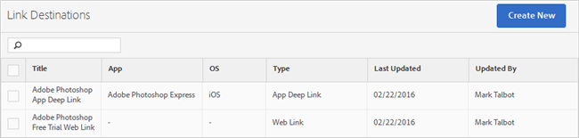

# Verbindingsdoelen maken en beheren{#create-and-manage-link-destinations}

Op de Manage pagina van de Doelen van de Verbinding, kunt u verbindingsbestemmingen tot stand brengen uitgeven, archiveren/unarchiveren, en schrappen. Deze doelen kunnen inline worden genoemd wanneer u marketingkoppelingen, pushberichten of in-app-berichten maakt.

Om de Manage pagina van de Doelen van de Verbinding te tonen:

1. Klik in het navigatiemenu links op **[!UICONTROL Manage Apps]**.
1. Klik op de naam van de app om de bijbehorende pagina App Information weer te geven.
1. Klik in de rechterbovenhoek op **[!UICONTROL Manage Link Destinations]**.

De pagina van de Doelen van de Verbinding toont uw verbindingsbestemmingen en verstrekt opties om tot stand te brengen, te archiveren, unarchive, uit te geven, en verbindingsbestemmingen te schrappen.

Bijvoorbeeld:

