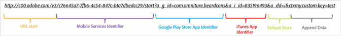
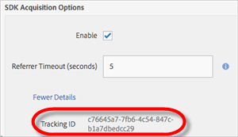

# Handmatig verwervingskoppelingen maken {#create-acquisition-link-manually}

U kunt marketingkoppelingen maken om nieuwe gebruikers van mobiele apps direct aan te schaffen door de URL-parameters handmatig te configureren.

>[!IMPORTANT]
>
>Voor deze functie is SDK-versie 4.6 of hoger vereist. Zie [Verwervingsvoorwaarden](/help/using/acquisition-main/c-acquisition-prerequisites.md) voor meer informatie.

Het volgende diagram illustreert de componenten van een manueel gebouwde het volgen verbinding en toont de verschillende parameters URL die u moet behoorlijk vormen wanneer manueel het creëren van verwervingsverbindingen.

Deze koppeling is geconfigureerd voor het uitvoeren van een platformspecifieke omleiding naar de Google Play-winkel of de Apple App Store voor een mobiele app. Als de bestemming niet kan worden bepaald, is de standaardwinkel ingesteld op de Apple App Store. Nadat de app is geïnstalleerd, wordt de aangepaste contextsleutel `my.custom.key:test` toegevoegd aan de installatiepunt voor analysemogelijkheden.

Gebruik de volgende URL-indeling om handmatig koppelingen te maken:

`http(s)://c00.adobe.com/v3/ {mobile-services-app-hash}/start? {parameters}`

>[!TIP]
>
>De versie van de Android-SDK die u gebruikt, heeft geen invloed op dit proces.

Voor iOS dient u het juiste protocol te gebruiken:

* Gebruik **HTTP** als u de iOS SDK&#39;s vóór versie 4.7.0 gebruikt, of als u iOS SDK 4.7.0 of hoger gebruikt en als **[!UICONTROL Use HTTPS]** **not** is geselecteerd op de pagina App Settings.
* Gebruik **HTTPS** als u iOS SDK 4.7.0 of later gebruikt en **[!UICONTROL Use HTTPS]** **is** geselecteerd op de pagina Toepassingsinstellingen beheren.

Wanneer aan de volgende voorwaarden is voldaan:

* `{mobile-services-app-hash}` komt overeen met de toepassings-id in het  `acquisition:appid ` configuratiebestand.

   U vindt `{mobile-services-app-hash}` op de pagina Toepassingsinstellingen beheren onder Opties voor ophalen van SDK in het veld Id bijhouden.

   

* `{parameters}` is een lijst van standaard specifiek genoemde URL vraagparameters.

Hier volgt een lijst met parameters:

* **`a_g_id`**

   Google Play Store App Identifier.

   * Samplewaarde: `com.adobe.beardcons`

* **`a_g_lo`**

   Lokale overschrijving in Google Play Store.

   * Samplewaarde: `ko`

* **`a_i_id`**

   iTunes App Identifier.

   * Samplewaarde: `835196493`

* **`a_i_lo`**

   Landinstelling iTunes overschrijven.

   * Samplewaarde: `jp`

* **`a_dd`**

   Standaardwinkel voor automatische omleiding.

   * Samplewaarde: `i | g`

* **`a_cid`**

   Aangepaste id overschrijven (meestal IDFA voor iOS of ADID voor Android).

   * Samplewaarde: `Any String < 255 characters (UTF-8 encoded)`

* **`ctx*`**

   Toetsen die met `ctx` zijn voorafgegaan, bevinden zich in de contextgegevens van de resulterende hit bij starten.

   * Samplewaarde: `ctxmy.custom.key=myValue`

* **`ctxa.referrer.campaign.name`**

   Naam van verwervingscampagne.

   Deze parameter is vereist voor rapportage als u de prestaties van verschillende verwervingskoppelingen wilt vergelijken.

   * Samplewaarde: Conferentie van de Top van 2015

* **`ctxa.referrer.campaign.trackingcode`**

   Trackingcode

   Deze parameter is vereist voor rapportage als u de prestaties van verschillende verwervingskoppelingen wilt vergelijken.

   * Samplewaarde: `lexsxouj`

* **`ctxa.referrer.campaign.source`**

   De bron.

   * Samplewaarde: Advertentienetwerk

* **`ctxa.referrer.campaign.medium`**

   Normaal

   * Samplewaarde: E-mail

* **`ctxa.referrer.campaign.content`**

   Inhoud

   * Samplewaarde: Afbeeldingsnummer 325689

* **`ctxa.referrer.campaign.term`**

   Term

   * Samplewaarde: wandelschoenen

Houd rekening met de volgende informatie wanneer u handmatig verwervingskoppelingen maakt:

* Alle parameters die niet overeenkomen met parameters in de tabel worden doorgegeven als onderdeel van de omleiding van de App Store.
* Alle parameters zijn technisch facultatief, hoewel de verbinding niet functioneel zal zijn, als minstens één opslagidentiteitskaart wordt gespecificeerd.

   Een voorbeeld van een opslag-id is `a_g_id`/ `a_i_id`.

* Als de bestemmingsopslag niet automatisch kan worden bepaald, en geen gebrek wordt verstrekt, is een fout 404 teruggekeerd.
