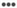

# Marketing-koppelingen maken of bewerken{#create-or-edit-marketing-links}

U kunt marketingkoppelingen maken of bewerken om deze diepgaand te koppelen aan uw mobiele app of uw website. Zie Universele koppelingen van [Apple en Android App-koppelingen](/help/using/c-manage-app-settings/c-mob-confg-app/c-universal-app-links.md)voor meer informatie.

1. Vouw in uw app in het navigatievenster aan de linkerkant uit **[!UICONTROL Acquisition]** en klik op **[!UICONTROL Marketing Link Builder]**.
1. Voer een van de volgende taken uit:

   * Als u een marketingkoppeling wilt maken, klikt u **[!UICONTROL Create New]** op.
   * Als u een koppeling wilt bewerken, klikt u op de naam van de koppeling in de **[!UICONTROL Title]** kolom.

1. Typ gegevens in de volgende velden:

   * **[!UICONTROL Marketing Link Name]**:

      (**Vereist**) Geef een beschrijvende naam op voor uw marketingkoppeling. De naam wordt alleen weergegeven op de pagina Marketing Links in de gebruikersinterface van Adobe Mobile Services. Een beschrijvende naam helpt u of anderen in uw organisatie snel een specifieke koppeling te vinden en kan inzicht verschaffen in het doel ervan.

   * **[!UICONTROL Unique Tracking Code]**:

      (**Vereist**) Geef de gewenste trackingcode op of klik op het pictogram genereren) om een nieuwe trackingcode te maken. U kunt rapporten weergeven waarin gedetailleerd gebruik wordt gemaakt van de trackingcode.

   * **[!UICONTROL Add Tracking Context Data]**:

      (**Optioneel**) Klik op het **[!UICONTROL +]** pictogram en typ de relevante informatie om uw campagne bij te houden met gebruik van contextgegevens. Selecteer een vooraf ingestelde tag of een van uw eigen tags in de **[!UICONTROL Custom Context Data]** vervolgkeuzelijst. De gegevens van de context worden gebruikt voor het melden wanneer de Verbinding van de Marketing wordt opgesteld.

      De volgende labels met voorinstellingen zijn beschikbaar:

      * **Aangepaste contextgegevens** Geef de sleutel en waarde op. Als u aangepaste contextgegevens toevoegt, moet u een verwerkingsregel maken. Zie Overzicht [van](https://docs.adobe.com/content/help/en/analytics/admin/admin-tools/processing-rules/processing-rules.html)verwerkingsregels voor meer informatie.

      * **Bron** Geef de oorspronkelijke referentie op, bijvoorbeeld &quot;nieuwsbrief&quot; of &quot;homepage&quot;.

      * **Normaal** Geef het marketingmedium op, bijvoorbeeld &#39;&#39;banner&#39;&#39; of &#39;&#39;email&#39;&#39;.

      * **Inhoud** Geef de naam of id van de advertentie op met de koppeling.

      * **Term** Geef betaalde voorwaarden of andere zoektermen voor de advertentie op.
1. Klik op **[!UICONTROL Save]**.
1. Typ gegevens in de volgende velden:

   * **(Vereist)** Geef in **[!UICONTROL Fallback URL]** op naar welke URL gebruikers worden geleid wanneer een doel niet kan worden gevonden (bijvoorbeeld als de gebruiker zich op een bureaublad of een ander platform bevindt dat niet overeenkomt met een doelregel).
   * Selecteer **[!UICONTROL Marketing Link Options]** of **[!UICONTROL Interstitials]** **[!UICONTROL Universal and App Links]**.

      Zie [Interstitiële](/help/using/acquisition-main/c-marketing-links-builder/t-create-edit-adobe-links/t-interstitials.md) of [Apple Universal Links en Android App Links](/help/using/c-manage-app-settings/c-mob-confg-app/c-universal-app-links.md)voor meer informatie.

   * **(Voorwaardelijk)** Als **[!UICONTROL Universal or App Links]** deze optie is geselecteerd, kunnen gebruikers in **[!UICONTROL Custom Path]** het domein het URL-pad na het domein definiëren met een willekeurige queryparameter. Zie Universele koppelingen van [Apple en Android App-koppelingen](/help/using/c-manage-app-settings/c-mob-confg-app/c-universal-app-links.md)voor meer informatie.

1. Klik **[!UICONTROL Edit Deep Link Interstitial]** en vorm de verbinding.

   (**Optioneel**) Wanneer er meerdere doelen zijn, kunnen gebruikers worden gerouteerd, afhankelijk van het feit of ze een mobiele toepassing hebben geïnstalleerd. Als de app is geïnstalleerd, wordt een tijdelijke bestemmingspagina weergegeven.

   Zie [Interstitials](/help/using/acquisition-main/c-marketing-links-builder/t-create-edit-adobe-links/t-interstitials.md)voor meer informatie.

1. Klik **[!UICONTROL Save]** en klik **[!UICONTROL Next]**.
1. In de pagina van de Bestemming, vorm de verbinding.

   1. Klik op het **[!UICONTROL Decision]** pictogram () en selecteer een van de volgende beslissingslocaties:

      * **[!UICONTROL Add Decision]**
      * **[!UICONTROL Add Path]**
   1. Als u **[!UICONTROL Add Decision]** deze optie hebt geselecteerd, selecteert u een van de volgende beslissingstypen:

      * **[!UICONTROL Operating Decision]**

         Tot de ondersteunde besturingssystemen behoren iOS, Android, AMX enzovoort.

      * **[!UICONTROL Device Type]**

         Tot de apparaattypen behoren apparaten zoals desktops, lezers, spelconsoles, mobiele telefoons, set top boxes enzovoort.
   1. Klik op het **[!UICONTROL Destination]** pictogram (  ) en selecteer een van de volgende doeltypen:

      * **[!UICONTROL App Store]**
      * **[!UICONTROL Web Link]**
      * **[!UICONTROL App Deep Link]**
      * **[!UICONTROL Hybrid Link]**

      >[!TIP]
      >
      >Wanneer u het **[!UICONTROL Web Link]** doeltype gebruikt met een koppeling naar de App Store, wordt de overname niet bijgehouden. Om verwervingen te volgen, gebruik het **[!UICONTROL App Store]** bestemmingstype.

      Voor meer informatie, zie een nieuwe [verbindingsbestemming](/help/using/acquisition-main/c-manage-link-destinations/t-create-new-app-deep-link-destination.md)creëren.

1. Als u de marketingkoppeling wilt opslaan, klikt u op  en vervolgens op **[!UICONTROL Save]**.
