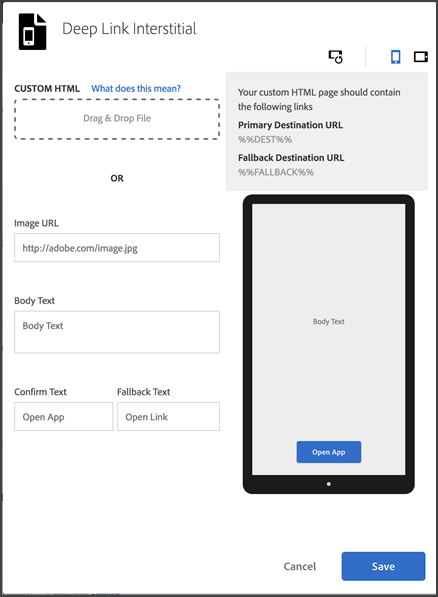

# Verspreide advertenties{#interstitials}

U kunt gebruikers naar een bestemming leiden afhankelijk van het feit of ze de app hebben geïnstalleerd (een koppeling om de app te verkennen) of niet (naar een website of een App Store). De keus van het verpletteren wordt het best verlaten aan gebruikers. De verkopers kunnen gebruikerskeuzen verstrekken door een interstitiële pagina te vormen die gebruikers de beschikbare landingsbestemmingen toont.

Om een interval te vormen wanneer het creëren van een Verbinding van de Marketing:

1. Klik op **[!UICONTROL Edit Deep Link Interstitial]**.

   

1. Typ gegevens in de volgende velden:

   * **[!UICONTROL Custom HTML]**

      Selecteer uw aangepaste interstitiële HTML-pagina.

      Door aangepaste interstitiële opvoerpagina&#39;s te gebruiken, kunnen marketers interstitiële opvoerpagina&#39;s aanpassen met aangepaste HTML/CSS/JS, waarmee u uw pagina&#39;s kunt markeren.

      Hier volgen de vereisten voor de HTML-pagina:

      * Dit moet een HTML-bestand zijn.
      * Moet de plaatsaanduidingen `%%DEST%%` en `%%FALLBACK%%` bevatten.
      * De geüploade HTML wordt weergegeven in een `<iframe>`.

         U moet ervoor zorgen dat uw koppelingsdoelstellingen naar een oudervenster richten. U kunt `<base target="_parent" />` in `<head>` of een doelbezit voor elk `<a/>` individueel specificeren.

         >[!TIP]
         >
         >Als u aangepaste HTML uploadt, worden de andere vier opties in deze tabel alleen gebruikt als u het geüploade bestand verwijdert.
   * **[!UICONTROL Image URL]**

      Geef de URL voor een afbeeldingselement op.

   * **[!UICONTROL Body Text]**

      Geef de hoofdtekst voor het interstitiële object op.

   * **[!UICONTROL Confirm Text]**

      Geef de tekst voor de tekstknop op.

   * **[!UICONTROL  Fallback Text]**

      Geef de fallback-tekst op die u wilt weergeven.

      In dit veld wordt de tekstknop bijgewerkt als een diepe koppeling mislukt. Gebruikers wordt gevraagd de diepe koppeling uit te proberen voordat ze naar een andere optie kunnen terugvallen. Een fallback kan bijvoorbeeld naar een App Store zijn om de app te downloaden en installeren of om gebruikers naar de website van het bedrijf te brengen. De fallback-tekst laat gebruikers weten dat er een andere optie beschikbaar is als de deep link mislukt.

1. (**Optioneel**) Klik op de pictogrammen boven de afbeelding om te zien hoe de interstitiële vormgeving is geroteerd en op verschillende apparaten.

   U kunt de afbeelding buiten Mobile Services wijzigen of bewerken om ervoor te zorgen dat de afbeelding in verschillende situaties correct wordt weergegeven.
1. Klik op **[!UICONTROL Save]**.
