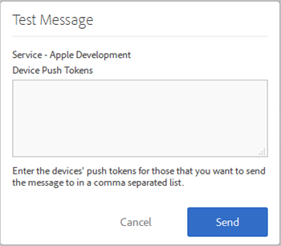

# Vereisten om pushberichten in te schakelen {#prerequisites-to-enable-push-messaging}

U moet deze taken voltooien alvorens pushberichten in uw toepassingen te vormen.

## De Experience Cloud voor uw bedrijf inschakelen

Uw Adobe Analytics Company moet Experience Cloud toegelaten zijn. U kunt de status verifiëren van uw Adobe-accountmanager.

## De mobiele SDK installeren en configureren

* **De mobiele SDK installeren**

   Als u pushberichten wilt configureren, moet u ten minste versie 4.6 of hoger van de Mobile SDK downloaden en installeren. Zie [SDK&#39;s downloaden](/help/using/c-manage-app-settings/c-mob-confg-app/t-config-analytics/download-sdk.md) voor meer informatie.

* **Pushservices configureren**

   U moet de pushservices configureren in de Mobile SDK.
Zie de volgende inhoud voor meer informatie:

   * [Push Messaging in Android](/help/android/messaging-main/push-messaging/push-messaging.md)
   * [Push Messaging in iOS](/help/ios/messaging-main/push-messaging/push-messaging.md)

## Meld u aan bij de Mobile Core Service met uw Adobe ID

>[!IMPORTANT]
>
>Om de functionaliteit van de Diensten van de Duw te gebruiken moeten de gebruikers zich bij de Mobiele Dienst van de Kern aanmelden door hun Adobe ID te gebruiken en hun account van de Analytics moet met hun Adobe IDs worden verbonden. De functie Push Services is niet beschikbaar als gebruikers zich aanmelden met hun bestaande Adobe Analytics-accounts.

Voer de volgende stappen uit als gebruikers geen Adobe-id hebben:

1. (**Experience Cloud Beheerder**) Vraag gebruikers aan de Experience Cloud uit.

1. (**Gebruiker**) creeer een persoonlijke Adobe ID gebruikend de instructies die u van de beheerder van de Experience Cloud ontving.

   Er wordt automatisch een e-mailbericht verzonden naar elke gebruiker nadat de beheerder de vorige stap heeft voltooid.

1. (**Users**) Meld u aan bij Mobile met hun Adobe ID.

## Gebruikersaccounts koppelen in de Experience Cloud

Elke gebruiker moet de de oplossingsrekening van Analytics van de organisatie van Experience Cloud verbinden.

1. Meld u aan bij [Adobe Experience Cloud](https://experience.adobe.com) met een Adobe ID.

1. Selecteer in de rechterbovenhoek de bedrijfsnaam Analytics.

1. Klik **[!UICONTROL Add Organization]** en selecteer **[!UICONTROL Adobe SiteCatalyst/Adobe Social]** van de drop-down lijst.

1. Typ de bedrijfsnaam, uw gegevens van oudere versies voor het opgegeven bedrijf en klik op **[!UICONTROL Link Account]**.

   De Adobe ID is nu gekoppeld aan uw aanmeldingsgegevens voor uw account, bedrijf en account voor Analytics.

Voor meer informatie, zie [Organisaties in de Experience Cloud](https://experienceleague.adobe.com/docs/core-services/interface/administration/organizations.html) in de gids van de Componenten van de Interface van de Experience Cloud Central.

## Pushservices en de SDK ID-service configureren in de mobiele gebruikersinterface

Voordat u de id-service voor uw app inschakelt, is de sectie **[!UICONTROL Push Services]** uitgeschakeld. Maar nadat u de dienst van identiteitskaart toelaat, wordt de sectie van de Diensten van de Duw toegelaten. Zie [Serviceopties voor SDK-id configureren](/help/using/c-manage-app-settings/c-mob-confg-app/t-config-visitor.md) voor meer informatie over het inschakelen van pushservices.

>[!IMPORTANT]
>
>Klik **[!UICONTROL Save]** om uw wijzigingen op te slaan en de pushservices te vernieuwen.
>
>U kunt in elke rapportsuite één app store-app configureren voor Apple en één voor Google. Als u aanvullende apps nodig hebt, bijvoorbeeld één voor een productieomgeving en één voor een ontwikkelomgeving, stelt u een nieuwe app store-app en een nieuwe rapportsuite in voor elke omgeving.

* Voor **Apple** sleept u de persoonlijke sleutel en/of het certificaat naar beneden. Als uw persoonlijke sleutel met een wachtwoord is gecodeerd, typt u het wachtwoord.

   * Voor **Persoonlijke Sleutel**, belemmering en laat vallen uw privé-zeer belangrijk dossier in de doos.

      U kunt ook op **[!UICONTROL Browse]** klikken om het bestand te selecteren. Dit bestand bevat de persoonlijke sleutel. Het certificaat kan ook in dit bestand worden opgenomen (`.p12`, `pkcs12`, `.pfx`, `.key`, `.pem`).

   * Typ voor **Wachtwoord voor persoonlijke sleutel** het wachtwoord als het bestand met de persoonlijke sleutel is versleuteld.

      (Voorwaardelijk) Voor **Certificaat**, sleep en laat vallen uw certificaatdossier in de doos. U kunt ook op **[!UICONTROL Browse]** klikken om het bestand te selecteren. Dit veld is niet vereist als het bestand met de persoonlijke sleutel ook het certificaat bevat ( `.cert`, `.cer`, `.crt`, `.pem`).

* Geef voor **Google** de API-sleutel voor de app op.

   Klik **[!UICONTROL Test]** om te bevestigen dat app en de Mobiele Diensten correct worden gevormd. Deze optie is nuttig voor het zuiveren en het oplossen van problemen.

   Typ de pushtokens van het apparaat die u het bericht wilt verzenden. U kunt het bericht naar meerdere apparaten verzenden door tokens op te geven in een lijst met komma&#39;s als scheidingsteken.

   
