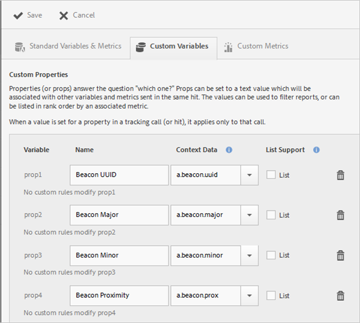
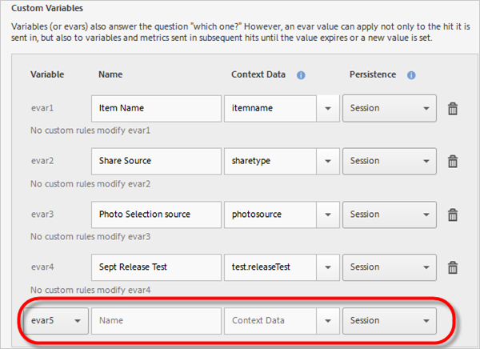

# Uw app beheren {#managing-your-app}

U kunt de gegevens bijhouden en beheren die u ontvangt van de app door een verscheidenheid aan variabelen en metriek te configureren.

## Variabelen en statistieken beheren {#section_EC2D58AC334F4ED49E764B81C2423A62}

* **Standaardvariabelen en -cijfers**

   Elke app bevat variabelen en maatstaven voor het bijhouden van winkelwagentjes en aankoopactiviteiten. Sommige aankoopgegevens kunnen niet worden verwerkt met verwerkingsregels, zodat de SDK de speciale `"&&products"` contextgegevens. U kunt bijvoorbeeld variabelen als winkelwagentjes, winkelwagentjes, uitchecken, bestellingen enzovoort hebben. De contextgegevens moeten worden toegewezen aan gegevens in Adobe Analytics. Als deze variabele wordt gevuld met een eenvoudige toewijzing van contextgegevens, is dit de sleutel die aan het in kaart brengt. Laat deze leeg als de variabele wordt gevuld met complexere regels in Analytics Admin Tools.

   Raadpleeg de volgende secties voor meer informatie over deze variabelen en metriek:

   * [Productvariabelen in Android](/help/android/analytics-main/products/products.md)
   * [Productvariabelen in iOS](/help/ios/analytics-main/products/products.md)

* **Aangepaste variabelen**

   Op de pagina Aangepaste variabelen worden alle aangepaste analytische variabelen weergegeven die zijn geconfigureerd voor de rapportsuite die uw toepassingsgegevens bevat. Op deze pagina kunt u extra variabelen inschakelen en contextgegevens toewijzen aan variabelen van Analytics.

### Contextgegevens toewijzen aan analytische variabelen

Klik op **[!UICONTROL Manage App Settings]** > **[!UICONTROL Manage Variables & Metrics]** > **[!UICONTROL Custom Variables]**.

Deze toewijzingen roepen dezelfde API aan als [Verwerkingsregels](https://experienceleague.adobe.com/docs/analytics/admin/admin-tools/processing-rules/processing-rules.html) gebruik in Adobe Analytics.

Hier is een lijst van de douanevariabelen die u kunt vormen:

* De **[!UICONTROL Custom Properties]** (of props) beantwoordt u de vraag &quot;welke?&quot; Props kunnen worden ingesteld op een tekstwaarde die wordt gekoppeld aan andere variabelen en metriek die in dezelfde hit worden verzonden. De waarden kunnen aan filterrapporten worden gebruikt of kunnen in rangorde door bijbehorende metrisch worden vermeld.

   Wanneer een waarde voor een bezit in een volgende vraag (of een klap) wordt geplaatst, is het slechts op die vraag van toepassing.

* De **[!UICONTROL Custom Variables]** (of eVars) beantwoorden ook de vraag &quot;welke?&quot; Een eVar-waarde kan echter niet alleen van toepassing zijn op de treffer die wordt verzonden, maar ook op variabelen en metriek die in volgende treffers worden verzonden tot de waarde vervalt of een nieuwe waarde wordt ingesteld.
* De **[!UICONTROL Custom List Variables (or Multi-Value Variables)]** gedraagt zich het zelfde als variabelen behalve zij staan u toe om veelvoudige waarden op één slag te vangen. Zie voor meer informatie [list](https://experienceleague.adobe.com/docs/analytics/implementation/vars/page-vars/list.html?lang=en) variabelen in de documentatie van Adobe Analytics.

De volgende afbeeldingen worden in Analytics weergegeven als gemaakt in Mobile Services.

* **[!UICONTROL Name]**

   De vriendelijke naam van de variabele voor gegevensverzameling.

* **[!UICONTROL Context Data]**

   Als deze variabele wordt gevuld met een eenvoudige toewijzing van contextgegevens, is dit de sleutel die aan het in kaart brengt. Laat dit veld leeg als de variabele wordt gevuld met complexere regels in Analytics Admin Tools.

   Klik in de kolom met contextgegevens en selecteer de variabele met contextgegevens die u wilt toewijzen. De vervolgkeuzelijst bevat variabelen die in de afgelopen 30 dagen zijn ontvangen, dus als de contextgegevens die u wilt toewijzen zich niet in de lijst bevinden, kunt u deze typen.

* **[!UICONTROL Persistence (Custom Variables and Custom List Variables)]**

   Persistentie bepaalt het punt waarop een waarde van de Variabele van de Douane (eVar) zal verlopen of niet meer met extra klusjes zal worden geassocieerd. Als een eVar is verlopen wanneer een hit wordt geactiveerd, wordt de waarde Geen gekoppeld aan de waarde bij die hit voor die eVar. Dit betekent dat er geen eVar-waarde actief was toen de hit werd geactiveerd.

   U kunt een van de volgende opties selecteren:

   * **[!UICONTROL Session]**

      De waarde eVar blijft geldig gedurende het analysebezoek.

   * **[!UICONTROL Tracking Call]**

      De waarde van de eVar blijft slechts voor de volgende vraag voortbestaan of het raken waarin het inbegrepen was.

   * **[!UICONTROL Never Expire]**

      De waarde van de eVar blijft voor alle verdere het volgen vraag voortbestaan.
   * **[!UICONTROL Advanced]**

      Adobe Analytics heeft een geavanceerdere interface voor het instellen van persistentie voor eVars. Als een persistentiewaarde wordt ingesteld voor de eVar die niet wordt ondersteund in Mobile Services, wordt deze waarde weergegeven in de gebruikersinterface van Mobile Services.

      Klik op **[!UICONTROL Adobe Analytics Report Suite Manager]** > **[!UICONTROL Conversion Variables UI]**.

   * **[!UICONTROL List Support]**

      Laat het overgaan van veelvoudige waarden toe om met het bezit in één volgende vraag worden geassocieerd. Het scheidingsteken moet één teken zijn en mag geen nul of spatie zijn.

   * **[!UICONTROL Delimiter]**

      Het scheidingsteken moet één teken zijn en mag geen nul of spatie zijn.

### Aanvullende analytische variabelen

U kunt extra variabelen toelaten gebruikend de drop-down lijst bij de bodem van elke veranderlijke sectie.

Selecteer een ongebruikt variabelenummer en typ een naam. U kunt optioneel de variabele van contextgegevens verstrekken die u en om het even welke extra informatie wilt opslaan.

* **Aangepaste cijfers**

   Metrische gegevens (of gebeurtenissen) beantwoorden de vragen *hoeveel ?* of *hoeveel?*. Gebeurtenissen kunnen telkens toenemen wanneer de gebruiker een handeling uitvoert of numerieke waarden zoals een prijs vasthoudt. Aangepaste meetgegevens zijn onder andere gebeurtenissen zoals een app die is gemaakt, het PDF- of CSV-bestand is gedownload of geëxporteerd, een campagne is opgeslagen, de SDK is gedownload, een rapport is uitgevoerd, een koppeling naar de App Store is toegevoegd, een bericht in de app is geactiveerd, enzovoort.

   Selecteer een van de volgende aangepaste metrische typen:

   * **[!UICONTROL Whole number]**
   * **[!UICONTROL Decimal number]**
   * **[!UICONTROL Currency]**

## Belangenpunten beheren {#section_990EF15E4E3B42CC807FCD9BEC8DB4C6}

Met interessepunten kunt u geografische locaties definiëren die u kunt gebruiken voor correlatiedoeleinden, als doel instellen voor berichten in de app, enzovoort. Wanneer een treffer wordt verzonden in een belangenpunt, wordt het aandachtspunt verbonden aan de treffer. Voor meer informatie over aandachtspunten raadpleegt u [Belangenpunten beheren](/help/using/location/t-manage-points.md).

## Koppelingsdoelen beheren {#section_F722A387E22A430187B063D358A87711}

U kunt koppelingsdoelen maken, bewerken, archiveren/ongedaan maken en verwijderen. Deze doelen kunnen vervolgens inline worden genoemd bij het samenstellen van marketingkoppelingen, pushberichten of in-app-berichten. Voor meer informatie over verbindingsbestemmingen, zie [Koppelingsdoelen beheren](/help/using/acquisition-main/c-manage-link-destinations/t-archive-unarchive-link-destinations.md).

## Postbacks beheren {#section_78B0A8D7AE6940E78D85AE3AB829E860}

Met Postbacks kunt u gegevens die door Adobe Mobile zijn verzameld, naar een andere externe server verzenden. Als u dezelfde triggers en kenmerken gebruikt om een bericht in de app weer te geven, kunt u Mobile zodanig configureren dat aangepaste gegevens naar een bestemming van een derde worden verzonden. Voor meer informatie over postbacks, zie [Postbacks configureren](/help/using/c-manage-app-settings/c-mob-confg-app/signals.md).
