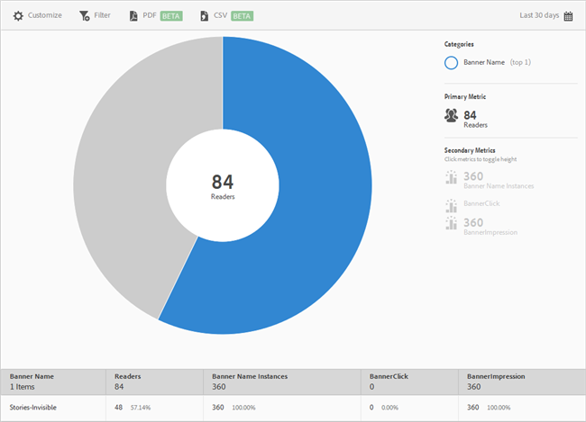

# Banner Metrics {#banner-metrics}

Het **[!UICONTROL Banner Metrics]** rapport geeft een zonneexplosieve visualisatie voor uw bestaande gegevens weer. Dit rapport is alleen beschikbaar voor klanten van Digital Publishing Suite (DPS).

Dit rapport geeft standaard de volgende maatstaven weer:

* **[!UICONTROL Banner Name]**, de naam van de banner.
* **[!UICONTROL Readers]**, dat is het aantal gebruikers van de app.
* **[!UICONTROL Banner Name Instances]** Dit is het aantal keren dat naar de banner werd verwezen door klikken en indrukken.
* **[!UICONTROL Banner Click]** Dit is het aantal keren dat gebruikers op de banner hebben geklikt.
* **[!UICONTROL Banner Impressions]** Dit is het aantal keren dat een banner op een browserpagina is weergegeven (of zichtbaar was).

Dit verslag lijkt op het **[!UICONTROL Technology]** verslag. Voor informatie over hoe te om te navigeren en zonnebarstrapporten te gebruiken; onderverdelingen en maatstaven toevoegen; doelactiviteiten te creëren; Maak kleverige filters en deel rapporten, zie [Technologie](/help/using/usage/reports-technology.md). De informatie in dit onderwerp kan worden gebruikt om het **[!UICONTROL Banner Metrics]** rapport aan te passen.
