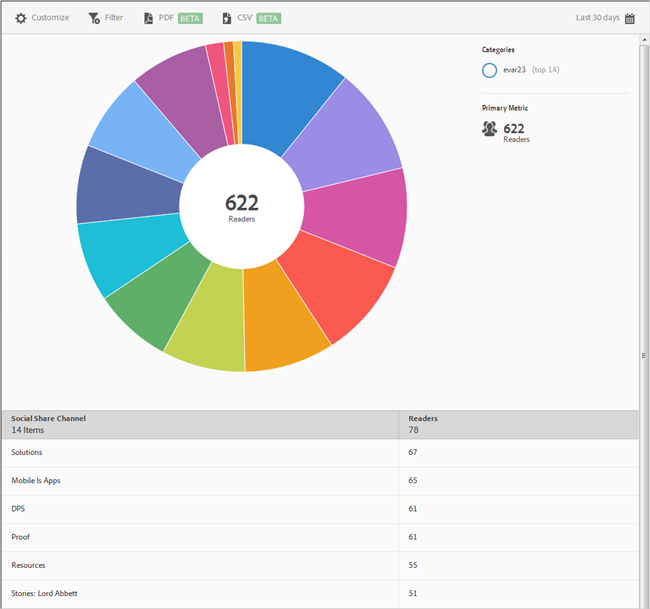

# Sociaal delen{#social-sharing}

De **[!UICONTROL Social Sharing]** het rapport toont een zonnebarstvisualisatie voor uw bestaande gegevens. Dit rapport is alleen beschikbaar voor DPS-klanten.

Standaard toont dit rapport het aantal lezers dat artikelen heeft gedeeld in verschillende kanalen, zoals e-mail, bericht enzovoort.

Dit verslag is vergelijkbaar met het **[!UICONTROL Technology]** verslag. Voor informatie over hoe te om te navigeren en zonnebarstrapporten te gebruiken; onderverdelingen en maatstaven toevoegen; doelactiviteiten te creëren; kleverige filters maken en rapporten delen, zie [Technologie](/help/using/usage/reports-technology.md). De informatie in het onderwerp van de Technologie kan worden gebruikt om het **[!UICONTROL Social Sharing]** verslag.
