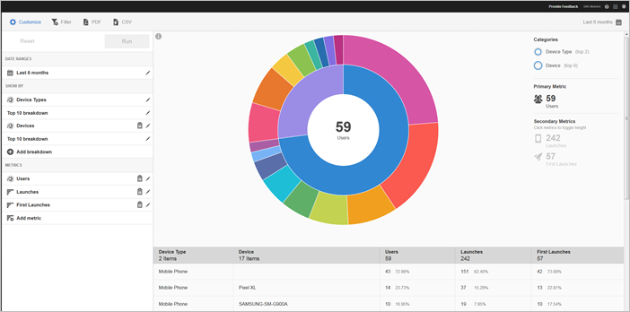
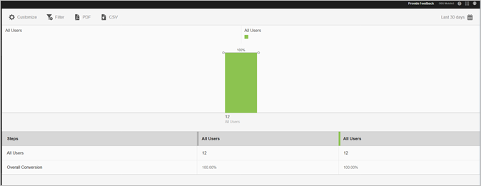

# Report Types {#report-types}

Wanneer het aanpassen van rapporten, zou de brede flexibiliteit sommige vragen over het type van rapport kunnen tot stand brengen dat het meest geschikt is om de gegevens te krijgen die u nodig hebt.

Alvorens rapporten aan te passen, moet u het verschil tussen metrisch en een afmeting begrijpen.

* Metrisch

   Metrisch wordt gebruikt om uw gegevens te meten. Metrische waarden zijn waarden die kunnen worden geteld en toegevoegd en die worden gebruikt om te zien hoe vaak specifieke acties in uw app voorkomen. De gemeenschappelijke metriek omvat installaties, lanceringen, opbrengst, levenwaarde, en logins. Elke keer dat uw app bijvoorbeeld wordt gestart, wordt de waarde van _launches_verhoogd met één.

* Dimension

   Een dimensie wordt gebruikt om uw gegevens te beschrijven. Dimension worden vertegenwoordigd door een koord, of een aantal te gebruiken dat als een koord (zoals een postcode handelt, en gebruikt om uw gegevens te organiseren en te segmenteren. Voorbeelden van veelvoorkomende afmetingen zijn onder andere de versie van het besturingssysteem, de naam van de campagne, de productnaam en de mobiele provider. Elke dimensie heeft een aantal specifieke waarden die met die dimensie worden geassocieerd. De versiedimensie van het besturingssysteem heeft bijvoorbeeld waarden zoals _iOS 7_ en _Android 4.1.2_.

Hier zijn de soorten rapporten die u in Mobiele UI kunt produceren:

## Overtijdrapport {#section_2741DA54C90C49AFB17C7B9BC7AD627D}

In de tijdrapporten ziet u hoe metrische gegevens in een tijdbereik werken, zodat u snel spikes en trends kunt identificeren. De analyse begint vaak in een over-tijd rapport en gaat in trended en gerangschikte rapporten aangezien u naar beneden boor om de factoren te onderzoeken die tot een metrische piek of een trend zouden kunnen bijdragen.

Als u bijvoorbeeld een piek in de lanceringen ziet, kunt u een trended-rapport uitvoeren met de lanceringen van de top 5-besturingssystemen om te zien welke besturingssystemen het meest bijdragen aan de piek in de lanceringen:

Als u waarden van dimensies wilt weergeven met andere metriek in een rapport dat langer duurt, kunt u de metrische instanties gebruiken en een dimensiefilter definiëren.

## Trend Report {#section_C9BE9A2EDBFF4D938B9AF14C8AA67883}

Met trendrapporten kunt u zien hoe de populairste dimensies presteren ten opzichte van een metrische waarde. U kunt dit rapport gebruiken om te bepalen welke waarden het meest aan een verandering in metrisch bijdragen.

Als u een trended-rapport voor een dimensie wilt weergeven, voegt u een kleverig filter (bijvoorbeeld Besturingssysteem = iOS 6.0.1) toe aan een overlooprapport om dezelfde gegevens weer te geven. Als bonus, kunt u vijf extra metriek aan het gefiltreerde over-tijd rapport toevoegen.

## Gefilterd overtijdrapport {#section_F8FAF2A4496F449CA99EF1E052C71A2D}

Als u een specifieke afmetingswaarde hebt die u wilt bekijken, kunt u een kleverige filter aan een rapport over tijd toevoegen. Het volgende rapport toont 30 dagen van lanceringen, verbeteringen, en neerstortingen voor een specifieke werkend systeemversie.

## Geregistreerd rapport {#section_C073D744A95843AF99EE74FB5B013735}

De gerangschikte rapporten tonen u hoe vaak de hoogste 50 afmeting aan metrisch bijdraagt. Dit rapport is nuttig om de totale bijdrage voor een datumbereik voor een groot aantal waarden weer te geven.

## Sunburst Report {#section_17A9842039174DE094A6B1E9837E35BB}

Zonneburstrapporten bevatten bijvoorbeeld het basisrapport en de uitsplitsingen. De visualisatie gebruikt hoogte om metrisch en de prestatiesverschillen tussen de metriek te tonen. Elke concentrische cirkel vertegenwoordigt een publiekssegment in de categorie voor die cirkel. U kunt acties uitvoeren voor een publiek, zoals het toepassen van een Vaste Filter, het verbergen van metrisch en het bekijken van metriek.

U kunt het rapport bekijken een in-product leerprogramma dat beschrijft hoe te met een zonnebarstgrafiek in wisselwerking te staan.

De zelfstudie starten:

1. Klik op **[!UICONTROL Usage]** Toepassingsinstellingen beheren.

1. Klik op **[!UICONTROL Technology]** > **[!UICONTROL Technology Breakdown]**.
1. Klik op de titelbalk van het rapport **[!UICONTROL Customize]** en klik op het informatiepictogram.

### Plakrapport {#section_AD400106BC684B50B27CCCD3F4497114}

Een tekenrapport is gebaseerd op padanalyse en geeft een paddiagram weer dat paden vertegenwoordigt die van de ene status in de app naar de andere worden verplaatst.

Elk knooppunt heeft de vorm van een vak en staat voor een staat in de paden van de gebruiker via een app. In de bovenstaande afbeelding geeft het bovenste knooppunt bijvoorbeeld het aantal gebruikers aan dat de app heeft gestart en een foto heeft geselecteerd in de galerie.

### Taalrapport {#section_AF3B0C899D844FC3AD1F91A2C452C92F}

Met bundelrapporten kunt u bepalen waar klanten een marketingcampagne verlaten of van een gedefinieerd conversiepad afwijken tijdens hun interactie met uw mobiele app. U kunt het rapport van het Kanaal ook gebruiken om de acties van verschillende segmenten te vergelijken.

De trechter visualisatie laat u zien waar de klanten uit het proces vallen. Door bij elke stap de zichtbaarheid van de beslissingen van de klant te krijgen, kunt u beter begrijpen waar klanten worden afgeschrikt, welk pad ze doorgaans volgen en wanneer ze uw app verlaten.

