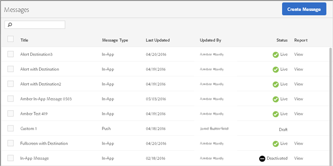

# Berichten beheren{#manage-messages}

{#eol}

Een lijst met uw in-app- en pushberichten weergeven met informatie over wanneer elk bericht voor het laatst is bijgewerkt en of de berichten live zijn of zijn gedeactiveerd.

U kunt berichten dupliceren, activeren/deactiveren en archiveren/archiveren. U kunt een rapport ook bekijken dat het aantal gebruikers toont die het bericht en het aantal gebruikers hebben bekeken die door het bericht hebben geklikt.

Als u berichten wilt beheren, klikt u op ***your_app_name*** > **[!UICONTROL Messaging]** > **[!UICONTROL Manage Messages]**.

Hier is extra informatie over de taken u op berichten kunt voltooien:

* **Berichten zoeken en filteren**

   Gebruik het zoekvak boven aan de lijst om berichten te zoeken en te filteren. Alles wat u in het zoekvak typt, toont de bijbehorende berichten uit de lijst. De zoekopdracht werkt in alle tabelkolommen. U kunt bijvoorbeeld typen `Draft` om alleen berichten met die status weer te geven. U kunt de naam van een gebruiker ook typen om alleen berichten weer te geven die door die gebruiker zijn bijgewerkt.

   Naast het zoekvak kunt u ook op een kolomkop klikken om de lijst in oplopende of aflopende volgorde te sorteren op de inhoud van die kolom.

   Als u bijvoorbeeld de opdracht **[!UICONTROL Message Type]** in oplopende volgorde worden alle in-app-berichten vóór uw pushberichten weergegeven. Als u de **[!UICONTROL Last Updated]** in aflopende volgorde worden in de lijst de meest recente bijgewerkte berichten boven aan de lijst weergegeven.

* **Berichten dupliceren**

   1. Schakel het selectievakje naast een of meer berichten in en klik op **[!UICONTROL Duplicate Selected]**.
   1. Selecteer de app waarvoor u een dubbel bericht wilt maken.
   1. Typ een naam voor het bericht.

      Als u een bericht voor dezelfde app wilt dupliceren, typt u een nieuwe naam voor het bericht. Als u dezelfde naam hebt als u het oorspronkelijke bericht wilt overschrijven. Als u een bericht voor een andere app dupliceert, kunt u dezelfde naam behouden zonder het oorspronkelijke bericht te overschrijven.

   1. Klikken **[!UICONTROL Duplicate]** of **[!UICONTROL Overwrite]**, indien nodig.

* **Berichten deactiveren of activeren**

   Als u een bericht wilt deactiveren, schakelt u het selectievakje naast ten minste één actief bericht in en klikt u op **[!UICONTROL Deactivate Selected]**.

   Als u een gedectiviseerd bericht wilt activeren, schakelt u het selectievakje in naast ten minste één gedeactiveerd bericht en klikt u op **[!UICONTROL Activate Selected]**.

* **Berichten archiveren**

   Om berichten te archiveren en uw berichtlijst schoon te maken:

   >[!TIP]
   >
   >Voordat u een bericht kunt archiveren, moet u het deactiveren.

   1. Schakel het selectievakje naast ten minste één gedeactiveerd bericht in en klik op **[!UICONTROL Archive Selected]**.

* **Gearchiveerde berichten weergeven**

   1. Klik op **[!UICONTROL View Archive]**.
   1. Schakel het selectievakje naast ten minste één gearchiveerd bericht in en klik op **[!UICONTROL Unarchive Selected]**.
