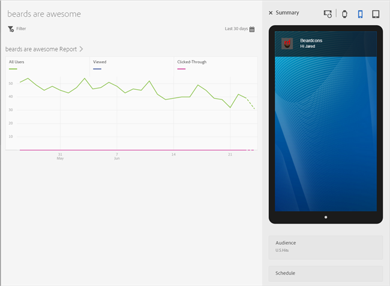
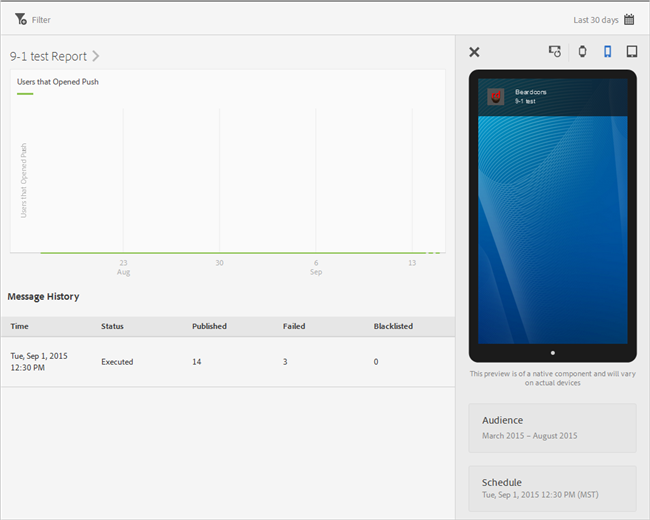

# Berichtenrapporten weergeven{#view-message-reports}

U kunt berichtrapporten weergeven voor in-app- en pushberichten.

1. Klikken  in de **[!UICONTROL Report]** kolom voor een bericht.
1. (**Optioneel**) Maak een plakfilter voor het rapport of wijzig de tijdsperiode door op de knop **[!UICONTROL Calendar]** pictogram.

   Zie voor meer informatie over het maken van een kleverig filter [Een kleverig filter toevoegen](/help/using/usage/reports-customize/t-sticky-filter.md).

>[!TIP]
>
>Afhankelijk van het type van bericht u bekijkt, zou het rapport kunnen variëren.

## In-app berichten {#section_90B79BA58E8141F78538C187EB1BF8C7}

Als u rapporten bekijkt voor een bericht in de app, ziet het rapport er ongeveer als volgt uit:

### Metrische gegevens van in-app-berichten

Hier volgt een lijst met de meetgegevens die beschikbaar zijn voor in-app berichten:

* **[!UICONTROL Impression]**, wanneer een bericht wordt geactiveerd.

* **[!UICONTROL Click through]**, wanneer een gebruiker op de knop **[!UICONTROL Click Through]** op een waarschuwing of een bericht op een volledig scherm en wanneer een gebruiker de app opent vanuit een lokaal bericht.

* **[!UICONTROL Cancel]**, wanneer een gebruiker op de knop **[!UICONTROL Cancel]** op een alarm of een volledig-schermbericht.

* **[!UICONTROL Engagement Rate]**, een berekende metrische waarde uit Adobe Analytics en is het resultaat van het aantal klikdoorslagen gedeeld door het aantal indrukkingen.

## Pushberichten {#section_BEAFD858CA194185B6F88903446058E9}

Als u rapporten voor een duwbericht bekijkt, kijkt het rapport gelijkaardig aan de volgende illustratie:

In het diagram boven wordt het aantal gebruikers weergegeven dat het bericht heeft geopend.

### Metrische gegevens van pushberichten

Hier volgt een lijst met de meetgegevens die beschikbaar zijn voor pushberichten:

* **[!UICONTROL Time]**

   De tijd dat het bericht aan apparaten van de Diensten van Mobile werd geduwd.

* **[!UICONTROL Status]**

   De status van het bericht en de beschikbare statussen zijn:

   * **[!UICONTROL Cancelled]**
   * **[!UICONTROL Scheduled]**
   * **[!UICONTROL Executing]**
   * **[!UICONTROL Executed]**

* **[!UICONTROL Published]**

   Het aantal apparaattokens dat naar de Apple Push Notification Service/Firebase Cloud Messaging (APNS/FCM) is verzonden voor het verzenden van het bericht naar de gebruikersapparaten.

* **[!UICONTROL Failed]**

   Het aantal apparaattokens is niet verzonden naar APNS/FCM. Enkele mogelijke oorzaken van fouten:

   * Een ongeldige pushID

   * Het push-platform (APNS, FCM enzovoort) dat is opgegeven om naar te gaan, bestaat niet voor de toepassing van de taak. Het platform verzamelt bijvoorbeeld iOS-pushtokens, maar de APNS-service is niet geconfigureerd.

   * Het bericht kan zijn mislukt omdat de pushservice niet correct is geconfigureerd of omdat het Mobile Services-systeem is uitgeschakeld.
   >[!IMPORTANT]
   >
   >Als u een ongebruikelijk groot aantal mislukkingen hebt, controleer uw configuratie van de duwdiensten. Neem contact op met de klantenservice van Adobe als de pushservices correct zijn geconfigureerd.

* **[!UICONTROL Blocklisted]**

   Het aantal apparaattokens dat niet langer geldig is om naar APNS of FCM te worden verzonden. Dit betekent doorgaans dat de app van het apparaat is verwijderd of dat de gebruiker zijn of haar aanmeldingsinstellingen heeft gewijzigd om berichten te ontvangen. Android en iOS verschillen van mening wanneer tokens worden geteld als op de lijst met ongewenste personen staan. Android-tokens worden direct weergegeven in het aantal lijsten van gewezen personen. iOS-tokens worden in eerste instantie weergegeven als gepubliceerd, maar op basis van feedback van APNS, worden weergegeven als op de lijst met ongewenste personen staan op volgende berichten.
