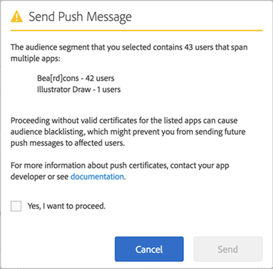

# Publiek: pushberichten{#audience-define-and-configure-audience-segments-for-push-messages}

U kunt publieksopties voor pushberichten definiëren en configureren, waaronder opties voor datumbereik, Analysesegmenten en aangepaste segmenten.

## Doelsegmenten definiëren {#section_7C4D2393CF7441959FE2381A02867CAC}

Wanneer een publiekssegment voor pushberichten wordt gecreeerd, zou het segment gebruikers van één of meerdere apps kunnen impliceren omdat de rapportreeksen of virtuele rapportreeksen gegevens van één of meerdere apps zouden kunnen bevatten. Voor meer informatie over virtuele rapportsuites, zie [Virtuele rapportsuites](/help/using/manage-apps/c-mob-vrs.md).

In Adobe Mobile Services kunnen marketers slechts op één app per platform drukken. Als marketers vanuit meerdere apps proberen naar segmenten te gaan die gebruikers bevatten, wordt een waarschuwing weergegeven met de mededeling dat dit kan leiden tot ernstige pushfouten en het blokkeren van gebruikers. Als u een drukkwaliteit ervaart, zie *Het oplossen van duwmislukkingen* in het duw overseinen [van het](/help/using/in-app-messaging/t-create-push-message/c-schedule-push-message.md)Oplossen van problemen.

Om de gegevens van de Manager van de Publiek in uw segmentdefinitie te gebruiken, zie Analytics van het [Publiek](https://docs-author-stg.corp.adobe.com/content/help/en/analytics/integration/audience-analytics/mc-audiences-aam.html).

>[!IMPORTANT]
>
>Als gebruikers van de app blokkeerbaar zijn, kunnen marketers **nooit** pushberichten meer naar de betrokken gebruikers sturen.

Als u een publiekssegment selecteert dat gebruikers over veelvoudige apps bevat, zou u het volgende alarm kunnen zien:

De naam van de app is gebaseerd op de geparafeerde versie van de appId, die door de SDK van Mobile Services automatisch naar Adobe Analytics wordt verzonden in de `<app name> <version number> (<bundle id>)` indeling.

>[!TIP]
>
>Het versienummer is optioneel.

Maximaal 6 cijfersets voor de versie en 5 cijfersets voor de bundle-id worden verwijderd.

Bijvoorbeeld:

* `Bea[rd]cons 1.0 (123)` wordt weergegeven zoals `Bea[rd]cons`
* `Bea[rd]cons 1.2 (1.2)` wordt weergegeven zoals `Bea[rd]cons`
* `Bea[rd]cons 1.2.3.4.5.6.7 (1111)` wordt weergegeven zoals `Bea[rd]cons .7`
* `Bea[rd]cons 1.2.3. (1.2.3.4.5.6)` wordt weergegeven zoals `Bea[rd]cons (.6)`

Als u het pushbericht wilt blijven verzenden naar de vermelde apps, schakelt u het **[!UICONTROL Yes, I want to proceed.]** selectievakje in en klikt u **[!UICONTROL Send]**.

## Best practices

Hier volgen enkele aanbevolen procedures:

* Om verwarring te voorkomen, **vermijd** het bepalen van mobiele app virtuele rapportseries die gegevens van veelvoudige apps bevatten.
* Gebruik **elke** keer dat u een pushbericht wilt verzenden, een unieke toepassings-id als onderdeel van een publiekssegment.
Zo zorgt u ervoor dat pushmeldingen worden verzonden naar een publiekssegment dat tot **slechts** één app behoort.

### Voorbeelden

Hier volgen enkele voorbeelden om u te helpen begrijpen hoe u segmenten correct kunt definiëren:

**Doe**: De Marketer biedt pushcertificaten voor de iOS- en Android-versies van één app, bijvoorbeeld voor Adobe Photoshop. De Marketer kan een pushmelding verzenden naar een gebruikerssegment dat zich uitstrekt over beide platforms.

**Niet**: Marketers bieden pushcertificaten voor iOS- en Android-versies van één app, bijvoorbeeld voor Adobe Photoshop. Als de markeerteken de laatste 30 dagen *een segment van* alle actieve gebruikers maakt en naar deze gebruikers doorvoert, ontvangen alleen de gebruikers van de Adobe Photoshop iOS- en Android-app de pushmelding en worden alle gebruikers van de Adobe Illustrator iOS- en Android-app geblokkeerd. Voor meer gedetailleerd, zie het voorbeeld het *Oplossen van de mislukkingen* van het pushbericht in het Overseinen [van de](/help/using/in-app-messaging/t-create-push-message/c-troubleshooting-push-messaging.md)Vraag van het Oplossen van problemen.

## publiekssegmenten configureren {#section_A92C60885A30421B8150820EC1CCBF13}

1. Ga naar de pagina Publiek voor een nieuw duwbericht.

   Zie [Een pushbericht](/help/using/in-app-messaging/t-create-push-message/t-create-push-message.md)maken voor meer informatie.

   Houd rekening met de volgende **belangrijke** informatie wanneer u de publieksopties configureert:

   * Dit **[!UICONTROL Estimated Opt-In Audience]** is het aantal apparaten dat overeenkomt met het Adobe Analytics-segment **en het** aantal opted-in-apparaten.

      U kunt een schatting weergeven van het aantal gebruikers in het geselecteerde segment of de geselecteerde segmenten die zich hebben aangemeld voor het ontvangen van berichten en die het pushbericht zullen ontvangen. Het totale aantal gebruikers van de app wordt weergegeven onder de schatting, ongeacht de status van de opt-in.

   * Dit **[!UICONTROL Total]** is het aantal apparaten dat overeenkomt met het Adobe Analytics-segment.

   * Pushberichten worden verzonden naar de apparaten die deel uitmaken van een gedefinieerd Adobe Analytics-segment **en die** hebben gekozen voor push-berichten.

      Dit betekent dat de SDK een waarde heeft verzonden van `True` voor de optie Inschakelen voor pushberichten.

   * Hoewel het apparaat een geldig apparaattoken heeft, wordt het bericht niet naar het apparaat geduwd, tenzij Adobe Analytics de markering voor Inschakelen heeft ingesteld.

   * Voor meer informatie over het oplossen van problemen duw overseinen, zie het volgende:

      * [Push messaging in iOS](https://docs.adobe.com/content/help/en/mobile-services/ios/messaging-ios/push-messaging/push-messaging.html)

      * [Pushberichten in Android](https://docs.adobe.com/content/help/en/mobile-services/android/messaging-android/push-messaging/push-messaging.html)

1. Typ gegevens in de volgende velden:

   * **[!UICONTROL During The]**

      Typ het tijdkader dat voor het geschatte publiek moet worden gebruikt. Selecteer een optie in de **[!UICONTROL During The]** vervolgkeuzelijst:

   * **[!UICONTROL Last]** Hiermee kunt u een relatief tijdframe selecteren (bijvoorbeeld de laatste 7 dagen, de laatste 30 dagen of de laatste 60 dagen) vanaf het moment dat het bericht volgens de planning moet worden verstuurd.

      Als u bijvoorbeeld de laatste 30 dagen selecteert en het bericht op 31 oktober plant, is het geschatte publiek het aantal gebruikers dat heeft gekozen om de 30 dagen voor 31 oktober pushberichten te ontvangen.

   * **[!UICONTROL Static Range]** Hiermee kunt u een statisch bereik selecteren door de begin- en einddatum voor het geschatte bereik van het publiek te kiezen.

      Als u in het vorige voorbeeld een datumbereik selecteert dat begint op 1 oktober en eindigt op 15 oktober, maar het bericht op 31 oktober verzendt, wordt het geschatte publiek weergegeven als het aantal gebruikers dat heeft gekozen voor het ontvangen van pushberichten in het statische datumbereik dat u hebt opgegeven (1 oktober tot 15 oktober).

   * **[!UICONTROL Analytics Segments]**

      Selecteer een bestaand Adobe Analytics-segment in de vervolgkeuzelijst. Voor meer informatie, zie [Bouwstijl segmenten](https://docs.adobe.com/content/help/en/analytics/components/segmentation/segmentation-workflow/seg-build.html).

   * **[!UICONTROL Custom Segments]**

      Selecteer metrisch of variabele van de drop-down lijst (bijvoorbeeld, **[!UICONTROL Days Since Last Use]** of **[!UICONTROL Point of Interest]**) en vorm de filter zoals gewenst. Het volgende aangepaste segment richt zich bijvoorbeeld op gebruikers met een mobiele telefoon waarop iOS wordt uitgevoerd en die zich in het Californische gebied (Verenigde Staten) bevinden.
   >[!IMPORTANT]
   >
   >Als u in de **[!UICONTROL Create Audience]** sectie klikt, wordt een dialoogvenster weergegeven waarin u wordt herinnerd aan de geldigheid van een geldig certificaat voor elke app die wordt vermeld **[!UICONTROL And]****** . Als u hebt geklikt, wordt **[!UICONTROL Or]** het standaarddialoogvenster weergegeven. Voor meer informatie over geldige certificaten en rapportreeksen, zie [Virtuele rapportreeksen](/help/using/manage-apps/c-mob-vrs.md).
