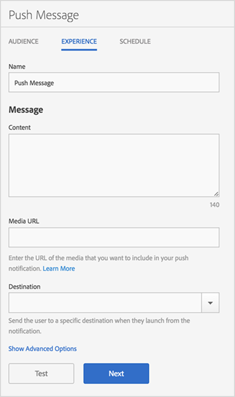

# Ervaring: pushbericht {#experience-push-message}

{#eol}

U kunt ervaringsopties configureren voor pushberichten en uitgebreide pushberichten, zoals naam, berichttekst en bestemmingsopties. U kunt ook geavanceerde opties configureren, zoals opties voor het laden van objecten en aangepaste opties voor iOS-apparaten.

1. Klik op de pagina Publiek voor een nieuw pushbericht **[!UICONTROL Experience]**.

   

1. Typ een naam voor dit bericht.
1. Typ informatie in de volgende velden in het dialoogvenster **[!UICONTROL Message]** sectie:

   * **[!UICONTROL Content]**

      Geef de tekst van het bericht op. U kunt maximaal 140 tekens opgeven.

   * **[!UICONTROL Media URL]**

      Typ de URL van het mediabestand dat u wilt gebruiken in het pushbericht. Voor vereisten voor het gebruik van uitgebreide pushberichten raadpleegt u *Vereisten voor RTF-berichten* hieronder.

      >[!IMPORTANT]
      >
      >Houd rekening met het volgende als u een afbeelding of video wilt weergeven in een pushmelding:
      > * De `attachment-url` gegevens worden verwerkt in de pushlading.
      > * De media-URL moet aanvragen van spikes kunnen verwerken.

   * **[!UICONTROL Destination]**

      Selecteer een specifieke bestemming, zoals een web-, diepe of hybride koppeling, om gebruikers te verzenden wanneer zij op het bericht klikken. Zie voor meer informatie [Doelen](/help/using/acquisition-main/c-create-destinations.md).

      >[!TIP]
      >
      >Wanneer u de * **[!UICONTROL Web Link]** of **[!UICONTROL Custom Link]** doeltypen, wordt het doeltype niet bijgehouden. Alleen **[!UICONTROL Deep Links]** worden bijgehouden.

## Vereisten voor uitgebreide pushmeldingen

Hier volgen de vereisten voor het verzenden van uitgebreide pushberichten:

* **Ondersteunde versies**

   Rijke pushmeldingen worden ondersteund in de volgende versies:
   * Android 4.1.0 of hoger
   * iOS 10 of hoger

      >[!IMPORTANT]
      >
      >De volgende informatie onthouden:
      >
      >* Rijke pushberichten die naar eerdere versies worden verzonden, worden wel verzonden, maar alleen de tekst wordt weergegeven.
      >* Op dit moment is er geen ondersteuning voor toezicht.

* **Bestandsindelingen**

   Hier volgen de ondersteunde bestandsindelingen:
   * Afbeeldingen: JPG en PNG
   * Animaties (alleen iOS): GIF
   * Video&#39;s (alleen iOS): MP4

* **URL-indelingen**
   * Alleen HTTPS

* **Grootte**
   * Afbeeldingen moeten een 2:1-indeling hebben of moeten worden bijgesneden.

Een pushbericht configureren op de pagina Experience:

1. (**Optioneel**) Klik op de knop **[!UICONTROL Show Advanced Options]** koppeling voor het configureren van aanvullende opties:

   * **[!UICONTROL Payload: Data]**

      Geef een aangepaste pushlading in JSON die via een pushmelding of een lokale melding naar de app wordt verzonden. De limiet voor Android en iOS is 4 kB.

   * **[!UICONTROL Apple Options: Category]**

      Geef een categorie op voor pushberichten en lokale meldingen. Zie voor meer informatie [Meldingsondersteuning van uw app beheren](https://developer.apple.com/library/content/documentation/NetworkingInternet/Conceptual/RemoteNotificationsPG/SupportingNotificationsinYourApp.html#//apple_ref/doc/uid/TP40008194-CH4-SW9) in de *iOS Developer Library*.

   * **[!UICONTROL Apple Options: Sound]**

      Geef de naam op van het geluidsbestand dat in uw app-bundel moet worden afgespeeld. Een standaardgeluid wordt afgespeeld als dit niet is ingesteld. Zie voor meer informatie [Kennisgevingsondersteuning van uw app beheren](https://developer.apple.com/library/content/documentation/NetworkingInternet/Conceptual/RemoteNotificationsPG/SupportingNotificationsinYourApp.html#//apple_ref/doc/uid/TP40008194-CH4-SW10) in de *iOS Developer Library*.

   * **[!UICONTROL Apple Options: Content Available]**

      Selecteer deze optie zodat iOS uw app op de achtergrond activeert wanneer het bericht verschijnt en de app code kan uitvoeren op basis van het berichtlading. Zie voor meer informatie [Apple Push Notification Service](https://developer.apple.com/library/content/documentation/NetworkingInternet/Conceptual/RemoteNotificationsPG/APNSOverview.html#//apple_ref/doc/uid/TP40008194-CH8-SW1) in de *iOS Developer Library*.

2. (Optioneel) Klik op de volgende pictogrammen om een voorvertoning van de lay-out van het bericht weer te geven:

   * **[!UICONTROL x Summary]**

      Hiermee verbergt u het voorvertoningsvenster. Klikken  om het voorvertoningsvenster opnieuw weer te geven.

   * **[!UICONTROL Change the orientation]**

      Als u de richting van de voorvertoning wilt wijzigen van Staand in Liggend, klikt u op . In het geval van stalen verandert de oriëntatie van een rond horlogevlak in een vierkant horlogevlak.

   * **[!UICONTROL Preview on a user's watch]**

      Klik op .

   * **[!UICONTROL Preview on a user's mobile phone]**

      Klik op .

   * **[!UICONTROL Preview on a user's tablet]**

      Als u een voorvertoning van uw bericht wilt weergeven op de tablet van de gebruiker, klikt u op .
   Onder aan het voorvertoningsvenster kunt u een beschrijving weergeven van het publiek dat u in de vorige stap hebt geselecteerd.

3. (**Optioneel**) Klik **[!UICONTROL Test]** om uw bericht voor testdoeleinden naar opgegeven apparaten te verzenden.
4. Selecteer de service en typ de pushtokens voor ten minste één apparaat waarop u het bericht wilt duwen.

   Geef de tokens op in een lijst met komma&#39;s als scheidingsteken om het bericht naar meerdere apparaten te sturen.

5. Vorm de het plannen opties voor het bericht.

   Zie voor meer informatie [Planning: pushbericht](/help/using/in-app-messaging/t-create-push-message/c-schedule-push-message.md).
