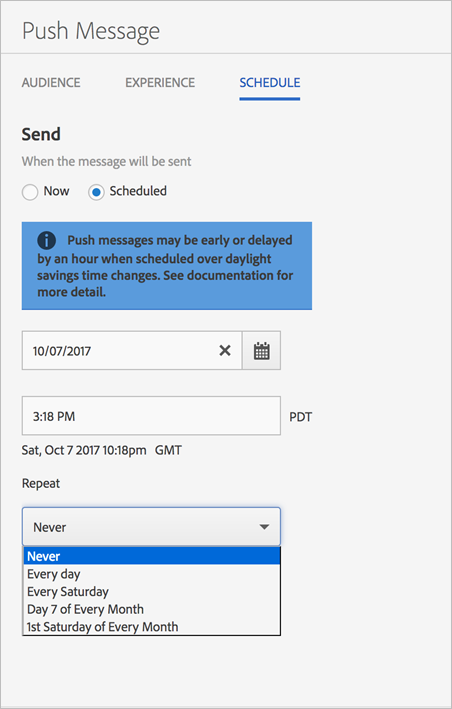

# Planning: pushberichten{#schedule-push-message}

{#eol}

In de gebruikersinterface van Adobe Mobile Services kunt u een pushbericht plannen dat direct moet worden bezorgd, dat later moet worden geleverd, en als een terugkerende gebeurtenis. Deze gebeurtenissen kunnen dagelijks, wekelijks, of maandelijks worden gepland.

>[!TIP]
>
>Gebruikers kunnen de planningsinstellingen voor een pushbericht op elk gewenst moment wijzigen. Als er geen van toepassing zijnde datum is om een terugkerend gepland bericht, bijvoorbeeld, een maandelijkse terugkomende baan om de 31ste dag, op 31e februari, of de 5e Dinsdag van de maand te verzenden, wordt geen bericht verzonden.

De volgende informatie onthouden:

* De juiste datum- en tijdnotatie is `hh:mm` en `mm/dd/yyyy`.

* U kunt een gepland bericht op de volgende manieren bewerken:

   * Wijzig de datum in een latere datum.
   * Wijzig het herhalingsinterval in een ander interval.

      Bijvoorbeeld, als u oorspronkelijk een bericht had dat elke dag werd verzonden, kunt u de herhaling aan wekelijkse schakelen.

## Voordat terugkerende pushberichten worden gepland

U **moet** Lees de volgende informatie voordat u terugkerende pushberichten plant:

* De opties die worden weergegeven in het dialoogvenster **[!UICONTROL Repeat]** de vervolgkeuzelijst is afhankelijk van de datum waarop u het bestand hebt getypt of geselecteerd.

   Als u bijvoorbeeld `Saturday, October 7`worden de volgende opties weergegeven:

   * **[!UICONTROL Never]**
   * **[!UICONTROL Every day]**
   * **[!UICONTROL Every Saturday]**
   * **[!UICONTROL Day 7 of Every Month]**
   * **[!UICONTROL 1st Saturday of Every Month]**

* Pushberichten worden gepland en verzonden op basis van Greenwich Mean Time (GMT).

   Als u bijvoorbeeld een terugkerend bericht hebt gepland dat elke zaterdag om 12:00 uur (twaalf uur &#39;s middags) wordt verzonden **PST** Het bericht wordt op 7 oktober om 19.00 uur verzonden **GMT**.
* De berichten worden verzonden verschillend afhankelijk van of u in de V.S., Europa, of Azië wordt gevestigd.

   Bijvoorbeeld als u in San Jose, Californië wordt gevestigd, en u plant een bericht dat moet worden verzonden ***31 oktober*** 17:30 **PST**, wordt het bericht daadwerkelijk verzonden op ***1 november*** 12:30 **GMT**. Als u zich in Tokio bevindt en u een bericht wilt verzenden ***1 januari*** om 17:30 uur wordt het ***31 december*** 20:30 **GMT**.
* Pushberichten worden een uur eerder of later verzonden, afhankelijk van het tijdstip waarop de dag licht wordt bespaard.
* Wanneer u uw rapport van de duwberichten bekijkt, wordt het bericht getoond in de lokale tijdzone van uw systeem.

   Bijvoorbeeld, als uw begintijd 12:00 pm is **PST**, hoewel het bericht om 19.00 uur wordt verzonden **GMT** wordt de verzonden tijd weergegeven als 12:00 pm **PST**.

## Een terugkerend pushbericht plannen {#section_675BD754E5A04423A1751193698A978F}

1. Selecteer op de pagina Schema voor een nieuw pushbericht **[!UICONTROL Scheduled]** of **[!UICONTROL Now]**.

   Zie voor meer informatie [Een pushbericht maken](/help/using/in-app-messaging/t-create-push-message/t-create-push-message.md).

   Als u **[!UICONTROL Now]**, wordt het bericht onmiddellijk geduwd. Als u wilt voorkomen dat het bericht direct wordt gepland, klikt u op **[!UICONTROL Save as Draft]**.

   

1. Als u **[!UICONTROL Scheduled]** klikt u op het kalenderpictogram en selecteert of typt u een begindatum.
1. Typ een tijd. 
1. Onder **[!UICONTROL Repeat]** selecteert u een van de volgende opties:

   * **[!UICONTROL Never]**
   * **[!UICONTROL Every day]**
   * **[!UICONTROL Every Tuesday]**
   * **`<Day x>`van de maand**

      De weergegeven opties veranderen afhankelijk van de dag die u hebt geselecteerd of als startdag hebt getypt.
   * **`<nth day>`van elke maand**

      De weergegeven waarde verandert afhankelijk van de datum die u hebt geselecteerd of als begindatum hebt getypt.

1. In **[!UICONTROL End Repeat]**, typt u een einddatum en -tijd.
1. Klik op een van de volgende opties:

   * **[!UICONTROL Save as Draft]**

      Met deze optie slaat u het bericht op in een concept-indeling. U kunt deze optie kiezen om een onvoltooid bericht op te slaan of het bericht op te slaan zodat iemand anders het bericht kan bewerken en goedkeuren voordat het wordt geactiveerd.

      Als u **[!UICONTROL Now]** in de vorige stap wordt het ontwerpbericht onmiddellijk na activering verzonden. Als u een datum en tijd selecteerde om het bericht te duwen, wordt het bericht gedrukt volgens dit programma.

   * **[!UICONTROL Save & Schedule]**

      Met deze optie verstuurt u het bericht op de geplande dag en tijd.

Voer een van de volgende taken uit als u het conceptbericht later wilt uitvoeren:

* Klikken **[!UICONTROL Manage Messages]** schakelt u het selectievakje naast het bericht in en klikt u op **[!UICONTROL Activate Selected]**.
* Klikken **[!UICONTROL Save & Send]** om het bericht op te slaan en te verzenden.
