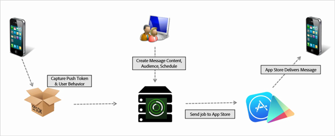

# Een pushbericht maken {#create-a-push-message}

U kunt pushberichten naar Analytics-segmenten verzenden vanuit de gebruikersinterface van Mobiele services om uw robuuste analysegegevens te gebruiken tijdens het werken met gebruikers.

>[!IMPORTANT]
>
>Voordat u een pushbericht maakt, raadpleegt u [Voorwaarden om pushberichten](/help/using/c-manage-app-settings/c-mob-confg-app/configure-push-messaging/prerequisites-push-messaging.md)in te schakelen.

Gebruikers die zich hebben aangemeld, krijgen pushberichten te zien als ze uw app niet actief gebruiken. In deze meldingen worden gebruikers gewaarschuwd voor nieuwe updates, aanbiedingen en herinneringen. Met deze meldingen kunt u pushberichten maken, testen, beheren en rapporteren in een gestroomlijnde workflow.

Pushberichten worden door de App Store naar de server verzonden in plaats van via Adobe Mobile Services:

Een pushbericht maken:

1. Klik op ***uw_app_name*** > **[!UICONTROL Messaging]** > **[!UICONTROL Manage Messages]** > **[!UICONTROL Create Message]** > **[!UICONTROL Create Push]**.
1. Configureer de publieksopties.

   Zie [Publiek voor meer informatie: definieert en configureert publiekssegmenten voor pushberichten](/help/using/in-app-messaging/t-create-push-message/c-audience-push-message.md).
