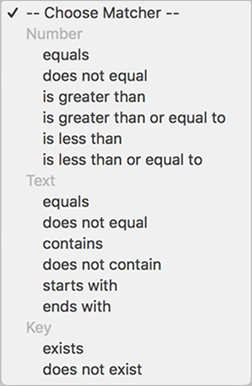

# Publiek: in-app-bericht {#audience-in-app-message}

U kunt publieksopties configureren voor berichten in de app, zoals opties voor weergave, trigger en gedrag.

1. Klik in uw app op **[!UICONTROL Messaging]** > **[!UICONTROL Manage Messages]** > **[!UICONTROL Create Message]** > **[!UICONTROL Create In-App]**.
1. Typ op de pagina Publiek informatie in de volgende velden:

   * **[!UICONTROL View]**

      Selecteer de optie waarmee een bericht wordt geactiveerd om weer te geven:

      * **[!UICONTROL Always]**

         Deze optie houdt in dat het bericht wordt weergegeven telkens wanneer de trigger plaatsvindt.

      * **[!UICONTROL Once]**

         Deze optie houdt in dat het bericht alleen wordt weergegeven wanneer de trigger voor de eerste keer wordt geactiveerd.

      * **[!UICONTROL Until Click-Through]**

         Deze optie houdt in dat het bericht wordt weergegeven telkens wanneer de trigger plaatsvindt totdat de gebruiker doorklikt. Deze trigger is alleen van toepassing op volledig scherm- en waarschuwingsberichten. De meeste berichten moeten een resource omleiden of gebruiken van het internet en worden niet weergegeven als ze offline zijn. Als u het bericht altijd wilt weergeven, ongeacht de netwerkconnectiviteit, schakelt u het selectievakje **[!UICONTROL Show Offline]** in.
   * **[!UICONTROL Trigger]**

      Selecteer een optie in de vervolgkeuzelijst en selecteer een voorwaarde. U kunt bijvoorbeeld **[!UICONTROL Launched]** selecteren in de eerste vervolgkeuzelijst en **[!UICONTROL Exists]** in de tweede vervolgkeuzelijst. U kunt ook aangepaste contextgegevens opgeven die moeten worden opgenomen in de activerende hit om het bericht weer te geven.

      >[!IMPORTANT]
      >
      >Als u meerdere triggers selecteert, wordt het bericht alleen weergegeven als alle triggers op dezelfde hit worden uitgevoerd.

   * **[!UICONTROL Traits]**
U kunt bepalen wie het bericht in de app moet zien wanneer het wordt geactiveerd en het publiek filteren (segmenteren) op treffers die opgegeven gegevens hebben. U kunt bijvoorbeeld een regel definiëren waarin punten van interesse Denver bevatten. Met dit filter kunt u het bericht weergeven aan klanten die zich in een van uw interessepunten met Denver in de naam bevinden, tijdens de trigger.

## Aanvullende informatie over eigenschappen en triggers {#section_48C39EFB8CAA4F62B994FCC91DF588E6}

>[!IMPORTANT]
>
>Triggers en traits gebruiken gegevens die vanuit uw app worden doorgegeven aan Analytics. Deze waarden worden doorgegeven als contextgegevens, toegewezen variabelen en metriek. Een variabele is een op tekst gebaseerde waarde en een metrische waarde is een numerieke waarde.

Als u de toewijzing van deze sleutelwaardeparen in de gebruikersinterface van Mobiele services wilt bekijken en de waarde voor de trigger wilt valideren, klikt u op **[!UICONTROL Manage App Settings]** > **[!UICONTROL Manage Variables & Metrics]** >, die de volgende tabbladen weergeeft:

* **[!UICONTROL Standard Variables & Metrics]**
* **[!UICONTROL Custom Variables]**
* **[!UICONTROL Custom Metrics]**

Nadat u de afbeelding bevestigt, selecteer de aangewezen matcher of logische exploitant om uw publiek voor het bericht te vormen.

### Metriek en variabelen selecteren {#example_AB126F03BD1C4094B791E230B3DB1189}

De volgende scenario&#39;s helpen u bepalen of om metrisch of een variabele als uw trekker te selecteren:

### Metrics

Een metrische waarde is een getal en een voorbeeld is het aantal aankopen.

1. Klik op **[!UICONTROL Manage Messages]** > **[!UICONTROL Create Message]**.
1. Voer de volgende stappen uit in de sectie **[!UICONTROL Trigger]** op het tabblad **[!UICONTROL Audience]**:

   1. Selecteer een standaardgebeurtenis zoals **[!UICONTROL Launched]** en selecteer **[!UICONTROL exists]**.
   1. Selecteer een tweede trigger die een aangepast gegevenspunt is en die is toegewezen aan een metrische waarde.
   1. Selecteer onder **[!UICONTROL Number]** een matcheroptie.

### Variabelen

Een variabele is een tekenreeks die een unieke id is, en voorbeelden zijn land, luchthaven enzovoort.

1. Klik op **[!UICONTROL Manage Messages]** > **[!UICONTROL Create Message]**.
1. Voer de volgende stappen uit in de sectie **[!UICONTROL Trigger]** op het tabblad **[!UICONTROL Audience]**:

   1. Selecteer een standaardgebeurtenis zoals **[!UICONTROL Launched]** en selecteer **[!UICONTROL exists]**.
   1. Selecteer een tweede trigger die een aangepast gegevenspunt is en die is toegewezen aan een variabele.
   1. Selecteer onder **[!UICONTROL Text]** een matcheroptie.

Zie [Uw app beheren](/help/using/manage-apps/manage-apps.md) voor meer informatie over contextgegevens, variabelen en metriek.
