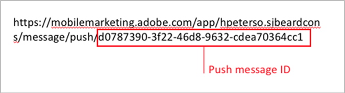
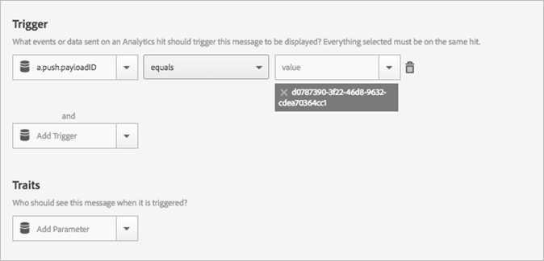

# Een bericht in de app activeren wanneer de app wordt geopend vanuit een pushbericht{#trigger-an-in-app-message-when-the-app-is-opened-from-a-push-message}

{#eol}

U kunt instellen dat de berichttrigger in de app de pushbericht-id is die wordt verzonden wanneer een gebruiker de app opent vanuit het pushbericht.

1. Haal de pushbericht-id op voor het pushbericht dat naar de gebruiker wordt verzonden.

   U kunt de pushbericht-id in de URL vinden tijdens de workflow voor het maken van berichten.

   Hier volgt een voorbeeld:

   

1. Sla het bericht in de app op en activeer dit met de volgende trigger:

   `"a.push.payloadID" =`

   >[!TIP]
   >
   >De pushbericht-id is de id die u in stap 1 hebt geplaatst.

   Deze trigger moet handmatig worden toegevoegd omdat deze niet beschikbaar is in het dialoogvenster **[!UICONTROL Trigger]** vervolgkeuzelijst.

   

1. Sla het pushbericht op en verzend het met de push-id die u in stap 1 hebt geplaatst.
1. Klik door het pushbericht om de app te openen en te controleren of het bericht in de app wordt weergegeven wanneer de app wordt geopend.

   Denk aan de volgende informatie terwijl u test:

   * Nadat u het bericht in de app hebt opgeslagen, duurt het ongeveer 45 seconden voordat het gehoste configuratiebestand wordt bijgewerkt met het nieuwe bericht.
   * De app zoekt naar updates van configuratiebestanden (het nieuwe in-app-bericht) wanneer er een **new** starten, zodat u zeker weet dat de app een nieuwe start start wanneer op het pushbericht wordt geklikt.
   Dit betekent doorgaans dat u ervoor moet zorgen dat de sessietime-out is opgetreden. De standaardtime-out is 5 minuten.
