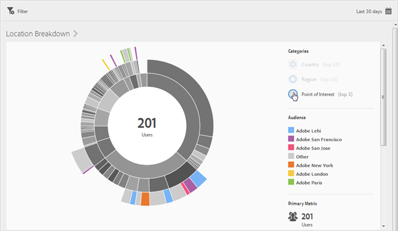

# Overzicht (locatie){#overview-location}

De **[!UICONTROL Location Overview]** Met dit rapport kunt u de verschillende landen, regio&#39;s en belangengebieden (POI) zien waarin uw app wordt gebruikt.

Dit rapport biedt een zonneexplosieve visualisatie voor uw bestaande gegevens en u kunt het rapport gebruiken om publiekssegmenten (verzamelingen bezoekers) voor doelgroepen te zoeken. Het maken en beheren van soorten publiek lijkt op het maken en gebruiken van segmenten, behalve dat u het publiek beschikbaar kunt maken in de Experience Cloud.

Hieronder vindt u aanvullende informatie over dit rapport:

## Navigatie en gebruik {#section_4A88C3849B5847BF8CF433CCFD99FDC3}

Deze visualisatie verstrekt, bijvoorbeeld, het basisrapport met onderverdelingen. De visualisatie gebruikt hoogte om metrisch in nadruk, en de prestatiesverschillen tussen de metriek te tonen. Elke ring vertegenwoordigt een publiekssegment in de categorie van de ring. U kunt acties uitvoeren voor een publiek, zoals het toepassen van een Vaste Filter, het verbergen van metrisch en het bekijken van metriek.

>[!TIP]
>
>Naast deze informatie, kunt u een in-product leerprogramma bekijken dat beschrijft hoe te met de zonneburstgrafiek in wisselwerking te staan. Als u de zelfstudie wilt starten, klikt u op **[!UICONTROL Location Breakdown]** in de titelbalk van het rapport en klik op de knop **[!UICONTROL i]** pictogram.

Deze zonneburstgrafiek is interactief. U kunt de tijdsperiode wijzigen door op de knop **[!UICONTROL Calendar]** in de rechterbovenhoek. Plaats de muis boven een willekeurig deel van het diagram om meer informatie weer te geven. In de volgende afbeelding ziet u bijvoorbeeld het totale aantal en het percentage gebruikers dat uw app in de Verenigde Staten gebruikt.

In deze afbeelding worden de **[!UICONTROL Categories]** met de knoppen in de rechterbovenhoek kunt u schakelen tussen het weergeven van informatie over de bovenste tien landen, gebieden en de bovenste drie **[!UICONTROL Points of Interest]**.

Hier is de visualisatie wanneer u selecteert **[!UICONTROL Country]**:

Hier is de visualisatie wanneer u selecteert **[!UICONTROL Points of Interest]**:

U kunt op een segment in de ring klikken om het publiek te selecteren waarop u handelingen kunt uitvoeren, zoals inzoomen, publiek verbergen, een bericht in de app maken of een ticky Filter maken.

U kunt secundaire metrisch op de rechterkant klikken om het aan visualisatie toe te voegen en deze metrisch te tonen door kleur, hoogte, of allebei te gebruiken.

## Uitsplitsingen en metriek toevoegen {#section_15833511E82648869E7B1EFC24EF7B82}

U kunt onderverdelingen en secundaire metriek toevoegen, die de hoogte van elk publiek met betrekking tot het andere publiek in de grafiek veranderen.

>[!TIP]
>
>Hoe meer ringen u toevoegt aan de zonneexplosie, des te langer duurt het om te verwerken.

Klik op **[!UICONTROL Location Breakdown]** in de titelbalk van het rapport en klik op **[!UICONTROL Customize]** om de juiste spoorlijn te openen.

Wanneer u op **[!UICONTROL Add Breakdown]** of **[!UICONTROL Add Metric]**, wordt een nieuw item weergegeven met dezelfde naam als het vorige item in de respectievelijke lijst. Klik op de nieuw gemaakte metrische uitsplitsing of op de nieuwe metrische waarde om een vervolgkeuzelijst te openen waarin u een nieuw item kunt selecteren.

## Een plakfilter maken {#section_365999D49FC744ECBF9273132497E06C}

Klik op een segment in de ring om het publiek te selecteren waarvoor u een plakfilter wilt maken en klik op **[!UICONTROL Sticky Filter]**. Met dit plakfilter kunt u de huidige filters toepassen en een nieuw rapport uitvoeren op basis van de filters.

## Rapporten delen {#section_F8AF2AA73D4C4C008976D45847F82D0B}

Nadat u een rapport hebt gemaakt, worden uw instellingen gebruikt om een aangepaste URL te maken, die u kunt kopiëren en delen.

## Aanvullende informatie

Zie de volgende inhoud voor meer informatie over de locatie:

* [Kaart](/help/using/location/c-map-points.md)
* [Belangenpunten beheren](/help/using/location/t-manage-points.md)
