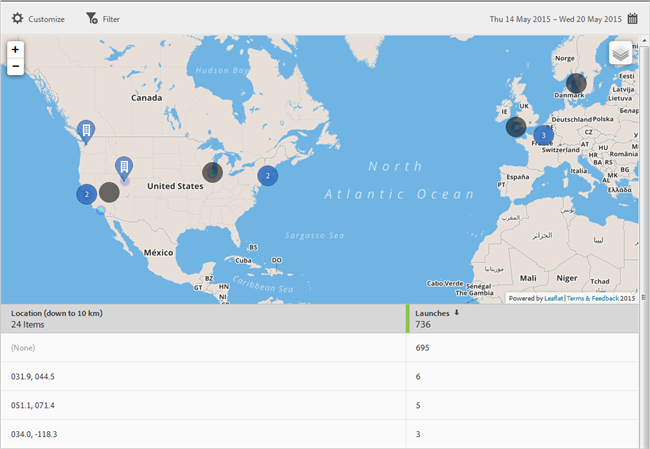

# Kaart {#map}

U kunt een interactieve kaart bekijken die uw POI en andere gegevenstellers toont.

Hier volgt een aantal belangrijke informatie die u moet onthouden:

* U kunt de grootte van de kaart vergroten of verkleinen.

   Deze functie is bijvoorbeeld handig als u twee aandachtspunten hebt die dicht bij elkaar liggen. Als u de kaart vergroot, kunt u deze gedetailleerder weergeven.
* Uw aandachtspunten worden in blauw weergegeven.

   Andere gegevensmarkeringen, zoals Launches, worden zwart weergegeven. Klik op een markeerteken om meer informatie weer te geven.

Klik op  om de volgende opties te selecteren:

* **[!UICONTROL Map ]**

   Een eenvoudige kaart weergeven.

* **[!UICONTROL Satellite]**
Geef de kaart weer in de satellietmodus.

* **[!UICONTROL Data Markers]**

   Geef op of zwarte gegevensmarkeringen moeten worden weergegeven.

* **[!UICONTROL Heat Map]**

   Geef op of u markeringen voor warmtekaarten wilt weergeven. Hoe groter de intensiteit van de kleur, hoe vaker aan de voorwaarde (bijvoorbeeld Starten) wordt voldaan.

* **[!UICONTROL Points of Interest]**

   Geef op of u uw aandachtspunten wilt weergeven.

U kunt de volgende opties voor dit rapport vormen:

* **[!UICONTROL Time Period]**

   Klik op het **[!UICONTROL Calendar]** pictogram om een aangepaste periode te selecteren of om een vooraf ingestelde tijdsperiode te selecteren in de vervolgkeuzelijst.

* **[!UICONTROL Customize]**

   Pas uw rapporten aan door de **[!UICONTROL Show By]** opties te veranderen, metriek en filters toe te voegen, extra reeksen (metriek) toe te voegen, en meer. Zie Rapporten aanpassen voor meer informatie.

* **[!UICONTROL Filter]**

   Klik **[!UICONTROL Filter]** om een filter te creëren dat verschillende rapporten overspant om te zien hoe een segment over alle mobiele rapporten presteert. Met een kleverig filter kunt u een filter definiëren dat wordt toegepast op alle rapporten die geen tekenen bevatten. Zie [Een plakfilter](/help/using/usage/reports-customize/t-sticky-filter.md)toevoegen voor meer informatie.

* **[!UICONTROL Download]**

   Klik **[!UICONTROL PDF]** of **[!UICONTROL CSV]** om documenten te downloaden of te openen en deze te delen met gebruikers die geen toegang hebben tot Mobile Services of om het bestand in presentaties te gebruiken.