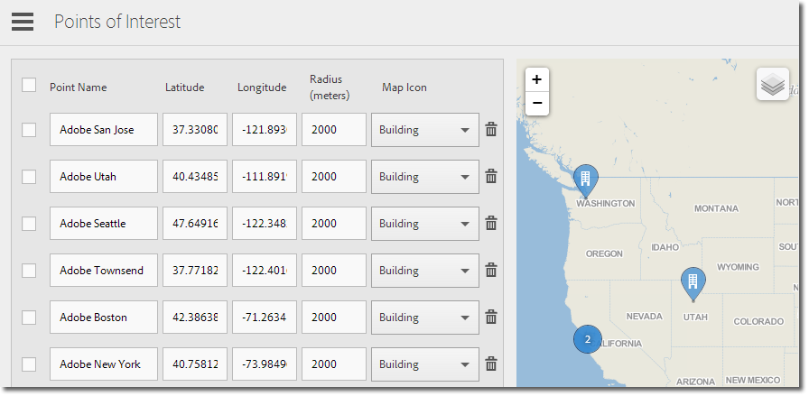

# Belangrijke {#manage-points-of-interest} beheren

U kunt POI&#39;s maken en beheren, waarmee u geografische locaties kunt definiëren die u kunt gebruiken voor correlatiedoeleinden, als doel kunt instellen voor berichten in de app, enzovoort. Wanneer een hit wordt verzonden in een POI, wordt de POI aan de hit gekoppeld.

Controleer voordat u Locatie kunt gebruiken de volgende vereisten:

* U moet beschikken over Analytics: Mobile Apps of Analytics Premium.
* U moet **[!UICONTROL Location Reports]** voor app toelaten.
* Als u een versie van de iOS SDK of de Android SDK ouder dan versie 4.2 gebruikt, moet u na het toevoegen van nieuwe **[!UICONTROL Points of Interest]** een nieuw configuratiebestand downloaden en dit aan de ontwikkelaars van de app geven.

   Als u de iOS SDK of Android SDK versie 4.2 of hoger gebruikt, hoeft u geen app-update naar de winkel te verzenden om uw **[!UICONTROL Points of Interest]** bij te werken. Als u op de pagina Punten van belang beheren op **[!UICONTROL Save]** klikt, worden de wijzigingen in het pakket opgenomen in de lijst **[!UICONTROL Points of Interest]** en wordt het configuratiebestand voor de live app bijgewerkt. Wanneer u de lijst met punten in uw app opslaat op de gebruikersapparaten, werkt u deze ook bij zolang de app de bijgewerkte SDK en de configuratie met een externe POI-URL gebruikt.

Als een hit op het apparaat van de gebruiker aan een **[!UICONTROL Points of Interest]** moet worden toegewezen, moet de locatie voor de app zijn ingeschakeld.

Voer de volgende taken uit om Locatie te gebruiken:

1. Klik op de naam van de toepassing om naar de pagina Toepassingsinstellingen beheren te gaan.
1. Klik op **[!UICONTROL Location]** > **[!UICONTROL Manage Points of Interest]**.

   

1. Typ de informatie in elk van de volgende velden:

   * **[!UICONTROL Point Name]**

      Typ de naam **[!UICONTROL Point of Location]**.

      Dit kan de naam zijn van een stad, provincie of regio. U kunt ook een **[!UICONTROL Point of Location]** rond specifieke locaties maken, zoals stadions of bedrijven.

   * **[!UICONTROL Latitude ]**

      Typ de breedtegraad van **[!UICONTROL Point of Location]**. U kunt deze informatie uit andere bronnen, met inbegrip van Internet vinden.

   * **[!UICONTROL Longitude]**

      Typ de lengtegraad van **[!UICONTROL Point of Location]**. U kunt deze informatie uit andere bronnen, met inbegrip van Internet vinden.

   * **[!UICONTROL Radius (Meters)]**

      Typ de straal (in meters) rondom de **[!UICONTROL Point of Location]** die u wilt opnemen. Als u bijvoorbeeld een POI maakt voor Denver, Colorado, kunt u een straal opgeven die groot genoeg is om de stad Denver en de omliggende gebieden op te nemen, maar Colorado Springs niet.

   * **[!UICONTROL Map Icon]**

      Selecteer een pictogram dat op [Overzicht](/help/using/location/c-location-overview.md) en [Kaart](/help/using/location/c-map-points.md) rapporten zal tonen.

1. Voeg zo nodig aanvullende POI&#39;s toe.

   We raden u aan niet meer dan 5.000 POI&#39;s toe te voegen. Als u meer dan 5000 toevoegt, kunt u de punten opslaan, maar ontvangt u een waarschuwingsbericht waarin u wordt gewaarschuwd dat volgens de aanbevolen procedures minder dan 5000 punten moeten zijn.

1. Klik op **[!UICONTROL Save]**.

Om één of meerdere POIs te schrappen, de toepasselijke controledozen te selecteren, en **[!UICONTROL Remove Selected]** te klikken.

Klik **[!UICONTROL Import]** of **[!UICONTROL Export]** om met de gegevens te werken door een `.csv` dossier in plaats van het gebruiken van de Mobiele gebruikersinterface van Adobe te gebruiken.
