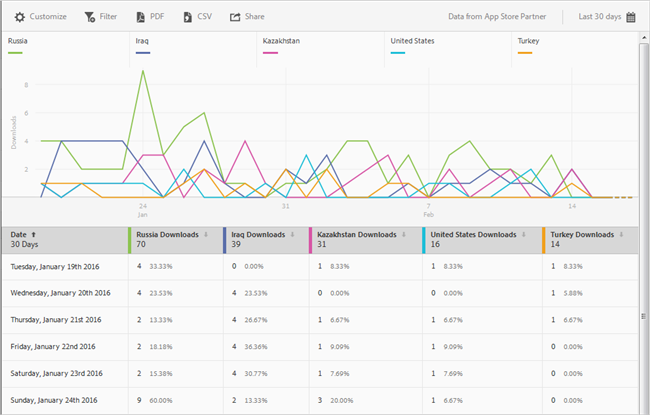

# Rapport Overzicht App Store{#app-store-overview-report}

Het **[!UICONTROL App Store Overview]**-rapport geeft u een momentopname van de maatstaven van uw app-winkel, waaronder het aantal downloads, aankopen in de app, de gemiddelde score van de App Store, downloadopbrengsten, in-app-inkomsten, downloads per land, downloads per App Store en aankopen in de app op naam.

>[!TIP]
>
>In Mobiele Diensten UI, **[!UICONTROL App Store]** menupunt en **[!UICONTROL Overview]** het rapport verschijnen in het linkernavigatiemenu nadat u de integratie vormt.

Het **[!UICONTROL Overview]**-rapport bevat een overtijdse grafiek met informatie over het aantal downloads van App Store, aankopen in de app die met uw app zijn gedaan en de gemiddelde classificatie van uw app.

U kunt op elke metrische waarde klikken om de bijbehorende lijn te verbergen of weer te geven. Als u de gegevens voor een dag wilt bekijken, houdt u de muis boven die dag.

>[!IMPORTANT]
>
>De gegevens van de App store, zoals downloads, rang, opbrengst, classificatie, etc. in Adobe Analytics vereisen een integratie van de Verbinding van Gegevens met een aangewezen verkoper. `appFigures` biedt momenteel een integratie, waarvoor u het juiste product en/of de juiste service moet aanschaffen  `appFigures` **** voordat u de integratie kunt inschakelen. Voor meer informatie over de integratie van de Verbinding van Gegevens, zie [Adobe Uitwisseling](https://www.adobeexchange.com/experiencecloud.html).

>[!TIP]
>
>Naast het veranderen van de de datumwaaier van het rapport door het kalenderpictogram in het hoogste recht te klikken, kunt u sommige boor-benedenrapporten aanpassen, filters en reeksen (metriek) toevoegen, plakfilters toevoegen, en het rapport in formaat downloaden PDF of CSV. Zie [Rapporten aanpassen](/help/using/usage/reports-customize/reports-customize.md) voor meer informatie.

## Gemiddelde waardering App Store {#section_60D0D21824AE4450BC3E34D7ACA12A7A}

In dit rapport wordt de gemiddelde score weergegeven die gebruikers uw app hebben gegeven met de functionaliteit van de app-store.

U kunt overal op **[!UICONTROL App Store Average Rating]** widget klikken om een grafiek en grafiek te tonen die de gemiddelde classificatie door datum toont. Als u de gegevens voor een dag wilt bekijken, houdt u de muis boven die dag.

## Download-inkomsten {#section_34F05998E8444544A1B507C1B852C4EE}

In dit rapport wordt de hoeveelheid inkomsten weergegeven die wordt gegenereerd door het downloaden van uw app.

## In-app-inkomsten {#section_58792ED9C4B54B7D836E30CF09E8E204}

Dit rapport geeft de hoeveelheid inkomsten weer uit aankopen in de app die zijn gedaan met uw app.

## Downloads per land {#section_10373CD28CA94BA5859DFDEED7D548C6}

In dit rapport wordt het aantal downloads voor uw app per land weergegeven.

Als u een grafiek en een grafiek wilt weergeven waarin het aantal downloads per land op datum wordt weergegeven, klikt u op **[!UICONTROL Downloads by Country]**. U kunt de muis boven een datum houden om de gegevens voor een dag weer te geven.

## Downloads via App Store {#section_F1CD1A3F0105469D879E4F280CE32484}

Dit rapport geeft het aantal downloads voor uw app weer, gegroepeerd per App Store.

Als u een grafiek en een grafiek wilt weergeven waarin het aantal downloads per App Store wordt weergegeven, gegroepeerd op datum, klikt u op **[!UICONTROL Downloads by App Store]**. U kunt de muis boven een datum houden om de gegevens voor die dag weer te geven.

## Aankopen in de app op naam {#section_D747A64F9F6449E0A02EF31D56C92F83}

In dit rapport worden alle aankopen in de app op naam weergegeven.
