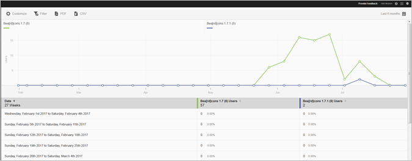

# Versierapport {#versions}

Het Versierapport is een rapport dat tijdens runtime informatie weergeeft over de verschillende versies van uw app die op het apparaat van een gebruiker worden uitgevoerd.

Hier is een voorbeeld van dit rapport:

