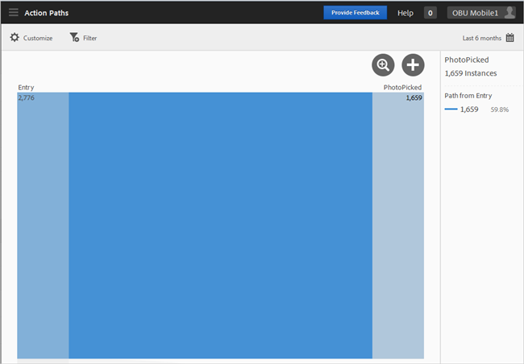
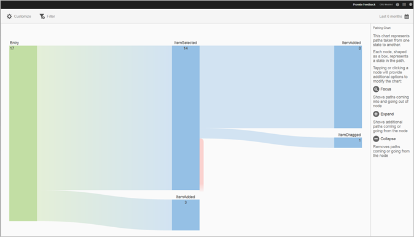
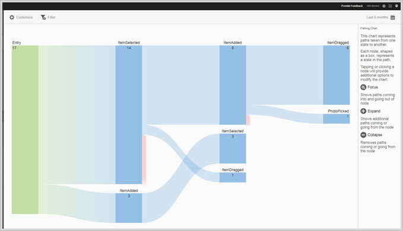
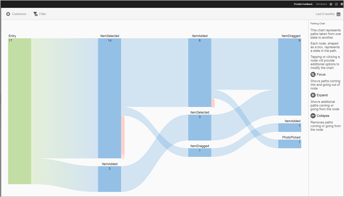

# Rapport voor paden naar actie{#action-paths}

Het rapport Paden van de Actie is gebaseerd op weganalyse en toont een het kleven grafiek die de wegen vertegenwoordigt die van één staat aan een andere staat in app worden genomen.

Zowel zijn **[!UICONTROL View Paths]** als **[!UICONTROL Action Paths]** rapporten kleveringsrapporten. In het **[!UICONTROL View Paths]**-rapport ziet u hoe gebruikers van het ene scherm naar het andere in uw app navigeren. Het **[!UICONTROL View Actions]** rapport toont u de opeenvolging van acties en gebeurtenissen, zoals kliks, selecties, resizing, etc., die de gebruikers in uw app uitvoeren.

>[!TIP]
>
>U kunt een trechterrapport gebruiken om navigatie en acties in één rapport te combineren. Zie [Trechter](/help/using/usage/reports-funnel.md) voor meer informatie.

Elk knooppunt in de vorm van een vak staat voor een staat in de paden van de gebruiker via een app. In de bovenstaande afbeelding geeft het bovenste knooppunt bijvoorbeeld het aantal gebruikers aan dat de app heeft gestart en vervolgens een foto van de galerie heeft gekozen.

Klik op een knooppunt en klik op **[!UICONTROL Focus]** of **[!UICONTROL Expand]** om de opties voor het wijzigen van het diagram weer te geven. Als u bijvoorbeeld op de toestand **[!UICONTROL PhotoPicked]** in het bovenste knooppunt klikt, worden de pictogrammen **[!UICONTROL Focus]** en **[!UICONTROL Expand]** weergegeven.

Klik op het pictogram **[!UICONTROL +]** om uit te vouwen. Met deze optie geeft u de extra paden weer die het knooppunt binnenkomen of verlaten. In de onderstaande afbeelding wordt met frame 1 de app gestart, met frame 2 wordt een foto gekozen (het item dat u eerder hebt uitgevouwen) en frame 3 bevat de verschillende paden die gebruikers hebben gekozen:

* Een item selecteren
* Een item toevoegen
* Een item slepen
* Een item schalen

Het uitbreiden van een staat is gelijkaardig aan een trechter.

Als u het knooppunt wilt isoleren en paden wilt weergeven die binnenkomen en uit het geselecteerde knooppunt wilt gaan, klikt u op het pictogram . In de onderstaande afbeelding zijn de volgende paden voltooid **voordat** gebruikers een foto hebben geselecteerd:

* Een item roteren
* Een item schalen
* Een item slepen
* Een item verwijderen

Van de gebruikers die een foto hebben geselecteerd, zijn de volgende paden voltooid **na** waarop de foto is geselecteerd:

* Een item selecteren
* Een item toevoegen
* Een item slepen
* Een item schalen

U kunt meerdere knooppunten activeren of uitbreiden om een gedetailleerde weergave te krijgen van paden die gebruikers in uw app afleggen. Bijvoorbeeld:

U kunt de volgende opties voor dit rapport vormen:

* **[!UICONTROL Time Period]**

   Klik op het pictogram **[!UICONTROL Calendar]** om een aangepaste periode te selecteren of om een vooraf ingestelde tijdsperiode in de vervolgkeuzelijst te selecteren.

* **[!UICONTROL Customize]**

   Pas uw rapporten aan door de **[!UICONTROL Show By]** opties te veranderen, metriek en filters toe te voegen, en extra reeksen (metriek) toe te voegen, en meer. Zie [Rapporten aanpassen](/help/using/usage/reports-customize/reports-customize.md) voor meer informatie.

* **[!UICONTROL Filter]**

   Klik **[!UICONTROL Filter]** om een filter tot stand te brengen dat verschillende rapporten overspant om te zien hoe een segment over alle mobiele rapporten presteert. Met een kleverig filter kunt u een filter definiëren dat wordt toegepast op alle rapporten die geen tekenen bevatten. Zie [Een kleverig filter toevoegen](/help/using/usage/reports-customize/t-sticky-filter.md) voor meer informatie.

* **[!UICONTROL Download]**

   Klik op **[!UICONTROL PDF]** of **[!UICONTROL CSV]** om documenten te downloaden of te openen en deze te delen met gebruikers die geen toegang hebben tot Mobile Services of om het bestand te gebruiken in presentaties.
