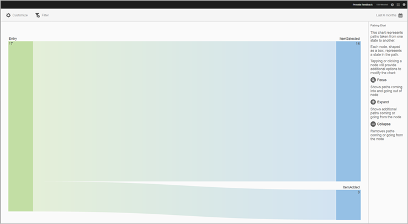

# Rapport voor paden naar actie{#action-paths}

{#eol}

Het rapport Paden van de Actie is gebaseerd op weganalyse en toont een het kleven grafiek die de wegen vertegenwoordigt die van één staat aan een andere staat in app worden genomen.

Beide **[!UICONTROL View Paths]** en **[!UICONTROL Action Paths]** verslagen zijn pijnlijke verslagen . De **[!UICONTROL View Paths]** In dit rapport ziet u hoe gebruikers van het ene scherm naar het andere in uw app navigeren. De **[!UICONTROL View Actions]** In dit rapport ziet u de volgorde van handelingen en gebeurtenissen, zoals klikken, selecties, vergroten, verkleinen, enzovoort, die gebruikers in uw app uitvoeren.

>[!TIP]
>
>U kunt een trechterrapport gebruiken om navigatie en acties in één rapport te combineren. Zie voor meer informatie [Trechter](/help/using/usage/reports-funnel.md).

Elk knooppunt in de vorm van een vak staat voor een staat in de paden van de gebruiker via een app. In de bovenstaande afbeelding geeft het bovenste knooppunt bijvoorbeeld het aantal gebruikers aan dat de app heeft gestart en vervolgens een foto van de galerie heeft gekozen.

Als u de opties voor het wijzigen van het diagram wilt weergeven, klikt u op een knooppunt en klikt u op **[!UICONTROL Focus]** of **[!UICONTROL Expand]**. Als u bijvoorbeeld op de knop **[!UICONTROL PhotoPicked]** status in het bovenste knooppunt, **[!UICONTROL Focus]** en **[!UICONTROL Expand]** pictogrammen worden weergegeven.

Klik op de knop **[!UICONTROL +]** pictogram. Met deze optie geeft u de extra paden weer die het knooppunt binnenkomen of verlaten. In de onderstaande afbeelding wordt met frame 1 de app gestart, met frame 2 wordt een foto gekozen (het item dat u eerder hebt uitgevouwen) en frame 3 bevat de verschillende paden die gebruikers hebben gekozen:

* Een item selecteren
* Een item toevoegen
* Een item slepen
* Een item schalen

Het uitbreiden van een staat is gelijkaardig aan een trechter.

Als u het knooppunt wilt isoleren en paden wilt weergeven die binnenkomen en uit het geselecteerde knooppunt willen gaan, klikt u op de knop   pictogram. In de onderstaande afbeelding zijn de volgende paden voltooid **voor** gebruikers hebben een foto geselecteerd:

* Een item roteren
* Een item schalen
* Een item slepen
* Een item verwijderen

Van de gebruikers die een foto hebben geselecteerd, zijn de volgende paden voltooid **na** de foto is geselecteerd:

* Een item selecteren
* Een item toevoegen
* Een item slepen
* Een item schalen

U kunt meerdere knooppunten activeren of uitbreiden om een gedetailleerde weergave te krijgen van paden die gebruikers in uw app afleggen. Bijvoorbeeld:

U kunt de volgende opties voor dit rapport vormen:

* **[!UICONTROL Time Period]**

   Klik op de knop **[!UICONTROL Calendar]** om een aangepaste periode te selecteren of een vooraf ingestelde tijdsperiode te selecteren in de vervolgkeuzelijst.

* **[!UICONTROL Customize]**

   Pas uw rapporten aan door te veranderen **[!UICONTROL Show By]** opties, metriek en filters toevoegen, en extra reeksen (metriek) toevoegen, en meer. Zie voor meer informatie [Rapporten aanpassen](/help/using/usage/reports-customize/reports-customize.md).

* **[!UICONTROL Filter]**

   Klikken **[!UICONTROL Filter]** om een filter tot stand te brengen dat verschillende rapporten overspant om te zien hoe een segment over alle mobiele rapporten presteert. Met een kleverig filter kunt u een filter definiëren dat wordt toegepast op alle rapporten die geen tekenen bevatten. Zie voor meer informatie [Een kleverig filter toevoegen](/help/using/usage/reports-customize/t-sticky-filter.md).

* **[!UICONTROL Download]**

   Klikken **[!UICONTROL PDF]** of **[!UICONTROL CSV]** om documenten te downloaden of te openen en deze te delen met gebruikers die geen toegang hebben tot Mobile Services of om het bestand in presentaties te gebruiken.
