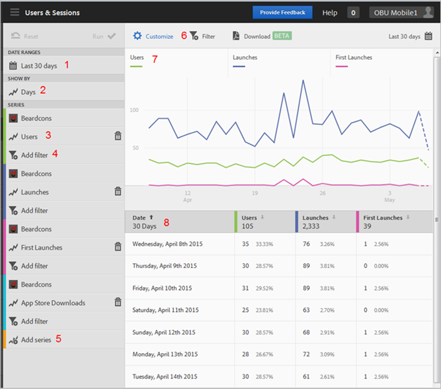

# Rapporten aanpassen{#customize-reports}

Deze informatie helpt u de ingebouwde rapporten te begrijpen en aan te passen.

U kunt uw rapporten aanpassen door het datumbereik, de **[!UICONTROL Show By]** opties (grafiek en lijstgegevens door tijdsperiodes of door afmetingen), voeg metriek en filters toe, voeg extra reeksen (metriek) toe, en meer.

Als u het spoor Aanpassen wilt weergeven, klikt u op de naam van de app om naar de overzichtspagina te gaan en klikt u op **[!UICONTROL Customize]**.

In het volgende voorbeeld wordt het rapport Gebruikers en sessies met de open **[!UICONTROL Customize]** spoorwegen. In dit voorbeeld worden gegevens van de laatste 30 dagen weergegeven, weergegeven op dagen, met vier actieve reeksen:

* **[!UICONTROL Users]**
* **[!UICONTROL Launches]**
* **[!UICONTROL First Launches]**
* **[!UICONTROL App Store Downloads]**

De volgende informatie beschrijft elk gebied van het rapport en **[!UICONTROL Customize]** spoor:

| Getal | Beschrijving |
|--- |--- |
| 1 | In **[!UICONTROL Date Ranges]**, laat de drop-down lijst u diverse datumwaaiers voor uw rapport selecteren. Alle gegevens in het diagram (9) en de bijbehorende tabel (10) voldoen aan het geselecteerde datumbereik. |
| 2 | In **[!UICONTROL Show By]**, laat de drop-down lijst u een op tijd-gebaseerde of op dimensie-gebaseerde vertoning voor uw rapport selecteren.  In de afbeelding ziet u bijvoorbeeld dat Dagen is geselecteerd. Als u de data onder de grafiek (7) en de rijen in de lijst (8) bekijkt, worden de gegevens gecategoriseerd door datum in een over-tijd rapport. Een maximum van zes metriek kan op overtijdrapporten worden gemeld door extra reeksen aan het rapport toe te voegen.  Als u een dimensie van de Levenscyclus selecteert, kunt u de hoogste 50 waarden in een gerangschikte lijst bekijken, de hoogste 5 waarden die door dag of week, of een top 5 of 10 waardescheiding worden afgebroken. |
| 3 | **[!UICONTROL Series]** vertegenwoordigt individuele metriek, zoals Gebruikers, Lanceringen, Eerste Lanceringen, en de Downloads van App Store in het bovengenoemde voorbeeld. Elke reeks heeft een kleurcode met gegevens in de grafiek (7) en tabel (8).  U kunt extra reeksen (metriek) en zelfs verschillende apps in verschillende rapportreeksen toevoegen om gegevens te vergelijken.  Zie voor meer informatie  [Reeks (metriek) toevoegen aan rapporten](/help/using/usage/reports-customize/t-reports-series.md). |
| 4 | Met **[!UICONTROL Add Filter]** kunt u de ingebouwde rapporten aanpassen door extra filters (segmenten) toe te voegen.  Zie voor meer informatie  [Filters toevoegen aan rapporten](/help/using/usage/reports-customize/t-reports-customize.md). |
| 5 | Met **[!UICONTROL Add Series]**, kunt u de ingebouwde rapporten aanpassen door extra reeksen (metriek) of apps in verschillende rapportreeksen toe te voegen om gegevens te vergelijken.  Zie voor meer informatie [Reeks (metriek) toevoegen aan rapporten](/help/using/usage/reports-customize/t-reports-series.md). |
| 6 | Met **[!UICONTROL Sticky Filter]** kunt u een filter maken dat verschillende rapporten omvat. Bijvoorbeeld, zou u kunnen willen zien hoe een bepaald segment over alle mobiele rapporten presteert. Met een plakfilter kunt u een filter definiëren dat wordt toegepast op alle rapporten die geen tekenen bevatten.  Zie voor meer informatie [Filter Notitie toevoegen](/help/using/usage/reports-customize/t-sticky-filter.md). |
| 7 | De **[!UICONTROL Data Chart]** geeft gegevens weer in een geschikt diagram dat is gebaseerd op de geselecteerde meetgegevens. Grafiektypen omvatten lijngrafieken, staafdiagrammen, donutgrafieken, enz. |
| 8 | De **[!UICONTROL Data Table]** geeft gegevens weer in tabelvorm. U kunt op een kolomkop klikken om de gegevens in oplopende of aflopende volgorde te sorteren. |
