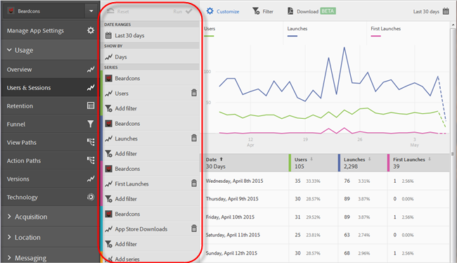

# Filters toevoegen aan rapporten{#add-filters-to-reports}

Deze informatie helpt u de ingebouwde rapporten aan te passen door extra filters (segmenten) toe te voegen.

>[!IMPORTANT]
>
>Metriek voor Mobile-apps zijn ook beschikbaar in marketingrapporten en -analyses, ad-hocanalyses, gegevensopslagruimten en andere analytische rapportageinterfaces. Als een uitsplitsing of rapporttype niet beschikbaar is in Adobe Mobile, kan het worden geproduceerd door een verschillende rapporteringsinterface te gebruiken.

In dit voorbeeld worden de opties **[!UICONTROL Users & Sessions]** , maar de instructies gelden voor elk rapport.

1. Open uw app en klik op **[!UICONTROL Usage]** > **[!UICONTROL Users & Sessions]**.

   

   Dit rapport bevat een volledige overloopweergave van gebruikers van de app. Metrische gegevens voor zowel de iOS- als de Android-versie van deze app worden echter verzameld in dezelfde rapportsuite. Wij kunnen gebruikers door mobiel OS segmenteren door een douanefilter aan de Gebruikers metrisch toe te voegen.

1. Klik op **[!UICONTROL Customize]**.

   

1. Onder **[!UICONTROL Users]**, klikt u op **[!UICONTROL Add Filter]** en klik op **[!UICONTROL Add Rule]**.

1. Selecteren **[!UICONTROL Operating Systems]** en in de vervolgkeuzelijst selecteert u **[!UICONTROL iOS]**.

   

   Als u Android als filter wilt toevoegen, moet u deze stap herhalen.

1. Klikken **[!UICONTROL And]**, selecteert u **[!UICONTROL Operating Systems]** in de vervolgkeuzelijst en selecteer **[!UICONTROL Android]**.

   De filters moeten er nu als volgt uitzien:

   

1. Klik op **[!UICONTROL Update]**.
1. Als u het rapport opnieuw wilt genereren, klikt u op **[!UICONTROL Run]**.

   In dit rapport worden nu gebruikers weergegeven die zijn opgesplitst naar besturingssysteem. De rapporttitel is gewijzigd en komt overeen met de filters die op het rapport zijn toegepast.

   

   U kunt dit rapport verder aanpassen. Vanuit iOS 8.3 kunt u de methode First Launches toevoegen met een versiefilter van het iOS 8.3-besturingssysteem om te zien hoeveel klanten van iOS 8.3 hun apps upgraden en een eerste keer starten.
1. Onder **[!UICONTROL First Launches]**, klikt u op **[!UICONTROL Add Filter]**, klikt u op **[!UICONTROL Add Rule]**, selecteert u **[!UICONTROL Operating Systems]** in de vervolgkeuzelijst en selecteer **[!UICONTROL iOS]**.
1. Klikken **[!UICONTROL And]**, selecteert u **[!UICONTROL Operating System Versions]** in de vervolgkeuzelijst en selecteer **[!UICONTROL iOS 8.3]**.

   De filters moeten er nu als volgt uitzien:

   

1. Klikken **[!UICONTROL Update]** en **[!UICONTROL Run]**.

   In dit rapport worden nu gebruikers met iOS 8.3 weergegeven die de app voor het eerst hebben gestart.

   

   Neem wat tijd om de verschillende opties in het menu van de rapportaanpassing te testen, en ervoor te zorgen dat u referentie uw favorieten. URL&#39;s rapporteren in Adobe Mobile is functioneel en kan worden gemaild of toegevoegd aan uw favorieten.
