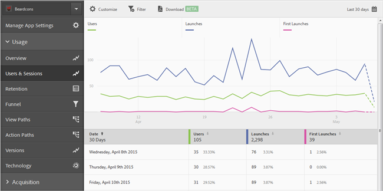

# Filters toevoegen aan rapporten{#add-filters-to-reports}

Deze informatie helpt u de ingebouwde rapporten aan te passen door extra filters (segmenten) toe te voegen.

>[!IMPORTANT]
>
>Metrische gegevens voor mobiele apps zijn ook beschikbaar in marketingrapporten en -analyses, ad-hocanalyses, gegevensopslagruimten en andere analytische rapportageinterfaces. Als een afbraak of rapporttype niet beschikbaar in Adobe Mobiel is, kan het worden geproduceerd door een verschillende rapporteringsinterface te gebruiken.

In dit voorbeeld, zullen wij het **[!UICONTROL Users & Sessions]** rapport aanpassen, maar de instructies zijn op om het even welk rapport van toepassing.

1. Open uw app en klik op **[!UICONTROL Usage]** > **[!UICONTROL Users & Sessions]**.

   

   Dit rapport bevat een volledige overloopweergave van gebruikers van de app. Metrische gegevens voor zowel de iOS- als de Android-versie van deze app worden echter verzameld in dezelfde rapportsuite. Wij kunnen gebruikers door mobiel OS segmenteren door een douanefilter aan de Gebruikers metrisch toe te voegen.

1. Klik op **[!UICONTROL Customize]**.

   

1. Klik onder **[!UICONTROL Users]** op **[!UICONTROL Add Filter]** en klik op **[!UICONTROL Add Rule]**.

1. Selecteer **[!UICONTROL Operating Systems]**, en van de drop-down lijst, en selecteer **[!UICONTROL iOS]**.

   

   Als u Android als filter wilt toevoegen, moet u deze stap herhalen.

1. Klik **[!UICONTROL And]**, selecteer **[!UICONTROL Operating Systems]** van de drop-down lijst, en selecteer **[!UICONTROL Android]**.

   De filters moeten er nu als volgt uitzien:

   

1. Klik op **[!UICONTROL Update]**.
1. Klik op **[!UICONTROL Run]** om het rapport opnieuw te genereren.

   In dit rapport worden nu gebruikers weergegeven die zijn opgesplitst naar besturingssysteem. De rapporttitel is gewijzigd en komt overeen met de filters die op het rapport zijn toegepast.

   

   U kunt dit rapport verder aanpassen. Vanuit iOS 8.3 kunt u de metrische gegevens Eerste starten toevoegen met een versiefilter van het besturingssysteem iOS 8.3 om te zien hoeveel iOS 8.3-klanten hun apps hebben geüpgraded en een eerste keer hebben gestart.
1. Klik onder **[!UICONTROL First Launches]** op **[!UICONTROL Add Filter]**, klik op **[!UICONTROL Add Rule]**, selecteer **[!UICONTROL Operating Systems]** in de vervolgkeuzelijst en selecteer **[!UICONTROL iOS]**.
1. Klik **[!UICONTROL And]**, selecteer **[!UICONTROL Operating System Versions]** van de drop-down lijst, en selecteer **[!UICONTROL iOS 8.3]**.

   De filters moeten er nu als volgt uitzien:

   

1. Klik op **[!UICONTROL Update]** en **[!UICONTROL Run]**.

   In dit rapport worden nu gebruikers met iOS 8.3 getoond die de app voor het eerst hebben gestart.

   

   Neem wat tijd om de verschillende opties in het menu van de rapportaanpassing te testen, en ervoor te zorgen dat u referentie uw favorieten. De rapport-URL&#39;s in Adobe Mobile zijn functioneel en kunnen worden gemaild of toegevoegd aan uw favorieten.
