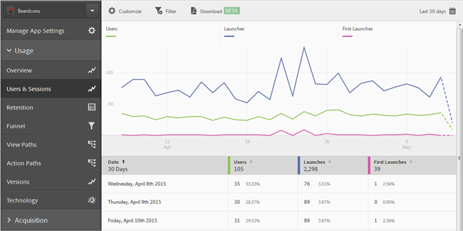
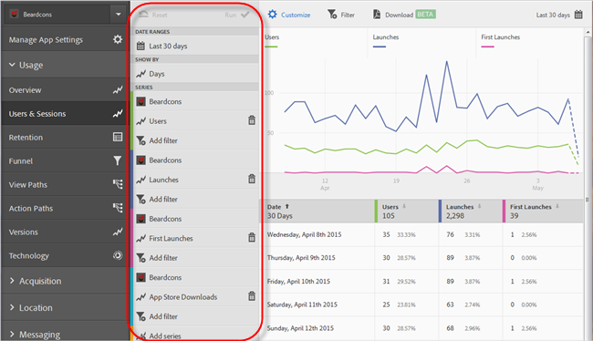
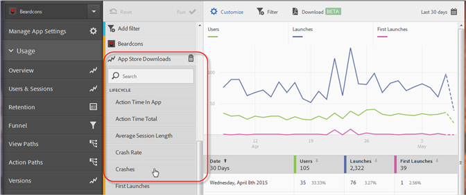
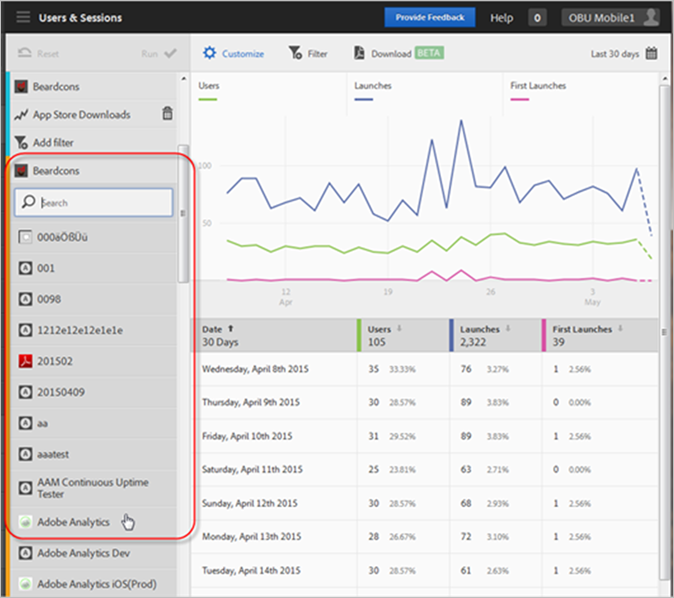

# Serie (metriek) toevoegen aan rapporten{#add-series-metrics-to-reports}

Deze informatie helpt u de ingebouwde rapporten aan te passen door extra reeksen (metriek) of apps in verschillende rapportreeksen toe te voegen om gegevens te vergelijken.

>[!IMPORTANT]
>
>De mobiele toepassingsmetriek zijn ook beschikbaar in marketing reports and analytics, ad hoc analyse, gegevenspakhuis, en andere Analytics rapporteringsinterfaces. Als een afbraak of rapporttype niet beschikbaar in Adobe Mobile is, kan het door een verschillende rapporteringsinterface worden geproduceerd te gebruiken.

In dit voorbeeld, zullen wij het **[!UICONTROL Users & Sessions]** rapport aanpassen, maar de instructies kunnen op om het even welk rapport van toepassing zijn.

1. Open uw app en klik op **[!UICONTROL Usage]** > **[!UICONTROL Users & Sessions]**.

   

   Dit rapport bevat een volledige overloopweergave van gebruikers van de app. We willen echter een reeks toevoegen om melding te maken van vastgelopen apps.

1. Klik op **[!UICONTROL Customize]**.

   

1. Schuif omlaag en klik op **[!UICONTROL Add Series]**.

   De naam van de reeks wordt gevuld met dezelfde naam als de laatste reeks in de lijst. In de vorige illustratie is de laatste reeks **[!UICONTROL App Store Downloads]** toegevoegd, dus wordt een nieuwe reeks toegevoegd met de naam **[!UICONTROL App Store Downloads]**.

1. Voer een van de volgende taken uit:

   * Als u een nieuwe (metrische) reeks wilt toevoegen, klikt u op de naam van de reeks die u net hebt gemaakt en selecteert u een nieuwe metrische levenscyclus in de vervolgkeuzelijst.

      

   * Als u een nieuwe app wilt toevoegen aan een andere rapportsuite zodat u gegevens kunt vergelijken tussen verschillende apps, klikt u op de naam van de app in de nieuwe serie en selecteert u de gewenste app.

      

1. (Voorwaardelijk) voeg filters aan de nieuwe reeks toe.

   Zie Filters [toevoegen aan rapporten](/help/using/usage/reports-customize/t-reports-customize.md)voor meer informatie.
1. Klik **[!UICONTROL Update]** en **[!UICONTROL Run]**.
