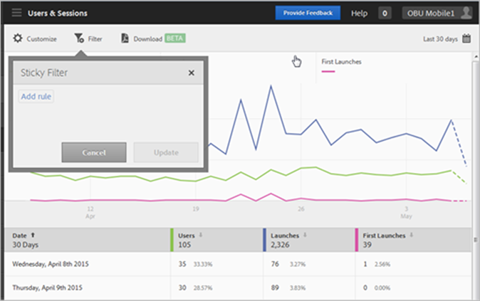
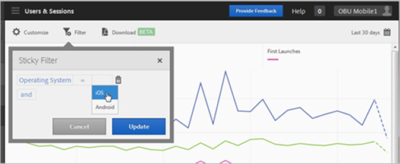
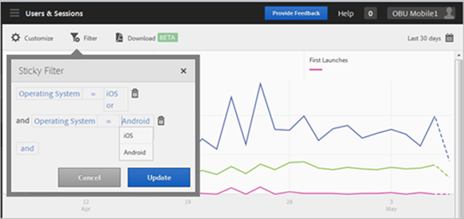

# Een kleverig filter toevoegen{#add-sticky-filter}

{#eol}

Creeer een filter dat verschillende rapporten overspant om te zien hoe een bepaald segment over alle mobiele rapporten presteert. Met een plakfilter kunt u een filter definiëren dat wordt toegepast op alle rapporten die geen tekenen bevatten.

In het volgende voorbeeld worden kleverige filters voor iOS- en Android-besturingssystemen toegevoegd aan de **[!UICONTROL Users & Sessions]** rapport, maar de instructies zijn op om het even welk rapport of metrisch van toepassing.

1. Klik op de knop **[!UICONTROL Filter]** boven aan een willekeurig rapport in Adobe Mobile.

   

1. Klik in het dialoogvenster Filter kiezen op **[!UICONTROL Add Rule]**, selecteert u **[!UICONTROL Operating Systems]** en in de vervolgkeuzelijst selecteert u **[!UICONTROL iOS]**.

   Herhaal deze stap om Android als filter toe te voegen.

   

1. Klikken **[!UICONTROL And]**, selecteert u **[!UICONTROL Operating Systems]** en in de vervolgkeuzelijst selecteert u **[!UICONTROL Android]**.

   De filters moeten er nu als volgt uitzien:

   

1. Klikken **[!UICONTROL Update]** en **[!UICONTROL Run]**.
