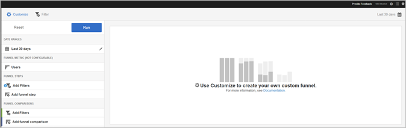
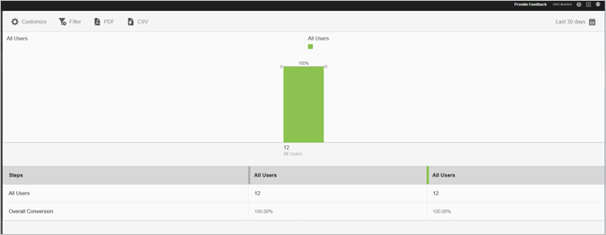

# Trechter-rapport{#funnel}

In het **[!UICONTROL Funnel]**-rapport wordt aangegeven waar klanten een marketingcampagne hebben verlaten of van een gedefinieerd conversiepad zijn afgeweken tijdens de interactie met uw mobiele app. U kunt het **[!UICONTROL Funnel]** rapport ook gebruiken om de acties van verschillende segmenten te vergelijken.

Door bij elke stap zichtbaarheid in de beslissingen van de klant te krijgen, kunt u beter begrijpen waar ze worden afgeschrikt, welk pad ze meestal volgen en wanneer klanten uw app verlaten.

Wanneer u het **[!UICONTROL Funnel]** rapport opent, moet u een douanetrechter tot stand brengen. Zie [Rapporten aanpassen](/help/using/usage/reports-customize/reports-customize.md) voor meer informatie.

>[!TIP]
>
>Om uw douanetrechter te bewaren, sparen URL nadat u zijn montages vormt en het rapport in werking stelt. U kunt de URL delen of opslaan in een document.

Hier is een voorbeeld van dit rapport:

Om een eenvoudige trechter aan te tonen, zijn hier de montages voor een configuratie die drie trechterstappen en twee trechter vergelijkingen gebruikt. We gaan ervan uit dat gebruikers in een demo-app een item, zoals een foto, kunnen toevoegen en dit vervolgens kunnen delen.

In het venster Aanpassen vindt u secties die aangeven dat de gebruiker de app heeft gestart, een foto uit een galerie in de app heeft toegevoegd, een of meer foto&#39;s uit de app heeft gedeeld op sociale media, tekstbericht, e-mail enzovoort. Met de trechter-vergelijkingen kunt u de niveaus van het toevoegen en delen van foto&#39;s vergelijken tussen gebruikers van de iOS-app en de Android-app.

Klik op **[!UICONTROL Run]** om het rapport te genereren.

Hier is een voorbeeld van een geproduceerd rapport:

De eerste serie laat zien dat 100 procent van de gebruikers de app heeft gestart. Uit de tweede reeks blijkt dat een hoger percentage Android-gebruikers een foto uit de galerie heeft toegevoegd. Uit de derde reeks blijkt dat bijna de helft van de iOS-gebruikers de foto heeft gedeeld, maar dat geen van de Android-gebruikers de foto heeft gedeeld. Dit kan wijzen op een probleem met app die moet worden onderzocht.

Als u aanvullende informatie wilt weergeven, plaatst u de muis boven een willekeurige balk in het diagram.

U kunt de volgende opties voor dit rapport vormen:

* **[!UICONTROL Time Period]**

   Klik op het pictogram **[!UICONTROL Calendar]** om een aangepaste periode te selecteren of om een vooraf ingestelde tijdsperiode in de vervolgkeuzelijst te selecteren.
* **[!UICONTROL Customize]**

   Pas uw rapporten aan door de **[!UICONTROL Show By]** opties te veranderen, metriek en filters toe te voegen, en extra reeksen (metriek) toe te voegen, en meer. Zie [Rapporten aanpassen](/help/using/usage/reports-customize/reports-customize.md) voor meer informatie.
* **[!UICONTROL Filter]**

   Klik **[!UICONTROL Filter]** om een filter tot stand te brengen dat verschillende rapporten overspant om te zien hoe een segment over alle mobiele rapporten presteert. Met een kleverig filter kunt u een filter definiëren dat wordt toegepast op alle rapporten die geen tekenen bevatten. Zie [Filter toevoegen](/help/using/usage/reports-customize/t-sticky-filter.md) voor meer informatie.
* **[!UICONTROL Download]**

   Klik op **[!UICONTROL PDF]** of **[!UICONTROL CSV]** om documenten te downloaden of te openen en deze te delen met gebruikers die geen toegang hebben tot Mobile Services of om het bestand te gebruiken in presentaties.
