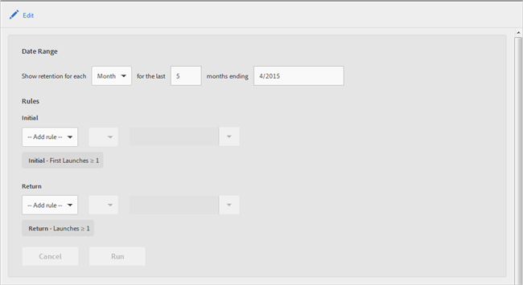

# Bewaarrapport {#retention}

Het **[!UICONTROL Retention]** rapport (voorheen bekend als First Launch Cohorts) is een cohortrapport waarin wordt weergegeven hoeveel unieke gebruikers uw app voor de eerste keer hebben gestart en de app vervolgens ten minste één keer in de daaropvolgende maanden opnieuw hebben gestart.

Standaard toont dit rapport de handhaving van groepen gebruikers op basis van het tijdstip waarop de gebruikers de app voor het eerst hebben gestart. U kunt dit rapport ook aanpassen als u een andere metrische waarde wilt gebruiken dan First Launch en extra handelingen wilt toevoegen.

Een cohort is een groep mensen die een gemeenschappelijke eigenschap of ervaring in een bepaalde periode delen. Het **[!UICONTROL Retention]** rapport neemt de algemene kenmerken over van gebruikers die de app op een bepaalde dag, week of maand hebben geïnstalleerd en geeft een overzicht van het aantal gebruikers dat de app de komende X dagen, weken of maanden heeft gestart. Het rapport toont hoe goed de bezoekers als actief of betrokken werden behouden.

Hier is een voorbeeld van dit rapport:

In de **[!UICONTROL MO]** kolom wordt het totale aantal personen weergegeven dat de app in november 2014 voor het eerst heeft gestart. In de **[!UICONTROL M1]** kolom wordt het aantal personen weergegeven dat de app opnieuw heeft gestart in december 2014, enzovoort.

Om de datumwaaier te veranderen of de regels van het rapport uit te geven, klik **[!UICONTROL Edit]**.

Het rapport kan door om het even welke variabele of metrisch, zoals de metriek van de Levenscyclus maar niet berekende metriek worden bevolkt.
