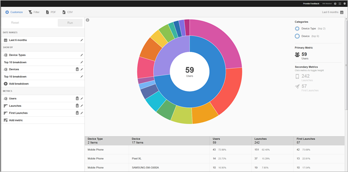

# Technologierapport {#technology}

Met het **[!UICONTROL Technology]**-rapport kunt u de verschillende apparaattypen, besturingssystemen, versies van besturingssystemen en mobiele dragers bekijken waarop uw app wordt gebruikt.

Dit rapport biedt een zonneexplosieve visualisatie voor uw bestaande gegevens en u kunt het rapport gebruiken om publiekssegmenten (verzamelingen bezoekers) voor doelgroepen te zoeken. Het maken en beheren van soorten publiek lijkt op het maken en gebruiken van segmenten, behalve dat u het publiek beschikbaar kunt maken in de Experience Cloud.

## Navigatie en gebruik {#section_83CA60E1AE6245FEBCBFF3205615C4DF}

Deze visualisatie verstrekt, bijvoorbeeld, het basisrapport en de onderverdelingen, gebruikshoogte om metrisch in nadruk te tonen, en de prestatiesverschillen tussen de metriek. Elke ring vertegenwoordigt een publiekssegment in de categorie van de ring. U kunt acties uitvoeren voor een publiek, zoals het toepassen van een kleverig filter, het verbergen van metrisch en het bekijken van metriek.

>[!TIP]
>
>Naast deze informatie, kunt u een in-product leerprogramma bekijken dat beschrijft hoe te met de zonneburstgrafiek in wisselwerking te staan. Als u de zelfstudie wilt starten, klikt u op **[!UICONTROL Technology Breakdown]** in de titelbalk van het rapport, klikt u op **[!UICONTROL Customize]** en klikt u op het pictogram **[!UICONTROL i]**.

Het zonneburstdiagram is interactief en u kunt de volgende taken uitvoeren:

* Plaats de muis boven een willekeurig deel van het diagram om meer informatie weer te geven.
* Wijzig de tijdsperiode door op het pictogram **[!UICONTROL Calendar]** te klikken.
* Klik op een segment in de ring om het publiek te selecteren waarop u handelingen kunt uitvoeren, zoals inzoomen, publiek verbergen, bericht in de app maken of een plakfilter.
* Selecteer in de rechterbovenhoek **[!UICONTROL Device Type]** en **[!UICONTROL Device]** om informatie over apparaten en apparaattypen weer te geven.

* Klik secundaire metrisch op de rechterkant om het aan de visualisatie toe te voegen.

   U kunt de secundaire metrische waarde weergeven met behulp van kleur, hoogte of beide.

De volgende lijst beschrijft de standaardrapporten en hoe zij in de Mobiele Diensten bevolkt zijn:

| Rapport | Populatiemethode | Beschrijving |
|--- |--- |--- |
| Apparaat | Levenscycluswaarden | Algemene maatstaven, uitgesplitst naar apparaattype. |
| Besturingssystemen | Automatisch | Gemeenschappelijke maatstaven uitgesplitst naar besturingssysteem. |
| Versie besturingssysteem | Levenscycluswaarden | Algemene maateenheden, uitgesplitst naar versie van het besturingssysteem. |
| Vervoerders | Automatisch | Gemeenschappelijke metriek uitgesplitst naar vervoerders. |

>[!TIP]
>
>In het **[!UICONTROL Carriers]**-rapport worden Wi-Fi-gebruikers gerapporteerd als `none`.

## Uitsplitsingen en statistieken {#section_15833511E82648869E7B1EFC24EF7B82} toevoegen

U kunt onderverdelingen en secundaire metriek toevoegen, die de hoogte van elk publiek met betrekking tot het andere publiek in de grafiek veranderen.

>[!IMPORTANT]
>
>Hoe meer ringen u toevoegt aan de zonneexplosie, des te langer duurt het om te verwerken.

Om onderverdelingen en secundaire metriek toe te voegen, klik **[!UICONTROL Technology Breakdown]** in de titelbar van het rapport en klik **[!UICONTROL Customize]**.

Wanneer u **[!UICONTROL Add Breakdown]** of **[!UICONTROL Add Metric]** klikt, toont een nieuw punt met de zelfde naam zoals het vorige punt in de lijst. Klik op de nieuw gemaakte metrische uitsplitsing of op de nieuwe metrische waarde om een vervolgkeuzelijst te openen waarin u een nieuw item kunt selecteren.

## Filter Wijzigen {#section_B4E355CD1FE34E4C8ADC38139ED67FC8}

Klik op een segment in de ring om het publiek te selecteren waarvoor u een plakfilter wilt maken en klik op **[!UICONTROL Sticky Filter]**. Met dit filter kunt u de huidige filters toepassen en een nieuw rapport uitvoeren op basis van de filters.

## Rapporten delen {#section_560DD5CED5144249B7E49461E2422100}

Nadat u een rapport hebt gemaakt, worden uw instellingen gebruikt om een aangepaste URL te maken die u kunt kopiëren en delen.
