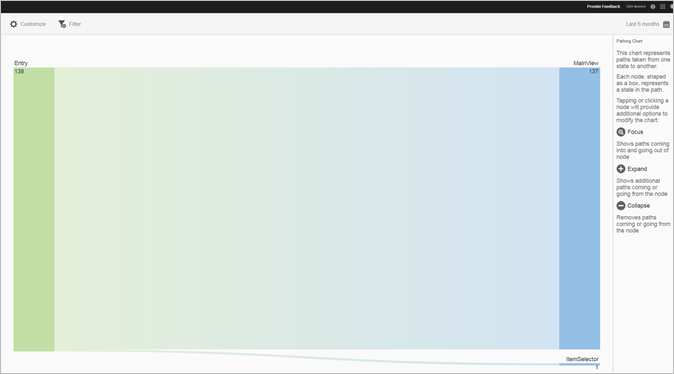
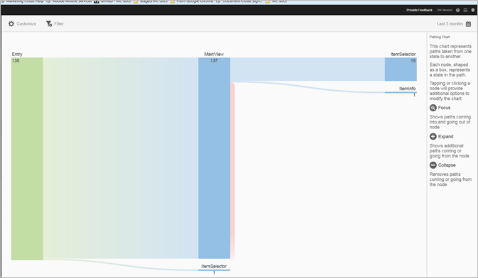
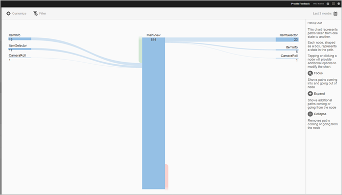
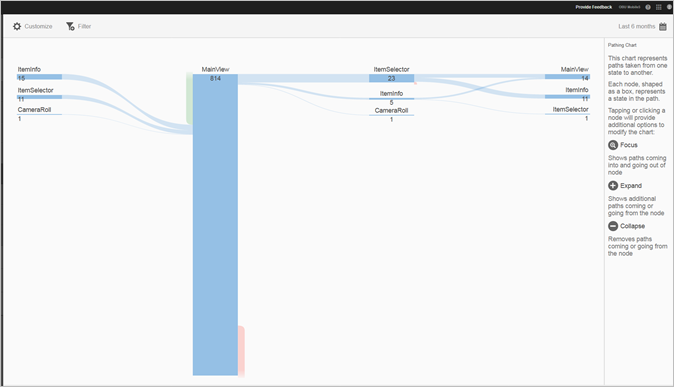

# Rapport Paden weergeven {#view-paths}

{#eol}

De **[!UICONTROL View Paths]** In dit rapport, dat is gebaseerd op padanalyse, wordt een paddiagram weergegeven dat de paden vertegenwoordigt die tussen de frames in de app zijn gemaakt.

>[!TIP]
>
>De **[!UICONTROL View Paths]** en **[!UICONTROL View Action]** verslagen zijn vergelijkbaar omdat beide verslagen tekenend zijn . De **[!UICONTROL View Paths]** kunt u zien hoe gebruikers van het ene scherm naar het andere in uw app navigeren. De **[!UICONTROL View Actions]** In dit rapport wordt de volgorde weergegeven van handelingen (gebeurtenissen zoals klikken, selecties, vergroten/verkleinen, enzovoort) die gebruikers in uw app uitvoeren. U kunt een trechterrapport gebruiken om navigatie en acties in één rapport te combineren. Zie voor meer informatie [Trechter](/help/using/usage/reports-funnel.md).

Elk knooppunt in de vorm van een vak staat voor een staat in de paden van de gebruiker via een app. In de bovenstaande illustratie geeft het bovenste knooppunt bijvoorbeeld het aantal gebruikers aan dat de app heeft gestart en naar de hoofdweergave is genavigeerd.

Als u op een knooppunt klikt om aanvullende opties voor het wijzigen van het diagram op te geven, kunt u aanvullende opties instellen, zoals **[!UICONTROL Focus]** of **[!UICONTROL Expand]** weergegeven. Wanneer u bijvoorbeeld op de knop **[!UICONTROL MainView]** status in het bovenste knooppunt, **[!UICONTROL Focus]** en **[!UICONTROL Expand]** Er worden pictogrammen weergegeven.

Als u de weergave wilt uitvouwen, klikt u op de knop **[!UICONTROL +]** pictogram om de extra wegen te tonen die binnen aan komen of van de knoop gaan. In de onderstaande afbeelding wordt met frame 1 de app gestart, met frame 2 wordt de hoofdpagina van de app weergegeven en met frame 3 zijn de volgende paden opgenomen die gebruikers hebben gekozen:

* Navigeren naar de camerarol
* navigeren naar de itemkiezer
* naar de camera navigeren
* navigeren naar de pagina met iteminfo

Klikken  om de knoop te isoleren en de wegen te tonen die in komen en uit de geselecteerde knoop gaan. In de onderstaande afbeelding zijn de volgende paden voor gebruikers weergegeven die de hoofdweergave van de app bekeken:

* iteminfo
* itemkiezer
* Camerarol
* Camera

U kunt meerdere knooppunten activeren of uitbreiden voor een gedetailleerde weergave van de paden die gebruikers in uw app innemen. Bijvoorbeeld:

U kunt de volgende opties voor dit rapport vormen:

* **[!UICONTROL Time Period]**
Klik op de knop **[!UICONTROL Calendar]** om een aangepaste periode te selecteren of een vooraf ingestelde tijdsperiode te selecteren in de vervolgkeuzelijst.
* **[!UICONTROL Customize]**
Pas uw rapporten aan door te veranderen **[!UICONTROL Show By]** opties, metriek en filters toevoegen, en extra reeksen (metriek) toevoegen, en meer. Zie voor meer informatie [Rapporten aanpassen](/help/using/usage/reports-customize/reports-customize.md).
* **[!UICONTROL Filter]**
Klikken **[!UICONTROL Filter]** om een filter tot stand te brengen dat verschillende rapporten overspant om te zien hoe een segment over alle mobiele rapporten presteert. Met een kleverig filter kunt u een filter definiëren dat wordt toegepast op alle rapporten die geen tekenen bevatten. Zie voor meer informatie [Filter Notitie toevoegen](/help/using/usage/reports-customize/t-sticky-filter.md).
* **[!UICONTROL Download]**
Klikken **[!UICONTROL PDF]** of **[!UICONTROL CSV]** om documenten te downloaden of te openen en deze te delen met gebruikers die geen toegang hebben tot Mobile Services of om het bestand in presentaties te gebruiken.
