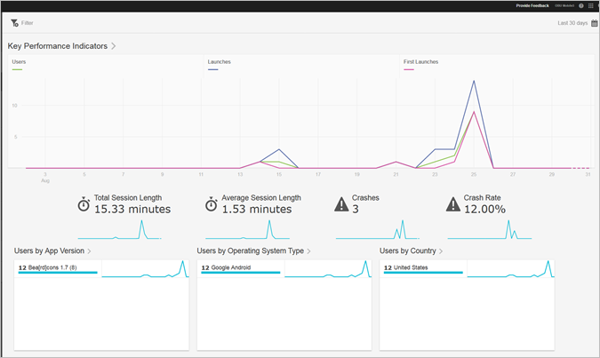

# Overzichtsrapport{#overview}

Het overzichtsrapport biedt een momentopname van uw belangrijkste meetgegevens.

Hier is een voorbeeld van dit rapport:

U kunt het datumbereik voor het rapport wijzigen door op het kalenderpictogram rechtsboven in het rapport te klikken. U kunt ook een plakfilter maken dat verschillende rapporten omvat om te zien hoe een segment in alle mobiele rapporten presteert. Voor meer informatie over het creëren van een kleverige filter, zie [kleverig filter toevoegen](/help/using/usage/reports-customize/t-sticky-filter.md).

>[!TIP]
>
>U configureert de belangrijkste meetgegevens voor dit rapport tijdens het maken van de app. Zie [Uw app configureren](/help/using/c-manage-app-settings/c-mob-confg-app/c-mob-confg-app.md) voor meer informatie.
