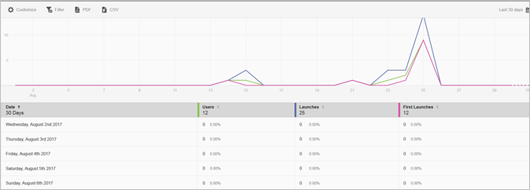

# Rapport Gebruikers en sessies{#users-and-sessions}

In het rapport Gebruikers en sessies worden metriek voor unieke bezoekers tijdens het geselecteerde tijdkader weergegeven.

U kunt de volgende opties voor dit rapport vormen:

* **[!UICONTROL Time Period]**

   Klik op het **[!UICONTROL Calendar]** pictogram om een aangepaste periode te selecteren of om een vooraf ingestelde tijdsperiode te selecteren in de vervolgkeuzelijst.

* **[!UICONTROL Customize]**

   Pas uw rapporten aan door de **[!UICONTROL Show By]** opties te veranderen, metriek en filters toe te voegen, extra reeksen (metriek) toe te voegen, en meer. Zie Rapporten aanpassen voor meer informatie.

* **[!UICONTROL Filter]**

   Klik **[!UICONTROL Filter]** om een filter te creëren dat verschillende rapporten overspant om te zien hoe een segment over alle mobiele rapporten presteert. Met een kleverig filter kunt u een filter definiëren dat wordt toegepast op alle rapporten die geen tekenen bevatten. Zie [Plakfilter](/help/using/usage/reports-customize/t-sticky-filter.md)toevoegen voor meer informatie.

* **[!UICONTROL Download]**

   Klik **[!UICONTROL PDF]** of **[!UICONTROL CSV]** om documenten te downloaden of te openen en deze te delen met gebruikers die geen toegang hebben tot Mobile Services of om het bestand in presentaties te gebruiken.