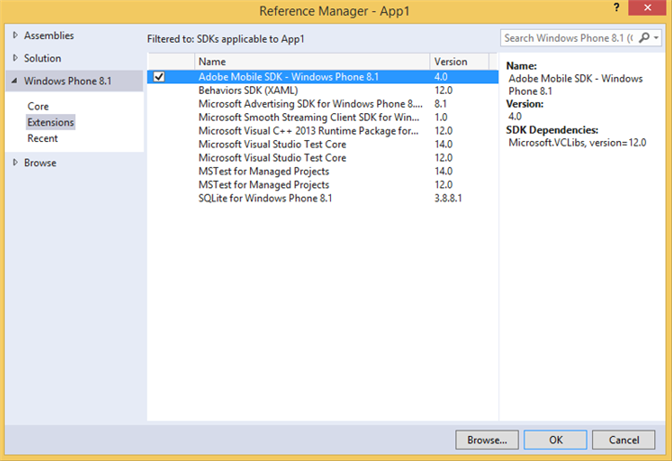

# Windows Visual Studio-extensies voor Experience Cloud Solutions 4.x SDK {#windows-visual-studio-extensions-for-experience-cloud-solutions-x-sdk}

Deze Uitbreidingen verstrekken u een veel gemakkelijkere manier om de verwijzing van de Vensters SDK van de Oplossingen 4.x van Experience Cloud in uw project toe te voegen.

## De bibliotheek van GitHub installeren {#section_F55DB6241EF1475286C05FEAEBF996A3}

1. Download de universele SDK van Vensters van [GitHub](https://github.com/Adobe-Marketing-Cloud/mobile-services/releases).
1. Pak het gedownloade bestand lokaal uit.
1. Dubbelklik op het bestand ADBMobileWindowsStoreVSIX.vsix of ADBMobileWindowsPhoneVSIX.vsix om het installatieprogramma te openen.

1. Selecteer **[!UICONTROL Global Location]** en installeer de bibliotheek.

## Referenties toevoegen aan uw project {#section_00C14FE9243D4330BE1F4BB56FCF08B1}

1. Open uw Windows 8.1- of Windows Phone 8.1-project.
1. Open het dialoogvenster Reference Manager.

   

1. Zoek en selecteer **[!UICONTROL Adobe Mobile SDK]** op het tabblad **[!UICONTROL Extensions]** van Windows 8.1 of Windows Phone 8.1.
1. Klik **[!UICONTROL OK]** om het te bewaren.

   De Adobe Mobile SDK wordt toegevoegd aan uw project en als dit nog niet is gebeurd, wordt het **[!UICONTROL Microsoft Visual C++ Runtime]**-pakket ook toegevoegd.

1. Selecteer in Configuratiebeheer een type Platform en begin met het testen van de app.
